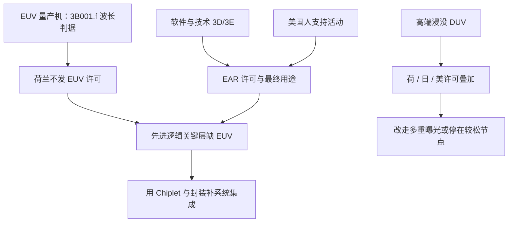

# EUV 出口管制

13.5 nm 光源的量产扫描仪只有一条商业供应链；许可制度把它挡在一部分市场之外，先进逻辑的关键层就无法按台积电、三星那条 EUV 路线去铺。

<footer>—— 对照公开的 EAR ECCN 3B001、荷兰对 ASML 的许可实践，以及 2022–2023 年 BIS 半导体规则</footer>

量产级极紫外光刻（EUV）把波长从浸没 ArF 的 193 nm 收到 13.5 nm，数值孔径 0.33 的 NXE 一类机台已是 7 nm 及以下逻辑关键层的默认工具；更高 NA 的 EXE 再把分辨率往约 8 nm 推。全球能交付这种扫描仪的商业供应商，公开事实里就是 ASML，镜头与光源分别深度绑定蔡司与 Cymer 体系。出口管制没有发明新的物理，它做的是：**不让这台机器、以及足够先进的浸没 DUV、相关软件与美国人员支持，按正常商业条件进入被管制目的地。** 结果是先进逻辑要么改走多重曝光的浸没路线，要么停在 EUV 出现之前的节点密度上。本篇只写已公布的条款编号与公开许可实践，不补充任何未公开的最终用户名单、内部许可证文本或情报判断。

## 问题

没有 EUV 时，7 nm 一类逻辑并非做不出来——可以用 193 nm 浸没加多重图形化，台积电在引入 EUV 之前就走过这段。代价是掩模次数、套刻误差、周期时间与缺陷机会一起涨，先进节点的经济性变差。EUV 的工业意义是把关键层从「多次曝光才能达到的密度」拉回「单次或少数次曝光」，让 5 nm / 3 nm 路线在成本上成立。卡住 EUV，等于卡住这条成本曲线，而不是宣布物理上不可能做出任何精细图形。

管制为什么能卡住，是因为供应链极度集中。一台 EUV 扫描仪是光源（激光打锡滴产生 13.5 nm 等离子体）、多层钼硅反射镜、真空工件台、掩模与套刻控制系统的集成。其中若干子系统来自少数不可替换的供应商。许可机关不必禁运「所有半导体设备」，只要把这一档光刻机及其关键零件、软件、美国人的支持活动管住，先进逻辑扩产就被钉在已安装机台上。浸没 DUV 的高端型号后来也被纳入许可，是因为公开报道已经表明：没有 EUV 的工厂可以用多重曝光把 DUV 往 7 nm 一类节点推，见 [国产 DUV 多重曝光](/llm/china-duv-multipattern)。

### 条款在管什么，不在管什么

公开的美国《出口管理条例》（EAR）把半导体制造设备放在 ECCN **3B001** 下。其中 **3B001.f** 是光刻设备：步进或扫描曝光装置，若光源波长短于 193 nm，或可分辨特征（MRF）达到规定阈值（历史上公开文本里出现过 45 nm 及更紧的后续修订），即落入管制。EUV 的 13.5 nm 短于 193 nm，直接落在 **3B001.f.1** 这类条目的波长判据里。掩模基板方面，公开文本把用于 EUV 的钼硅多层反射掩模坯料写在 **3B001.j**，2024 年 9 月的 BIS 规则又把特定 EUV 掩模/掩模版增列为 **3B001.q**。软件与技术分别走 **3D001 / 3E001** 等对应条目。2022 年 10 月 7 日的 BIS 临时规则及其 2023 年 10 月修订，把一部分原 **3B090** 项下的制造设备并回 3B001/3B002，并对澳门及国家组 D:5 目的地施加国家安全（NS）与地区稳定（RS）许可要求；对特定 EUV 相关项还出现过 **0% de minimis** 一类公开表述（例如修订中的 3B001.f.1.b.2.b）。这些编号都在联邦公报上，不是秘密。

瓦森纳安排（Wassenaar）的两用物项清单长期包含先进光刻机，荷兰作为 ASML 所在国另有本国许可。EUV 对华从未获得荷兰出口许可，是公开报道了多年的事实；2023 年起荷兰又把 NXT:2000i 及更新的浸没 DUV 纳入许可。日本经济产业省同期收紧了光刻等相关设备的出口程序。多边清单、美国 EAR、荷兰与日本国内法是叠在一起的，不是单一条款号在起作用。

## 方法

管制落地的方式，是许可默认拒绝或高度限制，而不是物理上拆掉已有工厂。已安装的浸没机台可以继续跑，缺的是新的 EUV 产能、高端 DUV 的增量、以及原厂维护与升级包在何种条件下还能提供。公开报道里，荷兰对 EUV 的立场是长期不发许可；对中档浸没机（如报道中常被点名的 NXT:1970i / 1980i）的管辖，在美荷之间有过对齐与调整，但都不改变「EUV 出不去」这一更硬的事实。

BIS 还使用最终用途控制：即使某台设备本身 ECCN 较松，若已知用于生产公开定义下的「先进节点集成电路」（规则文本里对逻辑、DRAM、NAND 的节点阈值有过明确数字，并随修订调整），美国人的支持活动仍可能需要许可。这是条款 **§744** 系列最终用途/最终用户控制的公开逻辑，用来堵「用老设备扩先进产能」的口子。具体阈值以当时有效的联邦公报为准，本篇不把某一版的纳米数字写成永恒物理常数。

对产业的直接方法含义是：被管制目的地的先进逻辑，不能复制「EUV 单次曝光打关键层、浸没打非关键层」的标准配方。剩下的公开选项是：把更多层留在浸没多重曝光上；把产品定义在 28 nm / 14 nm 一类可单次或较少次曝光的节点；用 [Chiplet 与先进封装](/llm/chiplet-packaging) 在系统级凑算力与带宽。三条都贵，但贵的方式不同。

### 许可对象是设备、软件、人，不只是「一台箱子」

把管制理解成「海关拦下一台 NXE」会低估范围。光源模块、反射镜、工件台、计算光刻软件、以及美国人在海外厂里做的安装与工艺支持，都可以落在 3B/3D/3E 或人员控制里。反过来，成熟制程用的较老 KrF / 干式 ArF、以及未达阈值的设备，并不自动等于全面禁运。讨论「卡住先进逻辑」时，要把节点、层、设备代数说清楚，不能写成「所有芯片设备都禁了」。

## 机制

物理机制先于法律。EUV 能降低 $k_1\lambda/\mathrm{NA}$ 中的 $\lambda$，使关键层不必付那么多重曝光。法律机制是切断这条 $\lambda$ 的商业来源。工厂若只有 193 nm 浸没，只能把 $k_1$ 用到极限并叠加 LELE、SADP、SAQP 一类多重图形化，用套刻精度换分辨率。套刻与缺陷随次数变差，先进逻辑的良率与周期被这条路径主导——这就是「卡住」的工程内容，不是口号。

产能机制是机台数量。ASML 公开的 EUV 年出货是有限整数，本就在台积电、三星、英特尔与存储厂之间分配。许可把一部分需求从这张分配表上划掉，不会在其他地区凭空多出 EUV 产能，只是让被划掉的地区无法加入分配。高 NA（EXE）更稀，管制效果按代数递增：越新的机台，越没有「已安装基数」可吃。

EAR 的 de minimis 规则处理的是「含美国含量的外国产设备」何时仍受 EAR 管辖。对特定 EUV 相关项曾公布 0% 阈值，意味着哪怕极少量美国含量也可能把整台设备拉回许可。这是公开的管辖技术，不是对某家公司的秘密点名。

地缘上的机制是供应链单点。镜头、光源、锡滴发生器、真空与计量，各自只有少数合格供应商。许可不必覆盖地球上每一颗螺丝，只要覆盖这些单点。这也是为何 [光刻胶、光源、镜头的国产替代](/llm/china-litho-supply-chain) 会成为独立题目：整机许可卡住之后，子系统同样是瓶颈。

## 边界与工程取舍

管制卡住的是**以 EUV 为预设的先进逻辑扩产**，不是全部集成电路。28 nm 一类成熟逻辑、许多模拟与功率器件，本就不靠 EUV；汽车、家电、工控的产能故事和 3 nm GPU 不是同一张表。把「EUV 出不去」写成「中国造不出芯片」，与公开的成熟制程扩产事实不符。把「已经能用 DUV 做出某款 7 nm 级产品」写成「EUV 管制无效」，同样不符：那是在付多重曝光税，而且扩产斜率受浸没机台许可约束。

条款会改。3B001 的子项、先进节点的定义、国家组、许可例外（如后来出现的 IEC 一类）都以联邦公报为准。写进内部合规手册必须锁日期，不能把 2022 年 10 月的一版阈值抄到永远。荷兰与日本的清单与美国 ECCN 并不逐字相同，出口分类要按物项实际所在管辖来做，不能只查一个编号。

本篇不引用未公开的许可证编号、内部最终用户名单或任何「据信」的绕关方案。公开事实已经足够说明：EUV 量产机没有对华交付纪录，先进逻辑因此不能按标准 EUV 配方扩产。

工程上的取舍因此是三选：付多重曝光的成本把浸没推向更密节点；把产品停在单次曝光吃得消的节点并靠封装集成；或等待国产 EUV 从原型走到量产——后者公开状态仍是原型，光学与光源是瓶颈，见 [国产 EUV 原型](/llm/china-euv-prototype)。没有第四条「用软件代替光刻」的路。

### 合规分类要锁日期，不要锁口头「先进」

出口分类问的是物项当时落入哪一条 ECCN、目的地在哪一组、最终用途是否触发 §744 的先进节点控制，而不是营销上的「7 nm 手机芯片」。同一台浸没机，卖给成熟制程扩产与卖给已知的先进逻辑线，许可结论可以不同。软件补丁、远程诊断、美国人现场安装，可能单独构成受控技术或人员活动，即使箱子已经在厂里。内部清单必须写：条款编号、生效的联邦公报日期、荷兰或日本的对应许可文号是否仍有效。口头上的「EUV 禁了所以什么都不能买」，既会过度合规挡住成熟制程备件，也会在高端 DUV 上漏检。

## 小结

- 量产 EUV 扫描仪商业上只有 ASML 一条链；荷兰长期不对其对华出口发许可。
- EAR 公开条目里，EUV 落入 **3B001.f** 的短波长判据，掩模坯料等见 **3B001.j / 3B001.q**，软件技术走 3D/3E；2022–2023 年规则强化了对先进节点最终用途与 D:5 目的地的许可。
- 卡住的是先进逻辑关键层的 EUV 配方与扩产斜率，不是全部芯片制造。
- 高端浸没 DUV 的后续许可，针对的是「没有 EUV 也能多重曝光往下做」这条公开路径。
- 替代是多重曝光、成熟节点加封装、或国产工具链，三者成本结构不同。
- 条款编号以联邦公报与各国官方法规为准，随修订失效；不要把某一版纳米阈值写成物理定律。
- 出处：BIS 联邦公报（含 2022-10-07 与后续 SME 规则、2024-09 对 3B001.q 等修订）、EAR 3B001 公开文本、ASML 产品页，以及路透社等对荷兰许可实践的公开报道。
