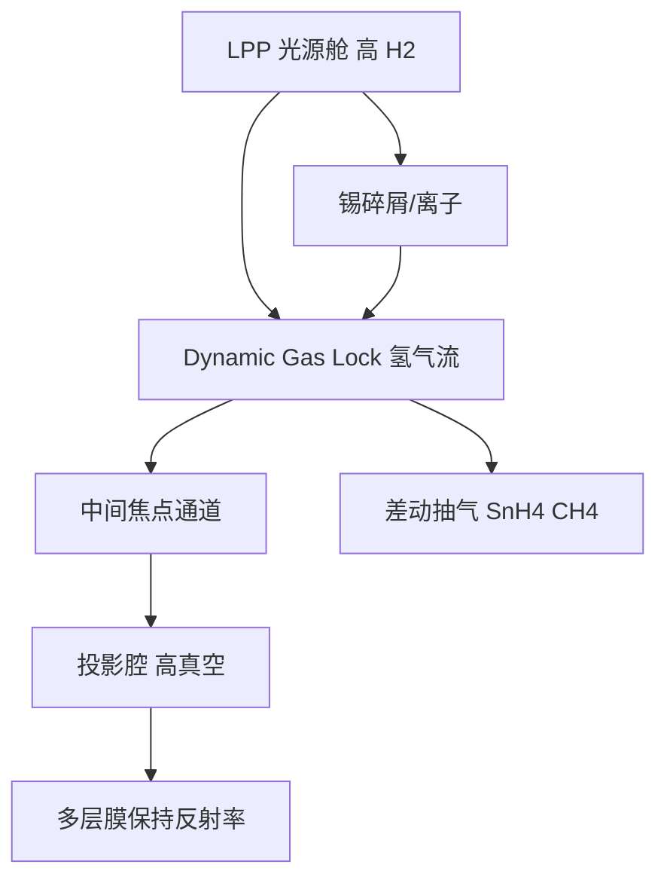

# 氢气流 Dynamic Gas Lock 防污染

氢气流与动态气锁把光源碎屑挡在扫描腔之外，并靠氢自由基原位清除锡污染。

<footer>—— 改写自 ASML 公开材料；污染化学见 Bakshi, EUV Lithography</footer>

13.5 nm 光路里没有可以随便换的空气窗。[LPP](/llm/euv-lpp-tin) 每秒喷出数万次锡等离子体，离子、中性锡和碳氢残余只要淀积在[多层膜](/llm/euv-multilayer-mirror)上，反射率就掉、光瞳就变形。量产机把氢（H₂）既当缓冲气体，又当清洗剂：EUV 光子把 H₂ 解离成自由基，H 与 Sn 生成挥发性 SnH₄，与碳生成 CH₄，再被抽走。动态气锁（Dynamic Gas Lock, DGL）用差压气流在光源舱与扫描舱、以及若干真空分区之间形成单向帘，让光子过、让碎屑不过。本篇写氢化学与气锁几何，不重写收集镜抛光。

## 问题

污染有三条并行的路。第一，锡碎屑镀到收集镜，带内反射率下降，IF 功率掉。第二，残余碳氢在 EUV 下裂解，碳膜在投影镜和掩模多层膜上生长，对比与剂量均匀性一起坏。第三，氧化和水汽攻击帽层与硅层，周期和应力漂移，波前跟着走。真空泵只能降低本底，不能挡住等离子体源持续注入的质量流，也不能把已经镀上的锡「抽」下来。

还要满足互相打架的压力：光源舱需要足够氢密度来减速离子、刻蚀锡；[投影物镜](/llm/zeiss-euv-optics)需要高真空以免沿程吸收和碳化；硅片与掩模台有自己的放气和运动约束。一块腔体一个压力做不到。必须分区，并用气流而不是固体窗来衔接——固体窗在 13.5 nm 是挡板。

### 为什么是氢而不是惰性气体

氦、氩可以当缓冲，把离子平均自由程打短，但它们不把锡变成可抽走的氢化物。锡会在镜面累积，只能靠换镜或离线清洗。氢的独特处是化学反应通道：

$$
\mathrm{Sn} + 4\mathrm{H} \rightarrow \mathrm{SnH_4},\qquad \mathrm{C} + 4\mathrm{H} \rightarrow \mathrm{CH_4}.
$$

自由基 H 主要来自 EUV 光解离和等离子体边缘，不是靠把整腔加热到热裂解温度。惰性缓冲可以辅助减速，量产公开叙述的核心清洗剂是氢。代价是氢会攻击不兼容的帽层、引起氢脆或起泡，镜面材料与气锁流量必须一起合格。

DGL 不是「氢气氛浸没光刻」。硅片侧没有液体，氢也不参与成像折射率。气锁的光学厚度必须薄到带内吸收可接受，又厚到分子扩散把锡挡回去——这是流量、缝几何和泵速的平衡，不是把扫描腔灌成一个大气压的氢气。

## 方法

光源舱维持较高的氢分压，收集镜浸泡在可刻蚀的自由基环境里。朝向 IF 的通道做成窄缝加逆向或横向氢气流，形成 DGL：下游压力低、上游压力高，净流指向光源或旁路泵口，锡蒸气的扩散平均自由程被气流吹回。扫描腔、掩模腔、硅片腔各自有泵组和气体帘，避免光源脉冲把压力波打进 POB。

流量是动态的：曝光时 EUV 本身在造自由基，停光时清洗速率下降，有时要维持辅助解离或接受暂时不能清洗。收集镜温度、氢流量和 IF 功率构成闭环——流量过大，沿程吸收吃掉带内功率；过小，锡累积。ASML 公开材料把这套系统写成光源与扫描机集成的一部分，而不是外挂过滤器。

### 分区真空与差动抽气

典型分区是：等离子体附近（相对「脏」、氢多）→ DGL → IF 管道 → 照明与投影（更干净）→ 掩模与硅片台。每一级差动抽气，像加速器束线的差分孔。缝太宽，气锁失效；太窄，挡光并增加热与对准敏感。工件台在扫，气锁几何还不能碰运动包络。氢的抽速、安全性（爆燃极限之外的高真空稀释）和泵的耐锡、耐碳能力，属于工厂设施而不只是光学设计。

## 机制

离子减速：氢分子把高能锡离子的动能通过碰撞降下来，减轻溅射产额。化学清除：落到镜面的 Sn 与 C 被 H 刻成气体，多层膜帽层（如钌）要在刻锡的同时尽量不被氧化或剥蚀。碳的来源往往不是锡滴，而是真空润滑、电缆放气、光刻胶除气和残留有机物；EUV 是高效的裂解灯。因此 DGL 既挡源，也逼整机材料清单变成「EUV 兼容真空」。

光子仍走直线穿过气帘。吸收截面使氢柱密度变成透过率项 $T_{\mathrm{gas}}$，直接出现在 IF 功率账里。气锁设计是在 $T_{\mathrm{gas}}$ 与挡锡效率之间取点，而不是把污染降到实验室本底。投影镜一旦碳化，清洗窗口比收集镜窄：过激的氢或氧清洗会改多层膜，波前永久坏。策略往往是「收集镜可牺牲地洗，POB 靠防胜于洗」。

不要把氢刻蚀理解成对微滴撞击无差别有效。高速液滴造成的机械损伤和局部溅射坑，化学反应补不回去。DGL 的首要任务是减少到达下游的质量流；收集镜寿命仍要靠预脉冲碎屑谱、磁场抑制和定期维护。

### 与 pellicle、胶和随机效应的交界

掩模侧若有 [pellicle](/llm/euv-pellicle)，薄膜本身会放气、会拦截颗粒，但也改变局部热和氢到达掩模多层膜的路径。硅片侧光刻胶在 EUV 下出气，是碳源之一；剂量提高以对抗[随机效应](/llm/euv-stochastics)时，出气和镜面碳生长可能一起升。污染控制因此与工艺剂量、胶化学绑定，不是光源舱的局部卫生问题。

## 边界与工程取舍

DGL 不增加 NA，不缩短波长，不消除光子散粒噪声。它只让光学合同在时间上可维持。关氢可以提高瞬时透过率，几小时后收集镜就脏到产能崩溃。开太大则 IF 功率被气体吃掉，激光白烧。量产窗口是「够洗、够挡、还留得出光」。

公开材料不会给出缝宽和 SCCM 流量。写清楚机制即可：氢自由基刻锡/碳、差压气帘代替固体窗、分区真空。不要把同步辐射束线的差分抽气或蚀刻机的远程等离子体清洗直接当成 NXE 的 DGL 图纸。Bakshi 书提供碳污染与氢清洗的物理图像；机台级实现以 ASML 公开架构为准。

安全与设施常被技术文省略：大量氢、真空泵、锡氢化物毒性与排气处理是工厂设计的一部分。光学文章可以不展开规范条款，但不要暗示「开一瓶氢气对着镜子吹」就是动态气锁。

## 小结

- EUV 多层膜的寿命由锡、碳、氧污染决定，真空泵单独不够。
- 氢自由基把 Sn、C 变成可抽走的 SnH₄、CH₄，是量产原位清洗通道。
- Dynamic Gas Lock 用差压氢气流当无形窗，隔开光源舱与扫描腔。
- 气柱密度进入带内透过率，流量是清洗与出光的折中。
- 收集镜以洗为主，投影物镜以防为主，帽层化学必须兼容氢。
- 微滴机械损伤不能单靠氢消除；碎屑谱仍要在光源侧控制。
- 出处：ASML 公开材料；Bakshi, *EUV Lithography*。
