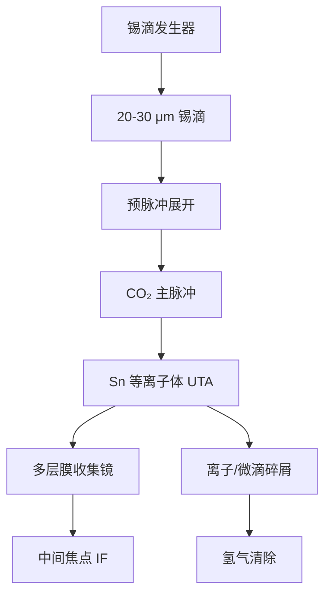

# LPP：CO₂ 激光打锡滴产生等离子体

锡等离子体在 13.5 nm 附近有强发射带；用脉冲 CO₂ 激光打击锡滴，是目前进入晶圆厂量产的 EUV 光源路线。

<footer>—— 改写自 ASML / Cymer 公开材料；光源物理见 Bakshi, EUV Lithography</footer>

EUV 光刻机不是「有一台 13.5 nm 激光器」。中间焦点（intermediate focus, IF）要的是数百瓦、2% 带宽内的极紫外，而且要能连续打几十亿次、碎屑可控。放电等离子体（DPP）走过样机，量产选的是激光等离子体（laser-produced plasma, LPP）：液滴发生器把直径约 20–30 μm 的锡滴送到焦点，主激光是 10.6 μm 的脉冲 CO₂，把锡电离到 Sn⁸⁺–Sn¹⁴⁺ 一带，未分辨跃迁阵列正好覆盖多层膜窗口。本篇写锡滴、CO₂ 驱动和收集几何；[预脉冲](/llm/euv-prepulse)把转换效率从约 1% 抬到约 5–6%，[收集镜](/llm/zeiss-euv-optics)把 2π 附近的光送到 IF。

## 问题

硅片剂量、物镜透过率与产能把 IF 功率钉在数百瓦。若按[多层膜](/llm/euv-multilayer-mirror)六镜约 12% 的投影透过率再乘照明与掩模，光源必须极其亮。候选元素里，锡的 UTA 与 13.5 nm 对齐最好；氙、锂做过研究，转换效率或碎片或谱匹配不够。还要满足工业约束：重复频率几十千赫，才能在扫描曝光的时间内攒够光子；靶要可补充，不能用会烧蚀殆尽的固体锡盘当量产方案。

激光波长也不是自由变量。等离子体的临界密度 $n_c\propto\lambda^{-2}$。10.6 μm 的 CO₂ 把吸收区放在相对稀薄的冕区，有利于在 13.5 nm 的离子价态上把激光能量留下，而不是全部变成动能碎屑。短波长固体激光更容易把能量耦进过密区，带内效率往往更差。量产因此是「CO₂ + 锡滴」，而不是「随便一台大功率激光打金属」。

### 为什么是液滴而不是固体靶

固体锡旋转靶能出光，但碎屑大、靶材消耗与热负荷难循环，重复频率与光学寿命不合格。液滴把每次击打的质量量子化：几十微米的球，质量纳克级，打完即耗尽，下滴再来。发生器以约 50 kHz 量级（后续机型更高）喷滴，位置抖动必须小于焦斑尺度，否则主脉冲打空，IF 功率掉、碎屑谱变。真空里还要把未击中或未完全电离的锡回收，避免在腔壁和收集镜上堆成金属膜。

LPP 的「激光」是驱动源，不是曝光光束。落到掩模和硅片上的 13.5 nm 来自锡离子的自发发射，经多层膜收集与滤波。不要把 CO₂ 的 10.6 μm 画进投影物镜。

## 方法

一条量产 LPP 链按时间对齐四件事：滴、预脉冲、主脉冲、收集。滴从发生器竖直或近竖直进入，被探测触发激光。预脉冲先把球展开成盘或雾化靶，主脉冲的焦斑才与靶的光学厚度匹配，细节见预脉冲专文。主脉冲来自 CO₂ 主振荡功率放大（MOPA）链，平均功率十千瓦量级，脉宽纳秒级，把靶加热到数十电子伏，辐射出带内 EUV。

收集镜是正入射多层膜椭球（或等价共轭面）：等离子体在一个焦点，IF 在另一个焦点。立体角大约数球面度，比掠入射收集器大得多，这是 LPP 能上功率的几何前提。收集镜同时是第一面牺牲光学，锡离子、中性原子和微滴会镀上去、溅射它。氢缓冲与自由基刻蚀把锡变成挥发性 SnH₄ 抽走，见[动态气锁](/llm/euv-hydrogen-dgl)。IF 之后才是扫描机的照明与投影，光源舱与曝光舱用气锁隔开。

### 转换效率与带内功率

转换效率（conversion efficiency, CE）定义为带内 EUV 能量除以打到靶上的激光能量。无预脉冲的实心滴 CE 大约 1% 量级；优化的预脉冲加主脉冲可以把 CE 推到约 5–6%。IF 功率还要扣收集立体角、收集镜反射率、气体吸收和光阑。ASML 公开的量产里程碑是 IF 250 W 支撑每小时百片以上的 [NXE](/llm/asml-nxe)；后续 NXE:3600D / 3800E 把功率和可用性再往上推。功率不是瞬时峰值，而是在剂量控制环下可维持的平均带内功率。

$$
P_{\mathrm{IF}} \approx P_{\mathrm{laser}}\cdot\mathrm{CE}\cdot\Omega_{\mathrm{col}}\cdot R_{\mathrm{col}}\cdot T_{\mathrm{gas}}.
$$

上式是数量级账，不是一张可代入出厂的公式：$\Omega_{\mathrm{col}}$ 与 $R_{\mathrm{col}}$ 随污染和角度变化。工程上盯的是 IF 处的带内功率、剂量稳定度和收集镜寿命。

## 机制

锡为什么亮，是原子物理。多价锡离子在 13.5 nm 附近有密集的 4p–4d 类跃迁，叠成 UTA，宽度与多层膜 2% 带宽相当。等离子体温度和密度必须落在出这些价态的窗口：太冷则价态不够，太热则能量跑到更高电离和动能，CE 掉、碎屑更猛。CO₂ 的临界密度低，吸收发生在膨胀冕里，有利于把离子价态停在带内，而不是做成高速抛射体。即便如此，离子仍会打收集镜，必须靠磁场、缓冲气体和氢化学一起减速、中和、清走。

重复频率把单次脉冲能量与平均功率拆开。单脉冲能量过高，流体力学不稳定性把靶打成喷溅；频率过低，扫描速度被光子预算卡住。滴频、激光重频和扫描同步是同一条产能链：[磁浮工件台](/llm/euv-maglev-stage)按扫描速度走过狭缝，光源必须在每个狭缝位置提供稳定剂量。功率抖动会直接变成 CD 抖动；随机效应则是剂量绝对值过低时的光子统计，见[随机效应](/llm/euv-stochastics)。

碎屑分三种：高能离子、中性原子、微米/亚微米液滴。氢刻蚀对镀上的薄膜锡有效，对高速微滴撞击造成的溅射损伤帮助有限。收集镜寿命往往由后一类和累积粗糙度决定，而不是由「氢开着就不会坏」。

### 光源舱与扫描机的接口

IF 是合同面：位置、发散、光谱、偏振和功率稳定性都在这里验收。下游照明假定一个干净的二次源。气锁把锡蒸气和大部分碎屑留在光源舱，扫描腔保持更高真空，以免投影镜被碳化或镀锡。剂量传感器在硅片侧闭环，但执行器在激光能量、滴触发和气体流量上。光源可用性（availability）与光学寿命一样进入晶圆厂的成本模型：一台 NXE 停着等换收集镜，比 CE 差 0.5 个百分点更贵。

## 边界与工程取舍

LPP 不把 13.5 nm 变成「便宜的短波长灯」。激光器本身是十千瓦级工业系统，滴发生器是真空里的精密流体力学，收集镜是消耗品。CE 的几个百分点是整机功耗与热负荷的杠杆：激光墙插功率远高于 IF 的数百瓦，工厂电力、冷却和水都按这个倍数准备。换氙或固体靶以图「更干净」，通常会在 CE 或重复频率上立刻出局。

也不要把实验室单脉冲的高 CE 外推成量产。量产要在 50 kHz、位置抖动、氢气流和收集镜逐渐变脏的条件下维持剂量。预脉冲配方、主脉冲包络、磁场碎屑抑制都是封闭的工艺窗口，公开材料只给出原理与功率里程碑。Bakshi 书里的等离子体模型解释为什么锡和 CO₂ 匹配，并不等于给出 ASML 光源的控制表。

DPP 与 LPP 不要混写成「EUV 光源」。早期 DPP 用电极放电，电极碎屑和热负荷限制了功率扩展。量产 NXE 系列的公开叙述是 LPP 锡滴。写供应链时也应写 Cymer 并入 ASML 之后的光源垂直整合，而不是假设存在一台独立的商品 EUV 激光器。

## 小结

- 量产 EUV 光源是 CO₂ 激光驱动的锡滴 LPP，曝光光来自 Sn 离子 UTA，不是 10.6 μm 激光本身。
- 液滴把靶材量子化，以数十 kHz 重复，满足扫描剂量与收集镜可维护性。
- CO₂ 波长把吸收放在较低临界密度，有利于 13.5 nm 带内效率。
- IF 功率是激光功率、CE、收集立体角与反射率、气体透过率的乘积；250 W 级是 NXE 量产的公开里程碑。
- 碎屑管理与氢清洗和收集镜寿命绑定，不能只优化瞬时 CE。
- 预脉冲是 CE 从约 1% 到约 5–6% 的关键，不在本篇展开。
- 出处：ASML/Cymer 公开光源说明；Bakshi, *EUV Lithography*。
