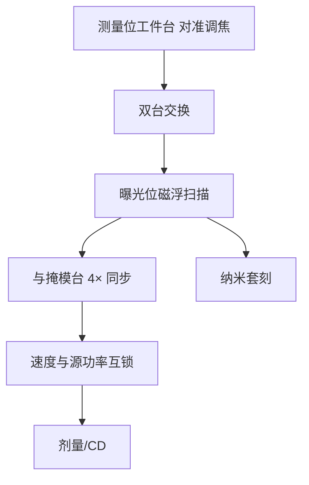

# 真空磁浮工件台

真空里不能用气浮轴承；硅片台与掩模台必须磁浮，并在纳米套刻下与扫描曝光同步。

<footer>—— 改写自 ASML 公开材料；平台背景见 Twinscan 与 Bakshi 系统章节</footer>

浸没 DUV 的 Twinscan 用空气轴承把工件台浮起来，真空 EUV 把这条路堵死：没有气膜，也不能把扫描腔灌成一个大气压。[NXE](/llm/asml-nxe) 与 [EXE](/llm/asml-high-na) 把硅片台、掩模台改成磁浮（magnetic levitation）：洛伦兹力提供无接触支承与六自由度控制，计量用编码器/干涉仪，短行程精细定位叠在长行程搬运上。双工件台架构保留——一台在曝光位扫描，一台在测量位对准、调焦、换片——否则真空里更长的开销会把产能打死。本篇写磁浮在真空扫描机里解决什么，以及它如何跟光学焦深、套刻绑在一起。

## 问题

扫描光刻的套刻预算是纳米：套刻要进单纳米到亚纳米量级的控制，扫描时硅片与掩模相对速度必须按倍率锁住（0.33 系统为 4×；High-NA 扫描向仍约 4×）。气浮在大气或微正压下工作，气流会破坏 EUV 真空、污染多层膜，也提供不了 EUV 腔要求的洁净与压力分区。机械滚珠导轨有摩擦、磨损和真空冷焊风险，纳米级反转误差不可接受。

真空还取消了对流散热。台子上的电机、电缆、编码器产生的热只能靠传导和辐射搬走，热变形直接进套刻。硅片背面与静电卡盘的夹持、形变，也要在无气体辅助的情况下可重复。问题因此是：无接触、无油气、可纳米伺服、可高加速扫描的真空工件台。

### 双台为什么在真空里更必要

曝光位的真空环境、狭缝扫描和剂量积分不能被换片、对准、调焦占满。Twinscan 把计量移到第二台：曝光台在扫时，测量台已经在为下一片准备叠对数据。EUV 单片曝光时间若因源功率或剂量变长，双台仍能把对准隐藏在并行里；若改单台串行，wph 会按真空机械手节拍再掉一截。磁浮是支承技术，双台是调度技术，二者一起才构成 EUV 产能。

磁浮工件台不是磁悬浮列车的缩小版。行程是硅片尺度加扫描超程，精度是纳米，带宽是伺服百赫兹到千赫兹，环境是真空与 EUV 氢。引用应写扫描机短/长行程台，而不是交通磁浮。

## 方法

长行程台负责分米级搬运与扫描主运动，短行程台（或短行程自由度）负责纳米级六自由度：X/Y 扫描、Z 调焦、Rx/Ry 调平、Rz 旋转。磁浮执行器按力指令出力，位置由栅尺或干涉仪以亚纳米量化。掩模台与硅片台同步：速度比等于光学倍率，相位误差进套刻。扫描加速度达数 g 量级，反力由反作用质量或机座隔离，以免把振动打进[蔡司物镜](/llm/zeiss-euv-optics)。

硅片用静电卡盘吸持，因为真空里没有真空吸盘那套「再抽一层」的简单故事——晶圆本身要被夹平。卡盘温度控制补偿无对流。电缆和冷却管做成拖链或无接触能量传输，尽量减少扰动。氢气流与 DGL 在腔体其他位置，台子附近的气体必须稳定到不影响计量光路折射率——EUV 成像在真空，但计量往往用深紫外或红外激光，残余气体折射率仍进误差模型。

### 扫描同步与剂量互锁

狭缝在硅片上扫过时，每一点的停留时间决定剂量。台速度抖动会变成剂量抖动，再变成 CD 抖动。伺服要把速度噪声压到剂量预算内，同时位置噪声压到套刻预算内。源功率闭环与台速度互锁：功率跌了就减速，而不是继续扫出欠剂量条纹。High-NA 焦深更薄，Z 向伺服的残余必须更小；半场扫描长度变短，加速度与建立时间的比例会变，台子轨迹规划要按 EXE 场重写。

## 机制

无接触支承消除库伦摩擦，反向间隙从结构上消失，这是纳米扫描的前提。剩余误差来自：计量路径的热与折射率、电缆力、质量不平衡、地面振动、曝光瞬时热（硅片吸收 EUV）。控制把可建模的周期误差喂进前馈，把随机振动留给反馈。套刻模型把工件台残差、对准传感器和对准标记变形收成一次曝光的校正表；磁浮台是执行器，不是套刻的全部。

真空磁浮的另一面是故障模式：失浮不能蹭气膜保护，必须有机械限位与安全落座，且落座不能产尘打到掩模或物镜。氢环境对某些磁性材料与绝缘有长期影响，材料清单与[气锁](/llm/euv-hydrogen-dgl)同一套 EUV 兼容性。台子产尘会直接威胁 pellicle 和掩模，运动副设计以「不摩擦」为第一原则。

不要把「纳米台」理解成只靠更密的光栅。光栅再密，热变形和振动隔离不够，读数只是在测一个在飘的世界。EUV 台是计量环、热环、力环一起设计的系统。

### 与光学合同的接口

NA 0.33 的焦深已经薄，0.55 更薄。调焦不是曝光前量一次 Z，而是扫描中持续跟踪硅片形貌。形貌来自前道工艺的应力与卡盘指纹。物镜像差里的场曲、像散要与台的 Rx/Ry 调平分配，不能两边都当对方会补。扫描方向的同步误差在 4× 几何里被倍率放大到掩模侧或缩小到硅片侧，取决于你从哪一端看；控制工程师按硅片坐标写规格。

## 边界与工程取舍

磁浮不提高 NA，不增加光子数。它只让真空扫描在套刻与产能上成立。加速度越大，建立时间与振动隔离越难，最终被光学积分时间限制。为了产能把扫描速度拉满，剂量不足时随机缺陷会先报警——这时该加源功率或改胶，而不是再骂台子。单台方案在研发工具上可能出现，HVM 的 NXE/EXE 公开叙事是双台。

ASML 不会公开磁钢排列和控制器增益。可写的是：真空导致气浮失效、磁浮六自由度、长短行程、双台并行、扫描同步。Bakshi 的系统章节帮助理解曝光机是光源—光学—工件台的闭环；具体轴承专利细节不必装进概念文。

掩模台同样磁浮、同样真空，载荷更小但速度按倍率更高、动态更狠。只写硅片台会漏掉一半同步问题。pellicle 框架的质量和热也会进掩模台的平衡。

## 小结

- EUV 扫描腔是真空，气浮轴承不可用，硅片台与掩模台采用磁浮无接触支承。
- 六自由度伺服叠加长行程扫描，位置计量到亚纳米，与倍率同步。
- Twinscan 双台把对准调焦与曝光并行，补偿真空换片开销。
- 速度噪声进剂量，位置噪声进套刻；源功率与扫描速度互锁。
- High-NA 更薄焦深和半场轨迹对 Z 向与建立时间提出更严要求。
- 热、产尘、失浮安全与氢兼容是真空台特有的工程边界。
- 出处：ASML 关于 NXE/EXE 真空平台与 Twinscan 的公开说明；Bakshi, *EUV Lithography*。
