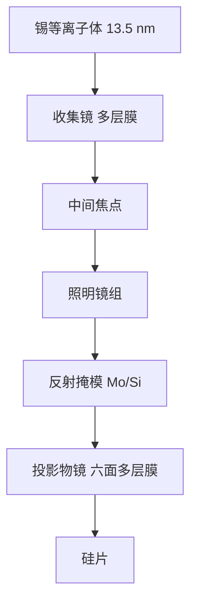

# 13.5 nm 真空全反射：Mo/Si 多层膜镜

所有材料——包括空气——都强烈吸收极紫外；因此整条光路必须在真空中工作，光学只能靠多层膜反射，而不能靠折射透镜。

<footer>—— 改写自 ASML 公开说明；多层膜物理见 Bakshi, EUV Lithography</footer>

极紫外（extreme ultraviolet, EUV）把曝光波长从 ArF 的 193 nm 推到 13.5 nm。光子能量约 92 eV，几乎所有固体、气体、甚至几厘米空气柱都会把它吃掉。传统折射物镜、浸没水和透射掩模在这里失效。量产机台把光学收成一条全反射链：光源先被收集镜收束，再经照明、反射掩模和投影物镜落到硅片上。每一面镜子都不是镀一层金属那么简单，而是钼/硅（Mo/Si）周期多层膜，在近正入射下靠布拉格干涉给出约 70% 的峰值反射率。本篇写为什么必须是 13.5 nm、多层膜怎样当镜子用，以及镜子张数如何反过来规定光源功率。收集镜与投影物镜的系统角色见[蔡司光学](/llm/zeiss-euv-optics)。

## 问题

光刻分辨率的瑞利形式是 $CD = k_1\lambda/\mathrm{NA}$。193 nm 浸没把 NA 抬到 1.35 之后，单次曝光的半节距停在大约 40 nm 量级，再往下只能靠多重图形。要把 $\lambda$ 再降一个数量级，候选落在软 X 射线与极紫外交界。难点不是「找不到更短的光」，而是：更短的光没有透射光学，也几乎没有反射光学——普通金属镜在正入射下的反射率只有百分之几，且随波长变短迅速恶化。

还要同时满足三条约束。第一，光源必须有足够的带内功率，锡等离子体恰好在 13.5 nm 附近有未分辨跃迁阵列（UTA）。第二，必须存在一种能在近正入射下给出高反射率的膜系，否则投影物镜张数一多，整机透过率掉到不可用。第三，残余气体、多层膜带宽和光源光谱要对准同一窗口。13.5 nm 是这三条的交点，不是光谱学上的任意选点。

### 为什么折射与单层金属镜都走不通

13.5 nm 处，几乎所有材料的消光系数都大到让毫米级透镜变成挡板。氟化钙、熔融石英这些 DUV 窗口在这里是不透明的。掠入射金属镜可以在极小掠角下反射，但收集立体角小，投影物镜也无法做成大 NA 的近轴系统。正入射金属镜的反射率又太低。于是只剩一条路：用两种折射率对比足够大的材料，按布拉格周期交替堆叠，让每一界面的微弱反射在相位上相长。Mo 与 Si 在 13.5 nm 附近分别扮演「散射体」和「间隔体」，是公开文献里量产采用的配对。

「真空全反射」不是全内反射。EUV 镜子的峰值反射率大约七成，其余被吸收或散射。全反射指的是光路里没有透射透镜、没有空气窗，所有成像面都是反射面，并且腔体必须抽真空。

## 方法

多层膜是一维布拉格晶体。近正入射时周期 $d$ 满足

$$
2d\cos\theta \approx m\lambda,
$$

$m=1$ 的工作点把双层周期放到大约 6.9 nm：钼层约占周期的四成，硅层占其余。典型投影镜堆 40–60 对，峰值反射率可到约 70%；理想无粗糙、无互扩散的上限大约 75%，再加对几乎被吸收与界面扩散吃掉。带宽很窄，大约 2% 量级，必须与光源的锡发射带和后续每一面镜子的角谱对齐，否则带内功率在光路里被滤掉。

掩模同样是 Mo/Si 多层膜加吸收体，而不是 DUV 那块透射铬版。照明以小角度入射，掩模三维效应（阴影、吸收体侧壁）会进套刻与 CD；这是反射式系统的几何税，不是多层膜镀坏了。收集镜面对等离子体，角范围宽，周期往往沿径向渐变，使不同入射角仍落在布拉格峰上。

### 界面、帽层与角谱

钼硅互扩散会生成硅化物，等效于把折射率对比冲淡、把界面弄毛。工艺上要控沉积温度、有时加极薄阻挡层。表面再覆帽层（常见为钌）以抗氧、抗氢刻蚀，并尽量少牺牲带内反射率。帽层是污染化学与光学之间的合同，详见[氢气流与动态气锁](/llm/euv-hydrogen-dgl)。

镜子在物镜里以不同主光线角工作。周期、层厚比必须按那一面镜子的角谱设计，不能六面镀同一张配方。粗糙度以埃计就会把高频散射抬起来，降低对比并增加杂散光。蔡司的抛光与装调把面形做到原子量级，正是因为多层膜只对「对的周期、对的入射角、足够光滑的基底」给高反。

## 机制

反射率相乘决定整机能量账。若单面 $R\approx 0.70$，六面投影镜的透过率大约 $0.70^6\approx 0.12$，还没算收集镜、照明、掩模、[pellicle](/llm/euv-pellicle) 的双程吸收。硅片上要的剂量是十几到几十 mJ/cm²，产能要每小时一百多片，中间焦点处就必须有数百瓦带内 EUV。这是[LPP 锡滴光源](/llm/euv-lpp-tin)必须把转换效率抠到百分之五以上的原因：镜子不是「有就行」，张数把光源功率放大成硬约束。

真空是吸收长度的直接推论。几个帕的残余气体、碳氢化合物都会在光路里变成沿程衰减，并在多层膜上裂解出碳膜。碳膜长厚，反射率掉，剂量和均匀性一起坏。因此真空不仅是「别挡住光」，也是污染控制的前提。氢自由基可以刻锡、刻碳，但也会攻击错误的帽层化学，光学与气锁必须一起设计。

不要把 13.5 nm 理解成「激光器输出的单色线」。带内通常指 2% 带宽；光源是等离子体的宽发射，多层膜是窄带滤波器。系统效率是光谱、角谱、偏振与面形误差的乘积，不是某一面镜子的峰值 $R$。

### 与 NA、场和偏振的耦合

NA 越大，投影镜上的入射角范围越宽，同一面多层膜越难在全光瞳内维持高反与小像差。这是 [High-NA 0.55](/llm/asml-high-na) 必须上变形光学、并把场切成半场的光学原因之一：掩模侧角度和镜子口径不能按 0.33 的 4× 正入射思路线性外推。多层膜还有偏振响应，大角度下 s/p 反射率分叉，照明偏振成为成像对比的一部分。NXE 的 0.33 已经在管理这件事；0.55 把它变成一等设计变量。

## 边界与工程取舍

多层膜解决的是「正入射下够不够亮」，不解决光源碎屑、氢刻蚀、热变形和随机效应。收集镜离等离子体最近，寿命由锡沉积与溅射决定，要靠氢气流原位清洗，而不是指望换一套更神奇的膜系。投影镜在更干净的扫描腔里，但对面形漂移极度敏感：瓦级吸收就会局部膨胀，必须靠材料、镀膜应力与热管理压到亚纳米波前。

镀膜均匀性、基底面形、装调自由度互相不可替代。反射率高但面形差，成像先坏；面形好但带宽错位，产能先坏。掩模空白的多层膜缺陷会直接印到硅片上，是掩模厂而不是物镜厂的缺陷预算。不要用「EUV 终于有镜子了」跳过缺陷、污染和热负荷——量产合同是整条反射链同时成立。

引用时应分开两件事：Bakshi 主编的 *EUV Lithography* 给出膜系、光源与系统物理；ASML/Zeiss 公开材料给出量产反射率、真空和光路张数。不要把实验室里单面 80% 的记录当成六镜物镜的系统透过率。

## 小结

- 13.5 nm 处没有可用的折射光学，量产光路是真空中的全反射链。
- Mo/Si 周期多层膜按布拉格条件在近正入射下给出约 70% 峰值反射率，带宽约 2%。
- 波长点同时对准锡的发射带与多层膜窗口，不是任意更短就更好。
- 投影镜张数把单面反射率乘成整机透过率，从而规定中间焦点需要的光源功率。
- 界面扩散、粗糙度、帽层和角谱决定实际 $R$，帽层还要兼容氢清洗。
- High-NA 的更大入射角范围会进一步挤压多层膜设计，并与变形光学、半场绑定。
- 出处：ASML 关于 EUV 真空与反射光学的公开说明；Bakshi, *EUV Lithography*（SPIE Press）。
