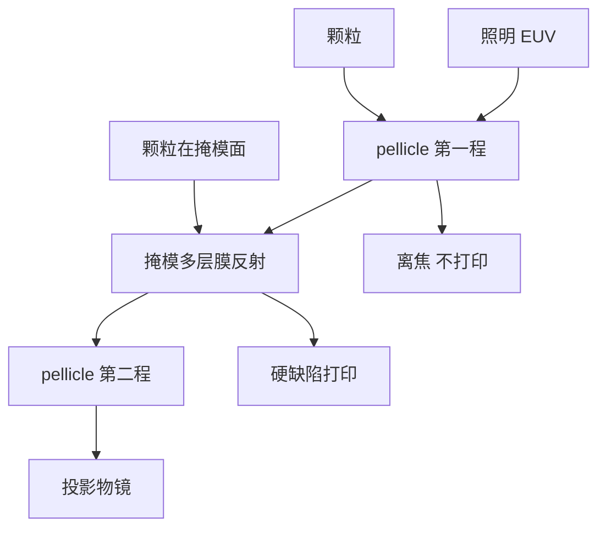

# EUV 薄膜 Pellicle

Pellicle 把颗粒挡在离焦平面上；EUV 的困难是薄膜本身也吸收 13.5 nm，而且还要扛住数百瓦级的热负荷。

<footer>—— 改写自 ASML pellicle 公开材料；膜物理见 Bakshi, EUV Lithography</footer>

DUV 掩模上的有机 pellicle 是成熟标准：颗粒落在离焦的薄膜上，印不进硅片。EUV 掩模是反射式 [Mo/Si](/llm/euv-multilayer-mirror)，光要进膜一次、出膜一次，任何吸收都按 $T^2$ 打到剂量上。早期量产甚至有过「无 pellicle 跑关键层、靠检测与有限寿命」的阶段。量产要的薄膜必须：带内单程透过率足够高（公开目标从约 80% 走向 90% 以上）、在真空里承受 IF 数百瓦对应的掩模热流、机械上罩住 6 英寸版、并且不引入不可控的波前与 CD 指纹。本篇写这张膜的光学与热合同，以及它和颗粒、剂量、[随机效应](/llm/euv-stochastics)的关系。

## 问题

掩模上的颗粒在反射几何里是硬缺陷：它挡多层膜、投阴影，扫描场里反复印。无 pellicle 时，掩模寿命由洁净室、搬运和腔内产尘决定，工厂要用极高频的掩模检测和对准报废。有 pellicle 时，颗粒落在膜上，离掩模面数毫米，投影物镜看它严重离焦，打印阈值大大提高。代价是膜成为光路里多出来的两层吸收体，并且膜的皱、热鼓包、局部透过率不均会变成全场 CD 与焦面误差。

13.5 nm 对纳米级薄膜仍然「不透明得惊人」。能用的材料清单极短：多晶硅、氮化硅、后来的碳纳米管（CNT）网等。膜越厚越结实、越扛热，透过率越差；越薄越透，越容易破、越容易在氢和 EUV 下老化。热是第二堵墙：[NXE](/llm/asml-nxe) 功率往 250 W 以上走时，膜吸收的功率密度足以把它烫到应力极限。

### 双程透过率为什么是一等指标

照明打到掩模前先过 pellicle，反射后再过一次。若单程透过率 $T=0.85$，双程只剩 $0.72$，相当于扔掉近三成带内光，直接吃产能或逼光源再加功率。$T=0.90$ 则双程 $0.81$，仍然痛，但可纳入剂量模型。均匀性比平均值更毒：膜中心与边缘差 1%，扫描场就有系统 CD 指纹，OPC 很难完全吃掉，因为热变形还随功率和时间变。因此 pellicle 规格同时写平均 $T$、空间均匀性、寿命脉冲数和破膜率。

EUV pellicle 不是把 DUV 有机膜「做薄一点」。有机膜在 13.5 nm 吸收截面不可接受，也会在 EUV 下迅速碳化破裂。材料路线是无机超薄膜或高孔隙纳米结构，机械支撑靠金属框架和应力工程。

## 方法

膜张在掩模上方的框架上，与图形面保持固定间隙，使颗粒离焦。框架必须与真空掩模台、装载机器人兼容，拆装不能产尘。第一代公开较多的是多晶硅类超薄膜，单程透过率大约八成量级，热与寿命在高功率下吃紧。后续路线提高透过率并改善热导：CNT pellicle 用稀疏纳米管网络降低吸收截面，同时让热量沿管网导走，目标单程 90% 以上，以匹配更高 IF 功率。

光学上要把膜当弱相位/振幅物：厚度均匀性进入波前，皱纹进入焦面。氢环境和 EUV 会改膜的化学与应力，寿命测试必须在接近扫描机的气体与功率下做，而不是只做可见光透过率。破膜是灾难性的：碎片落到掩模上比没有 pellicle 时更糟，因此检测「膜还在不在、有没有破洞」是机台联锁的一部分。

### 热、力学与氢兼容

吸收功率 $P_{\mathrm{abs}}\approx (1-T)P_{\mathrm{incident}}$ 在双程几何里对膜加热。真空中对流几乎为零，散热靠辐射和框架导热。温度一高，膜膨胀起皱，局部离焦量变化，颗粒防护能力与光学指纹一起变。预热、扫描占空比、功率爬坡都要进工艺窗口。氢自由基会刻某些膜材料，像刻收集镜上的碳一样；pellicle 材料必须在[DGL 氢环境](/llm/euv-hydrogen-dgl)里稳定，否则「防污染」的气体会把防护膜本身刻穿。

## 机制

离焦抑制颗粒：物镜把掩模面成像到硅片，pellicle 平面在物方离焦 $\Delta z$，颗粒的像在硅片上变成很大的模糊斑，强度低于胶的打印阈值（还受部分相干照明调制）。间隙太小，离焦不够；太大，框架与扫描包络、装载干涉，且膜更难做平。这是几何，对 DUV 和 EUV 相同；EUV 只是膜本身第一次成为功率限制元件。

对剂量的影响是全局缩放加空间指纹。光源必须多供 $1/T^2$ 的光子，才能在硅片上维持对抗随机效应的剂量。膜的局部缺陷（颗粒在膜上、膜厚台阶）若不够离焦，仍可能印出软缺陷。因此 pellicle 把「掩模硬缺陷」大部分转化成「膜上软缺陷 + 可更换膜」，而不是把缺陷物理消灭。掩模厂与晶圆厂的检测策略从「查版」变成「查版 + 查膜」。

不要把 pellicle 理解成「有了就可以脏」。膜上颗粒太大或太多仍会以散射和局部吸收的形式进场；膜破则立刻停机。它降低的是掩模多层膜上不可清洗颗粒的打印概率，不是取消洁净室。

### 与 High-NA 和半场的关系

[High-NA 0.55](/llm/asml-high-na) 掩模侧角度和功率密度更高，pellicle 的热与角透过率更苛刻；半场并不让膜面积减半到可以随便加厚，因为扫描方向仍要覆盖狭缝长度。变形光学改变主光线角，膜的有效光程随视场变，均匀性规格要按 EXE 光瞳重写。无 pellicle 跑 High-NA 关键层的颗粒风险，会因更小的打印阈值而更差。膜技术与 NA 升级是同一条量产链上的并行项。

## 边界与工程取舍

pellicle 不提高 NA，略微降低有效光子数，对随机效应是负向的，要用更高源功率或更灵敏的胶来补。无膜方案在研发和小批量仍可能出现，量产逻辑层则越来越把膜当默认。透过率、寿命、破膜率、框架产尘和价格构成四维取舍；CNT 等新膜若热导更好，仍要证明真空氢环境和全场均匀性。

ASML 公开的是需求与世代目标，具体膜供应商和厚度配方会迭代。写文章应坚持：双程吸收、离焦防护、高功率热极限这三条，并指向 Bakshi 中对 EUV 掩模防护的讨论。不要把 DUV pellicle 的透过率数字抄到 13.5 nm，也不要声称某一年之后「膜的问题已经彻底解决」——功率每次上台阶，热都会再审一次。

掩模三维效应、吸收体阴影与 pellicle 是不同层：前者在多层膜和吸收体里，后者在膜框架上。OPC/SMO 主要补前者；后者靠膜均匀性与热控制。混在一起会让人以为改吸收体就能解决 pellicle 皱纹。

## 小结

- Pellicle 把颗粒放在离焦平面，降低反射掩模硬缺陷的打印概率。
- EUV 必须双程透过薄膜，有效透过率为 $T^2$，直接吃 IF 功率预算。
- 材料从多晶硅类超薄膜走向更高透过、更高热导的路线（含 CNT 等）。
- 真空散热几乎只能靠辐射与框架导热，高功率下皱与破是寿命极限。
- 氢清洗环境必须与膜化学兼容，否则气锁会刻穿防护膜。
- 膜改善随机效应所依赖的剂量余量，需要光源功率补偿。
- 出处：ASML pellicle 公开材料；Bakshi, *EUV Lithography*。
