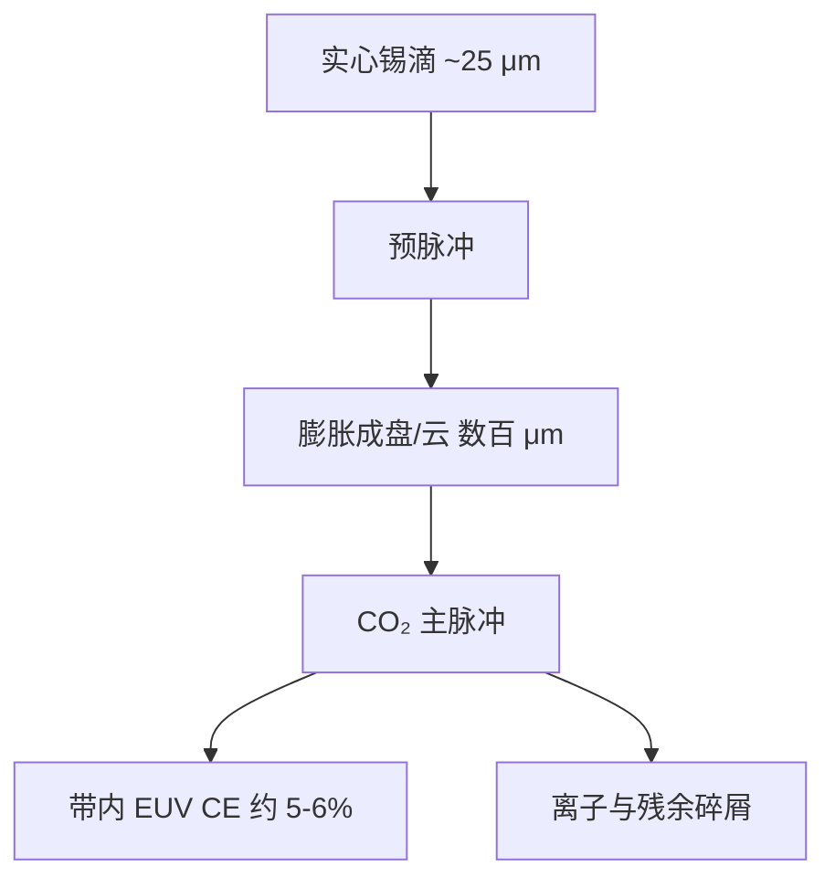

# 预脉冲 + 主脉冲提高转换效率

预脉冲把锡滴展开成盘状靶，主脉冲才能有效耦合；转换效率才能从约 1% 量级抬到约 5–6%。

<footer>—— 改写自 ASML 光源公开材料与 Bakshi, EUV Lithography</footer>

[LPP](/llm/euv-lpp-tin) 若直接把十千瓦级 CO₂ 打在 25 μm 的实心锡球上，大部分红外会被高密度等离子体反射或变成流体力学动能，带内极紫外只占约百分之一。预脉冲（pre-pulse）是量产光源的第一枪：用一束较弱、往往更短波长或不同脉宽的激光先打滴，让它膨胀、压扁成直径数百微米的盘或雾化云，密度和尺度才与主脉冲焦斑匹配。第二枪主脉冲（main pulse）才是出光的那一下。本篇写这两枪的分工、时间窗口和对碎屑的连带影响，不把光源舱的全部工程重写一遍。

## 问题

实心液滴对 10.6 μm 是错误的靶。半径只有十几微米，主脉冲焦斑却要大得多才能承载能量；失配意味着边缘激光打空、中心过密。过密区的临界密度反射把 CO₂ 挡在表面，耦合效率低，同时产生高速喷溅。CE 低会直接转化为：墙插功率暴涨、收集镜热负荷和溅射加剧、IF 功率达不到 [NXE](/llm/asml-nxe) 的剂量合同。

需要一种前置过程：在主脉冲到达前约微秒量级，把靶的特征尺寸从 25 μm 扩到与焦斑相当，把平均密度降到 CO₂ 能在冕区吸收的范围，并尽量做成面向收集镜的盘，而不是各向同性的球。这就是预脉冲。它不是「再加一点能量凑功率」，而是改靶的流体力学初态。

### 球靶的光学与流体力学失败模式

球对激光是变入射角的曲面。迎光面先电离，形成的等离子体羽流把后续能量挡掉；背光面几乎不加热，未电离的锡以微滴形式飞出，成为最难清的碎屑。球的光学厚度沿半径变化，带内发射区体积小。预脉冲要做的，是把球变成近似平板或可控的云，使主脉冲看到一块厚度和密度相对均匀的吸收层，发射区正对收集镜。失败的预脉冲同样危险：展开不够则仍像打实心球；展开过头则靶稀到主脉冲打穿，CE 一样掉。

预脉冲本身几乎不贡献带内功率。评估预脉冲只看它对主脉冲 CE、碎屑谱和滴间稳定性的影响。把两束激光的能量加总去除以 EUV 能量，会把 CE 定义搅乱；公开数字通常仍按主脉冲激光能量来归一，需在原文语境里核对。

## 方法

时序是：滴到位 → 预脉冲 → 自由膨胀（微秒）→ 主脉冲 → EUV 闪光。预脉冲能量远小于主脉冲，但强度要足以汽化/电离表面并驱动冲击波穿过液滴。公开叙述里，预脉冲把滴压成「饼」或盘，盘面法向对准收集镜光轴，厚度降到微米到十微米量级，横向尺寸扩到数百微米。主脉冲焦斑覆盖这块盘，CO₂ 在较低密度下被吸收，离子价态进入 Sn 的 UTA 窗口。

触发依赖滴探测。位置抖动会让预脉冲偏心，盘的法向歪掉，主脉冲看到的是侧缘而不是平板，CE 和离子抛射方向一起变。因此滴发生器、预脉冲瞄准和主脉冲瞄准是同一套伺服，而不是三台独立设备。氢气流在这个时间尺度上近似定常，它不参与展开动力学，但改变膨胀中的阻力和后续离子减速。

### 主脉冲包络与靶的光学厚度

盘靶准备好之后，主脉冲的强度、脉宽和可能的多脉冲包络决定吸收区能否停在带内价态。过强、过短容易做成高速飞散；过长则靶在脉冲结束前解体，后半段激光打在稀薄蒸汽上。量产系统把这些收成封闭配方。公开可写的机制是：最优靶是「对 10.6 μm 光学厚、对流体力学膨胀尚未拆完」的一块锡，寿命只有微秒。预脉冲负责把靶送到这个状态，主脉冲负责在状态消失前把能量耦进去。

$$
\mathrm{CE} = \frac{E_{\mathrm{EUV,in-band}}}{E_{\mathrm{laser,main}}}.
$$

从约 1% 到约 5–6% 是公开材料反复给出的量级跃迁。六倍 CE 意味着同样 IF 功率下激光可以小一个台阶，或同样激光下 IF 可以高一个台阶——这是产能和收集镜热负荷同时改善的杠杆。

## 机制

预脉冲改的是密度标长。激光吸收发生在临界密度面附近；实心液滴把临界面贴在极薄的表层，吸收体积小、反射高。展开后临界面变成一块面积更大的冕，主脉冲的能量在较大体积里热成 20–40 eV 量级的等离子体，正好出 13.5 nm。发射一旦发生，[多层膜收集镜](/llm/euv-multilayer-mirror)只收带内、近正入射的那一部分；盘的朝向相当于把辐射方向图对准收集立体角，几何收集效率也升。

碎屑谱随靶形态变。实心球倾向于喷出大微滴和高速离子；适度展开的盘把更多质量留在电离态，氢刻蚀能清的薄膜锡比例上升。展开过度或偏心则可能产生侧向喷流，打到收集镜特定方位，造成局部损伤。因此预脉冲是光学效率旋钮，也是收集镜寿命旋钮。磁场碎屑抑制仍需要，预脉冲不能替代[气锁与氢清洗](/llm/euv-hydrogen-dgl)。

不要把预脉冲理解成「两次曝光」。硅片只看见主脉冲产生的那一闪 EUV；预脉冲在红外或可见/近紫外，到不了投影物镜。剂量环控制的是主脉冲能量与滴命中率，不是预脉冲的 EUV 产额。

### 与重复频率、抖动和闭环的耦合

50 kHz 意味着每 20 μs 一次完整的「滴—预脉冲—膨胀—主脉冲」。膨胀窗口只有数微秒，伺服必须在滴到达前就算好触发时刻。相邻滴的尾流、氢气流扰动、上一次等离子体的残留电荷都会改变下一次展开。闭环用 IF 功率、滴成像和激光能量当观测量，执行器是两束激光的延时与能量。稳定性比单次最高 CE 更重要：扫描狭缝上的剂量必须片内均匀，否则 CD 先坏，平均功率数字没有意义。

## 边界与工程取舍

预脉冲把 LPP 做成可用，也把光源变成双激光、双瞄准的系统。多一束光就多一处对准、多一套损伤与气锁接口。配方对滴直径敏感：发生器若改尺寸，膨胀时间与盘厚度都要重调，不能把「5–6%」当成与滴无关的物理常数。公开文献里还有双预脉冲、不同预脉冲波长（例如固体激光预脉冲 + CO₂ 主脉冲）的变体；量产采用哪一种，以 ASML 公开叙述为准，不要把会议海报上的实验室靶形写成厂内配置。

CE 的上限仍受锡 UTA 的原子物理和收集立体角限制。预脉冲不能把能量守恒打破，也不能让收集镜免于氢化学与溅射。追求极端 CE 若以微滴暴增为代价，IF 功率短期上升、收集镜寿命下降，工厂的综合成本可能变差。工程取舍是：在目标碎屑谱内把 CE 维持在约 5–6%，并在数十 kHz 下抖动可控。

Bakshi 书中的流体力学与辐射流体模拟解释「为什么要先展开」；ASML 公开的是功率里程碑与锡滴 LPP 架构。二者不要拼成一张未公开的延时—能量表。写文章时把预脉冲与主脉冲分开，避免「双脉冲激光器」这种含混叫法。

## 小结

- 预脉冲改变锡滴的尺寸与密度，使靶与 CO₂ 主脉冲焦斑匹配。
- 实心球耦合差、碎屑差，CE 约 1%；展开成盘后 CE 可到约 5–6%。
- 两枪间隔在微秒量级，瞄准与滴抖动决定盘的法向和厚度。
- 预脉冲几乎不出带内 EUV，剂量由主脉冲那一闪决定。
- 靶形态同时影响辐射方向图和碎屑谱，从而影响收集镜寿命。
- 量产价值是在高重复频率下稳定维持 CE，而不是单次打出纪录。
- 出处：ASML 光源公开材料；Bakshi, *EUV Lithography*。
