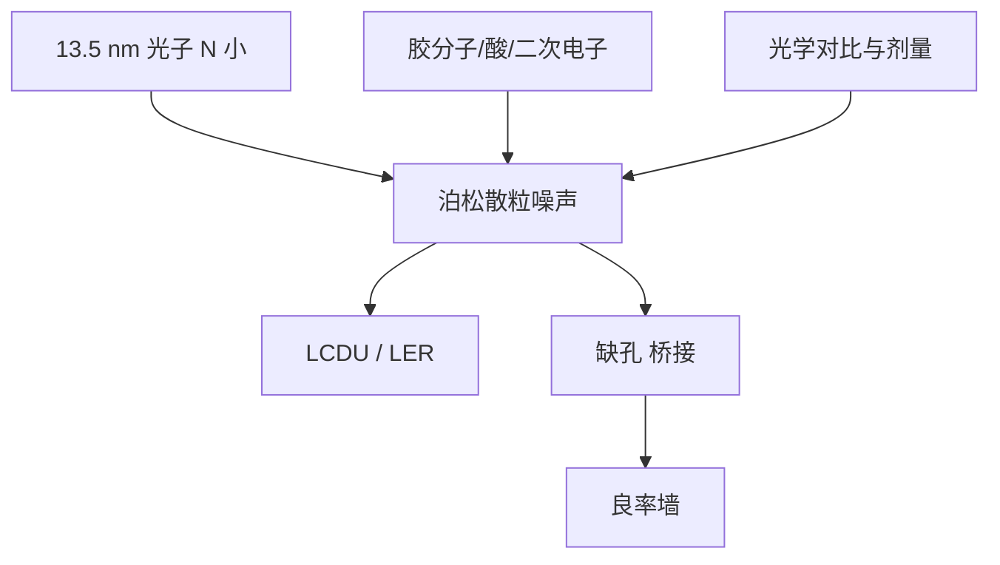

# 随机效应与光子散粒噪声

每个约 92 eV 的光子都算数；剂量不足时，散粒噪声会变成断线、缺孔与局部 CD 波动。

<footer>—— 改写自 Bakshi, EUV Lithography 与业界随机效应公开综述</footer>

瑞利式给出的是平均场分辨率。[NXE](/llm/asml-nxe) 的 0.33 和 [EXE](/llm/asml-high-na) 的 0.55 都假定光刻胶按连续强度分布显影。EUV 光子能量 $hc/\lambda\approx 92\,\mathrm{eV}$，是 ArF 6.4 eV 的十几倍；同样 mJ/cm² 剂量下光子数少一个数量级以上。落到一个 10 nm 级接触孔里的光子可以只有几十到几百，泊松涨落 $\sqrt{N}/N$ 变成局部尺寸抖动（LCDU）、线边缘粗糙、桥接和缺失孔。随机效应（stochastics）还叠上光酸发生剂、分子尺寸和二次电子模糊，不只是光子计数。本篇写噪声从哪来、如何进良率，以及剂量、胶与设计规则怎样换。

## 问题

定义剂量 $D$ 为能量面密度。光子面密度约为 $D/E_{\mathrm{ph}}$。$E_{\mathrm{ph}}\approx 1.47\times 10^{-17}\,\mathrm{J}$，于是

$$
1\,\mathrm{mJ/cm^2}\approx 6.8\times 10^{2}\ \text{光子}/\mu\mathrm{m}^{2}.
$$

20 mJ/cm² 大约 $1.4\times 10^{4}/\mu\mathrm{m}^{2}$。面积 10 nm × 10 nm $=0.01\,\mu\mathrm{m}^{2}$ 时，只有约 140 个光子量级；再扣光学对比小于 1、胶量子产率小于 1，有效计数更少。泊松标准差 $\sqrt{N}$，相对涨落 $1/\sqrt{N}$ 在 $N\sim 100$ 时已是 10%。接触孔阵列上，这表现为有的孔显开、有的孔关死，缺陷率对剂量极度敏感。

DUV 多重图形用更多光子、更大特征，把这个问题藏在平均里。EUV 单次把特征缩小的同时把光子变贵、变少，随机从「计量噪声」变成「良率墙」。只加 NA 而不加剂量或胶效率，墙会前移。

### 光子噪声不是唯一随机源

化学放大胶里，光酸分子数、捕获位点、聚合物尺寸同样离散。二次电子在胶里走几纳米，把「吸收事件」涂开，既贡献分辨率损失，也贡献额外方差。金属氧化物胶吸收截面更高，可用更少的入射光子达到相同酸当量，但簇聚和显影噪声换成另一种化学。掩模吸收体的边缘粗糙、多层膜缺陷，会以固定图案的形式混进「看起来像随机」的 LCDU。分析时要把光子泊松、化学离散、掩模贡献拆开，否则会把 OPC 能修的东西当成要加剂量才能修的东西。

随机效应不是「EUV 胶没做好」的骂人话。即使理想阈值胶，只要 $N$ 小，泊松仍在。胶可以改变从光子到可溶基团的增益与模糊，从而改写有效 $N$，不能让统计消失。

## 方法

工程上盯一组可测指标：LCDU（局部 CD 均匀性）、LER/LWR、缺失/桥接缺陷密度随剂量的曲线。剂量升，光子 $N$ 升，缺陷通常指数下降，直到化学噪声或工艺其他项封顶。于是出现剂量—产能折中：加剂量要降扫描速度或加源功率，直接打 [LPP](/llm/euv-lpp-tin) 和 [磁浮台](/llm/euv-maglev-stage) 的 wph。

缓解分四层。光学：提高对比（SMO、更优光瞳、High-NA 的 MTF）让阈值附近的强度更陡，同样 $\Delta I$ 对应更小 $\Delta CD$。工艺：换高吸收胶、优化 PEB 与显影，减小化学模糊同时保持灵敏度。设计：接触孔放宽、冗余通孔、避免最小孔走最差衬度。计算：随机感知 OPC、热斑检测、以缺陷而不是平均 CD 为目标函数。掩模侧降低吸收体 LER。没有单点魔法。

### 剂量、对比与缺陷指数

缺陷率往往对剂量呈极陡的曲线，像良率对电压。公开图常见「再加几 mJ，缺孔掉一个数量级」。这解释了为何工厂宁愿买更亮的源、忍受更贵的胶，也不在随机悬崖边省剂量。对比度差的图形（弱衬度孔、线端）等效于更少的有效光子，会先掉下悬崖。[pellicle](/llm/euv-pellicle) 的 $T^2$ 损失若不用源功率补回，等于系统性减剂量，随机变差。污染导致的光瞳变形同样伤对比，[氢清洗](/llm/euv-hydrogen-dgl)因此也是随机预算的一部分。

## 机制

泊松：吸收事件数 $n\sim\mathrm{Poisson}(\bar n)$，$\mathrm{Var}(n)=\bar n$。显影把 $n$ 映射成线宽或孔径；映射的斜率是「对比 × 胶响应」。斜率大，同样 $\Delta n$ 造成的 $\Delta CD$ 小，这是高对比光学能抑制 LCDU 的原因。斜率过大且模糊过小，又会把离散分子结构印成粗糙——模糊是低通，既加偏置也减方差。随机优化是在分辨率、灵敏度和噪声之间找模糊的最佳标长。

92 eV 光子打进胶，产生光电子与二次电子，电离事件成簇。簇的空间尺度是 EUV 特有的模糊源，ArF 的单光子能量不够做成同样的簇。金属氧化物纳米颗粒把吸收中心变成离散粒子，粒子统计成为新的泊松源。因此「换胶」是换一套噪声生成器，要重新量 LCDU，而不是假定灵敏度提高噪声一定下降。

不要用像素相机的「ISO 噪声」类比完事。光刻随机发生在潜影化学里，显影是非线性阈值，缺陷是极端尾部事件，不是高斯 LWR 的 $3\sigma$ 那么简单。良率关心的是百万分之一的缺孔，要用极值统计，而不是只报平均 CD。

### High-NA 会不会自动更好

0.55 提高光学衬度、缩小可印节距，对同一尺寸的孔，MTF 更高可能降低 LCDU。但目标孔往往跟着 NA 一起缩小，面积 $\propto CD^{2}$，$N$ 再降。结果不确定，取决于节点把孔缩到多小、剂量加到多少。High-NA 的正确说法是：它提供更高对比的光学工具，随机账要重新算，而不是「NA 高了光子问题消失」。双重 0.33 则把随机与套刻捆在另一张账上。

## 边界与工程取舍

随机效应不否定 EUV 量产：5/3 nm 已经在 NXE 上跑，说明在足够剂量、胶和设计规则下尾部可控。它否定的是「波长除以 NA 就是能印的最小孔」。计量本身也有噪声，要把设备方差从晶圆方差里分开，否则会加错剂量。模拟必须用随机抗蚀剂模型，连续 aerial image 不够。

权威文献是 Bakshi 书中的胶与光子噪声章节，以及 imec、ASML、SPIE 上大量 LCDU/缺陷公开报告。不要把某一胶在某一剂量下的「无随机」宣传写成物理定律。写工艺决策时把源功率、pellicle 透过率、扫描速度和缺陷规格放在同一张表里。

随机与套刻是不同良率通道：前者是单层局部打印失败，后者是层间对不准。EUV 双重会让两者一起出现。单次 High-NA 减轻套刻层数，可能加重单层随机——取舍要按层写，不要全球一句。

## 小结

- EUV 光子约 92 eV，同样剂量下计数远少于 ArF，小面积图形落入泊松稀事件区。
- 随机效应包括光子散粒、化学离散与二次电子模糊，表现为 LCDU、LER 和缺孔/桥接。
- 加剂量、加对比、改胶、放宽设计是四条杠杆，都与产能和成本对打。
- 缺陷率对剂量极度敏感，量产会停在随机悬崖上方而不是瑞利极限上。
- pellicle 吸收、镜面污染和弱衬度图形都会减小有效 $N$。
- High-NA 提高 MTF 但缩小目标面积，随机账必须重算。
- 出处：Bakshi, *EUV Lithography*；ASML / 业界关于 EUV stochastics 与 LCDU 的公开报告。
