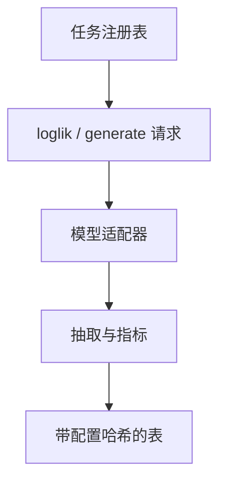

# 评测框架 lm-eval / OpenCompass

分数是脚本的输出。没有冻结的任务注册表、模板与抽取器，排行榜只是各实验室私有管道的合影。

<footer>—— Gao 等 EleutherAI lm-evaluation-harness；OpenCompass 作为并行实现传统</footer>

[上一课](/llm/multilingual-benchmarks)把译文卷与原生卷分列，禁止用单标量平均淹没尾部语种；分词碎片、拒答对齐、污染是三类不同的跌分。缺口是工程。这些选择必须落在同一份可版本化的代码里，否则每个仓库一份 `eval.py`，细差累积成不可复现的「领先 1.2 分」。本课写 lm-eval 与 OpenCompass 如何把任务登记成对象。不重拆多语言跌分。后课饱和默认：你比的是同一 harness 版本上的曲线，不是网页截图。

## 问题

每个模型仓库都有一份 `eval.py`。选项是否归一、GSM8K 抽哪一行、聊天模板从哪来，细差累积成不可复现的「领先 1.2 分」。框架的工作是把任务登记成对象：数据集路径、提示构造、请求类型（loglik / generate）、后处理、指标。EleutherAI 的 lm-evaluation-harness 把这件事做成社区默认；OpenCompass 在中文任务、模型适配与并行后端上给出另一套登记表。二者不是同一份数字，不能混表。

框架还会把错误藏进默认值：某任务默认 0-shot 无模板，某任务默认 5-shot 带聊天。只报「用了 lm-eval」而不报提交哈希与任务配置，等于没报。

HELM 走另一条路：端到端场景、多指标、明确的场景卡。它更重、更慢，适合声明级审计。日常回归用 harness，发布卡用 HELM 或同等场景描述，不要让其中之一吞掉另一。

## 方法

最小可复现包：框架版本或 git SHA、任务列表与 few-shot、$n$ 采样、生成超参、chat template 名、是否 apply 系统提示、随机种子（见[评测方差](/llm/eval-variance-seed)）。输出应保留 per-example 预测，以便事后换抽取器而不重跑模型。

新增任务：先写金标小集人工核对抽取器，再并入全量。禁止把私有提示调优写进「官方默认」。

## 机制

适配器把「模型 API」收成统一请求：补全、对话、对数概率。差异发生在适配器——有的实现把 chat 包装在评测器外，有的在内。同一 harness、不同适配器，仍可差出格式课写过的那几个点。比较开源权重时，应固定适配器实现，而不是固定「都叫 lm-eval」。

并行与缓存必须不改随机性：请求顺序若影响批内数值（极少见但存在于非确定核），要锁种子与批大小。

## 边界

框架不解决污染、不解决饱和、不解决法官偏差。它只冻结仪器。下一课处理仪器还在走、但公开卷面已经没有刻度的情况。

## 小结

- 分数绑定框架版本、任务配置与适配器，三者写入报告。
- lm-eval 与 OpenCompass 分表，禁止混成「开源评测分」。
- 保留逐题输出，抽取器才能后验迭代。
- 出处：Gao 等 lm-evaluation-harness；OpenCompass；Liang 等 HELM。
