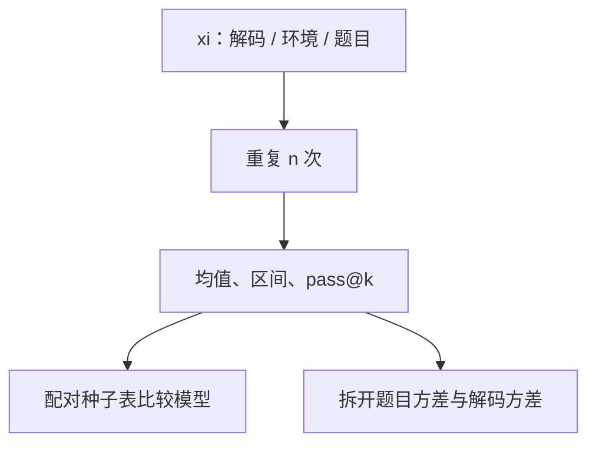

# 评测方差与随机种子

温度非零时，一次解码是随机变量；智能体再叠一层环境种子。只报一个点估计，等于把噪声当成模型差。

<footer>—— 对照 Pass@k、多次独立评测的置信区间；以及解码与数据划分的可复现约定</footer>

[智能体评测协议](/llm/agent-eval-protocol) 冻结了环境与预算。本课补仍被当成「实现细节」的噪声源：**解码种子、温度、评测题抽样、以及 RL 评测时的采样条数**。Arena 的不确定度来自对战次数；这里来自生成随机性。缺口是：同一检查点、同一协议，换种子可以改名次。后课工具训练默认你会用多次运行或 pass@k 说话，而不是一次 greedy 的运气。

## 问题

记一次评测为 $S(\theta,\xi)$，$\xi$ 含：解码 RNG、环境 RNG、题目子集、工具延迟抖动。Greedy（温度 0、无 tie-break 噪声）把解码项关掉，仍留下环境与数据划分。温度 0.7 的单次 GSM8K 可以在合理范围内抖好几个点；代码 pass@1 更抖。论文用单次采样对比两个差 1 分的模型，胜负没有定义。

智能体上 $\xi$ 更大：同一计划遇到工具超时与否。协议若允许抖动而不重复实验，分数测的是基础设施天气。需要：重复次数 $n$、汇总函数（均值、中位数、pass@k）、以及是否共享种子表。

### 种子表是协议的一部分

「seed=42」只钉解码器是不够的。数据加载 shuffle、并行下非确定 GPU 归约、MoE 路由的随机结、FlashAttention 的非确定核，都会让 greedy 也不复现。科学复现应声明：确定性算法是否开启、允许的非确定性核、以及评测是否在同一硬件。做不到完全确定时，**用多次运行的分布代替假确定**。Pass@k 估计的是 $k$ 次独立尝试中至少一次成功的概率，不是把 $k$ 次里最好的那次当主结果却写作 pass@1。训练时拒绝采样用 $k$ 条、评测用 1 条，要写清楚，否则闭环课的数字无法对照评测课。

## 方法

### 重复、汇总与配对比较

回归评测：温度 0 的自动集跑 1 次作 CI 烟雾；发布表对关键集跑 $n\ge 3$ 个解码种子（或 $n$ 次环境重置），报均值与区间。代码与数学生成报 pass@1 与 pass@k（$k$ 与产品重试一致）。智能体报 $n$ 次完整 rollout 的成功率均值，环境种子写入协议哈希。

比较两个模型：用配对（同一 $\xi$ 表）减少方差。非配对的独立种子会把 $\xi$ 差算进模型差。题集很大时，可对题做 bootstrap 估题目抽样方差，与解码方差分开报——两者指导的动作不同：前者扩题，后者降温度或增 $n$。

## 机制

温度升高，解码方差升、探索升。产品解码与评测解码必须一致，否则你在优化一个不过线的分布。RL 训练温度高于评测温度时，评测会系统性偏高或偏低，取决于任务。应在表中写「eval temperature」。

小样本人评的评分员方差通常大于解码方差。这时加解码重复是浪费；应加题或加评分员。自动集则相反。仪器课选人还是自动，本课选 $n$ 花在哪一维随机源上。

长 CoT 的长度本身是随机的，准确率与长度相关，单次运行的「又长又对」会被误读成能力。应报准确率–长度联合，或固定预算评测（长度课已要求）。种子只解解码噪声，不解预算混淆。

### 与污染、过拟合的关系

反复在同一小 dev 上用很多种子调解码参数，是另一种过拟合。种子搜索应在真正 held-out 上只做一次确认。把「幸运种子」写进配置当默认，等于把 $\xi$ 吃进模型卡。发布配置应是事先声明的解码器，不是事后挑的。

## 边界与工程取舍

完全确定性在 MoE + 高效核上可能不可得。工程选择是：CI 用低 $n$ 快测挡回归；发布用高 $n$ 付钱买区间。不要让 CI 的单次 greedy 成为唯一数字源，否则合并请求会为 0.3 分抖动吵架。

多语言、多任务加权总分会把方差不同的子项加在一起。应先分项再加权，并对每项有自己的 $n$。智能体活网评测的方差含网页改版，区间会跨周失效——回到协议课：活网不当主表。

μP 与训练种子是另一件事：训练不可复现不等于评测可以不报 $n$。两者都要，但本课只约束评测实验设计。

## 小结

- 评测是 $S(\theta,\xi)$；必须规定 $\xi$ 的哪些维被重复、如何汇总。
- 发布表用多次种子或 pass@k，配对比较模型；禁止幸运种子默认。
- 拆开题目抽样方差与解码方差，动作不同。
- 评测温度与产品解码一致；长链还要固定预算。
- 不确定核存在时用分布说话，不假装 greedy 可复现。
- 出处：pass@k 估计传统；实验设计中的配对与重复测量。
