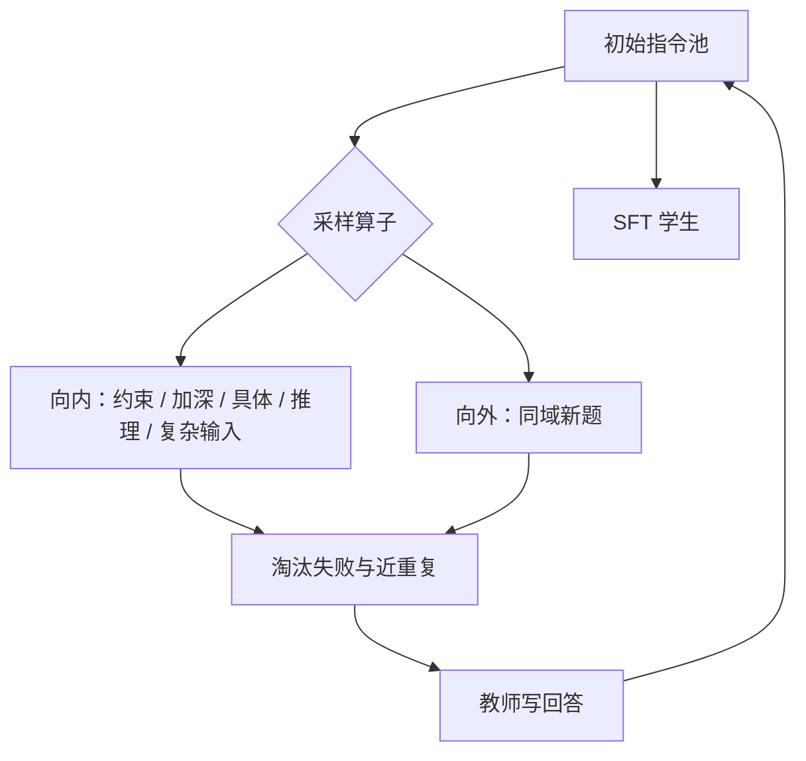

# WizardLM Evol-Instruct

对已有指令反复施加加深、加约束、具体化、加推理步和换主题等演化操作，得到更难、更多样的指令，再用它们微调，使模型更能遵循复杂请求。

<footer>—— Xu et al., WizardLM: Empowering Large Language Models to Follow Complex Instructions, 2023</footer>

Xu、Sun、Zheng 等人 2023 年的 WizardLM 把指令数据的主矛盾从「条数不够」换成「不够难」。Alpaca 式 [Self-Instruct](/llm/self-instruct) 已经能从种子铺出数万条题，但复杂度大致停在种子水平：加一个约束、换一个名词，模型在 Vicuna 风格的开放对话上像助手，一碰到多约束、多步推理、具体领域细节就露怯。Evol-Instruct 用教师模型对指令做受控改写，分成向内加深（in-depth）和向外换题（in-breadth），迭代若干轮，丢掉失败演化，再用演化后的指令生成回答并微调 LLaMA。本篇写这组演化算子、淘汰规则，以及「更难」如何变成可训练的监督，而不是把 WizardLM 的排行榜分数当成方法本身。

## 问题

Self-Instruct 的横向扩展增加动词与主题覆盖，不增加单题的结构深度。用户复杂指令的典型形态是：多个约束同时成立、要求给出推理过程、输入本身已经很长或很具体、或在同一领域里改问法。人写这种题很慢；随机提高生成温度只会得到不可执行的胡题。需要一组可重复的改写，把题从「总结这段」推到「总结这段、保留数字、按时间排序、并指出三处不确定」。每一步仍要能被教师回答，否则监督是噪声。

WizardLM 还面对开源评测当时的偏置：展示型对话偏流畅和礼貌，不偏难。若只在那种集上调，演化没有必要。作者因此要单独构造更难的测试指令，用人评比较 WizardLM 与 Alpaca、Vicuna。方法论文的主张是：在复杂指令子集上的偏好，来自训练分布被主动推难，而不是来自更大的基座。

### 演化是对指令的改写，不是对模型的强化学习

算子作用在题面上。回答仍由教师（或同一次生成）写出，学生做 SFT。不要把 Evol-Instruct 读成 Evol-RL：没有奖励模型，没有对策略采样的偏好环。难度来自数据，不来自 PPO。若教师答不好演化后的题，这条样本应被淘汰，而不是硬写进损失——否则学生在学失败的推理腔。

in-depth 与 in-breadth 不能互相替代。只加深会把同一道题绕成绕口令，覆盖仍窄；只换题会回到 Self-Instruct 的水平。论文把二者放进同一迭代，是为了同时要深度和主题多样性。

## 方法

从 Alpaca 52k 一类初始池出发。每一轮对池中指令采样一种演化提示。向内五种常见操作：加约束、加深（对某一要求继续追问细节）、具体化（把抽象题落到实体与数值）、增加推理步、使输入更复杂。向外一种：基于当前指令生成同一领域的新指令，避免只在原题上打补丁。教师执行改写后，用规则淘汰：演化失败（题不可理解、与原题矛盾、变成绘画等不支持模态）、与池中已有指令过近、或过长过短。存活指令再生成回答，进入下一轮。原文做约四轮，池子相对初始放大数倍，难度随轮次上升。

微调学生为 LLaMA 7B/13B，损失仍是回答段的因果 LM。评测分开放对话与专门的复杂指令集。人评时把复杂度本身当作切面：同一对模型，在简单题上可能接近，在多约束题上差距拉开——这是为了证明演化不是无差别地「多一点数据」。

### 淘汰规则比算子列表更关键

加约束很容易加到互相矛盾（「不超过 50 字」又「逐条引用全部条款」）。加深很容易变成无限追问，教师开始胡编细节。具体化很容易把题绑死在教师记忆里的错误事实上。没有淘汰，演化轮次越多，噪声比例越高，SFT 会学到「面对难题就写得更长更自信」。论文用启发式和教师自检做淘汰，这是方法能迭代多轮的前提。复现时若只抄五条提示、不抄淘汰，得到的是更脏的 Alpaca，不是 Evol-Instruct。

## 机制

向内演化改变的是完成该指令所需的潜在计算：更多约束意味着输出要同时满足多个谓词；更多推理步意味着中间变量要在文本里显式出现；更复杂的输入意味着注意力要覆盖更长的题面。SFT 不会给模型新的算法模块，它会提高「遇到这种题面就进入长答、分点、逐步」的条件概率。若基座本来就不会多步推理，演化监督会变成模仿教师的推理格式，对错另说。WizardLM 的增益因此依赖教师强于学生，本质是难例蒸馏，自举色彩比 Self-Instruct 原文更弱。

向外演化防止难度坍缩到单一题型。同域新题仍然受教师主题先验限制：教师没见过的专业规程，换题也换不出来。迭代把「浅而广」的 Self-Instruct 池改成「深浅混杂」：保留部分原题，加入多层演化后的题，避免灾难性遗忘简单遵循。这与课程学习同构，只是课程由提示算子自动生成，而不是人排课表。

人评复杂指令时，更长的回答容易赢。演化恰好鼓励长推理。应同时报长度匹配的对照，或要求评委按约束满足数打分，否则「更难的训练」会与「更长的套话」混在一起。

### 与 LIMA 的难度轴不同

LIMA 主张一千条精选人写足以定风格，前提是基座已有能力。Evol-Instruct 主张训练分布要包含难指令，否则复杂遵循出不来。二者可以叠：用 LIMA 定口吻与拒答，用演化表覆盖多约束题型。互相否定没有意义。WizardLM 没有声称少量数据够用，也没有声称人写无用；它声称的是：在开源教师蒸馏的设定下，主动加难比同质扩表更有助于复杂指令。

## 边界与工程取舍

教师错误会被加深：错的具体化比错的抽象题更像事实。安全上，加约束也可能把危险题变得更可执行（更具体的犯罪步骤）。演化管线必须接安全过滤，不能只接 ROUGE。多轮对话、工具调用需要另写算子；原文算子针对单轮任务型指令。轮次不是越多越好：过深的题教师自己失败率上升，有效样本下降，学生开始模仿失败。

评测切面要预先写死。若发布后再用自己演化出来的测试集做人评，训练与测试同源，增益被高估。应使用独立的复杂指令（人写或另一套算子、另一教师）。开源排行榜随后把 WizardLM 推到「遵循更好」的位置，混合了基座、数据、评测协议；引用方法时应回到算子与淘汰，而不是某个 7B 检查点的 arena 分数。

把 Evol-Instruct 接到 DPO 之前，先确认演化回答的质量配得上「被选中的赢家」。用失败演化当 $y_w$，偏好学习会强化胡编。演化表更适合当 SFT 难例，偏好对仍应对同一提示采样再标。

## 小结

- Evol-Instruct 对指令做向内加深与向外换题，迭代生成更难、仍可答的训练题。
- 向内算子包括加约束、加深、具体化、增加推理、复杂化输入；向外补主题覆盖。
- 淘汰失败演化与近重复，是多轮仍可用的前提。
- 学生做 SFT，方法是难例蒸馏，不是强化学习。
- 复杂指令上的人评增益，应与长度、评测同源分开报告。
- 与 Self-Instruct 是纵对横，与 LIMA 是难度对风格，可以同时用。
- 出处：Xu et al., *WizardLM: Empowering Large Language Models to Follow Complex Instructions*, 2023。
