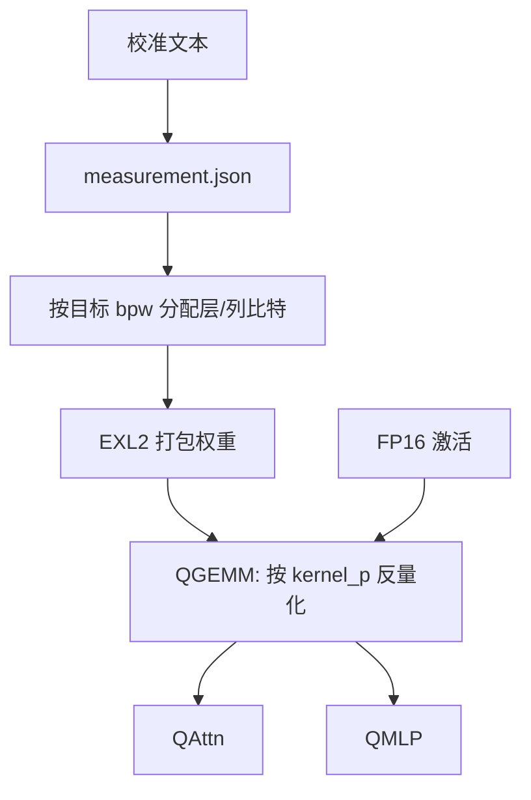

# ExLlamaV2 内核

    
同一层里可以同时有 2-bit 与 6-bit 的列：平均码率是目标，核要在几乎不罚吞吐的前提下按列切换格子。

    <footer>—— turboderp, ExLlamaV2 / EXL2 说明与 convert.md；对照 MARLIN 论文中的核对比</footer>

GPTQ 给出按层最小二乘的 4-bit 网格；落地时还要一颗把「打包权重 × FP16 激活」跑满带宽的核。第一代 ExLlama 把 GPTQ 的 act-order 重排做成可高效执行的推理器。ExLlamaV2（turboderp）在此之上引入 **EXL2**：同一模型、甚至同一线性层内混合 2/3/4/5/6/8-bit，用测量pass 把平均比特率打到任意介于 2 与 8 之间的目标，并配上自己的 QGEMM / QAttn / QMLP CUDA 核。它的主场是单卡、小 batch、要在 24 GB 里塞下 70B 一类的交互式生成。服务端中等 batch 的稠密 INT4，[Marlin](/llm/marlin) 更接近屋顶线。本篇写 EXL2 合同与核，不把 Hugging Face 上某个 `.exl2` 仓库的墙钟写成论文数字。

## 问题

固定 4-bit 对所有层一视同仁：浅层或注意力投影可能浪费比特，深层 MLP 又不够。想把 70B 塞进 24 GB 并留下 2k 上下文，平均码率往往要落到 2.5–3.5 bpw，纯 3-bit 或纯 2-bit 会在某些层先坏。需要一种格式：以**平均比特**为约束，把比特预算分给量化误差更大的模块或列，并且推理核不能因为「这一行是 3-bit、下一行是 6-bit」就退化成解释器。

V2 仍兼容 V1 的 4-bit GPTQ 权重，但主路径是新格式。量化基于与 GPTQ 相同的优化思想（二阶补偿 / 按误差分配），不是 AWQ 的激活保护，也不是 QLoRA 的 NF4。问题是双重的：离线如何选每层、每列的比特；在线 QGEMM 如何用一份模板核吃多种 `kernel_p` 比特标志。

### 测量 pass 与目标 bpw

`convert.py` 分两趟。第一趟对每个模块用校准数据反复量化，测量多种比特设置下的误差，写出 `measurement.json`（文档提醒这一趟约等于把模型量化十几次，务必存盘）。第二趟在总平均比特约束下组合各层参数，使整网最大误差尽量小。`-b` 是目标平均 bpw；`-hb` 单独指定 `lm_head`，默认 6 bit。同一份 measurement 可以打出 3.0、4.0、4.5 多个成品，不必重测。校准是 Parquet 文本；换域会改误差排序，从而改比特分配——这是 GPTQ 家族的固有过拟合通道。

作者自述：Llama 2 70B 在 **2.55 bpw** 量级可在单卡 24 GB、2048 上下文上产出「连贯且大体稳定」的生成；13B 约 2.65 bpw 进 8 GB。这是 2023–2024 年的显存叙事，绑定当时模型与实现，不是 2026 年所有 70B 的 SLA。

EXL2 允许「类似稀疏量化」：重要列用更多比特。ExLlama 把 act-order 的重映射技巧用到混合比特上，使列置换后访存仍规则。核看到的是重排后的连续段（`rows_8` … `rows_2` 计数），不是随机 bitwidth 跳变。

## 方法

运行时权重以打包整数、分组尺度、`q_group_map` / `q_perm` 驻留显存。QGEMM（`q_gemm.cu`）按格式走 EXL2 或 GPTQ 模板：加载 FP16 激活进共享内存，按行组的比特宽反量化权重，点积累加，再乘尺度。`kernel_p` 是编译期比特标志，指示本矩阵出现过哪些比特宽，用来裁掉未用的分支。$M$ 有上限（EXL2 与 GPTQ 路径不同）；更大的 batch 会切块多次发射，这是小 $M$ 优化留下的痕迹。

QAttn 把 QKV 投影、RoPE、注意力、输出投影串进量化感知路径；QMLP 覆盖 SwiGLU 一类门控 FFN，并延伸到 MoE、张量并行、LoRA 叠加。融合的意义与 TE 类似：减少 FP16 中间写回。Flash-decoding / 分组查询是否走最优注意力核，随版本变，要以当时仓库为准，不要假设「ExLlama 的注意力等于 FlashAttention-3」。

### 与 GPTQ 文件的关系

V2 可以加载旧 GPTQ 4-bit，走另一套 `q_gemm_kernel_gptq`。EXL2 成品不能当 AutoGPTQ 的 `.safetensors` 丢进只认 Marlin layout 的 vLLM 路径。平均 4.0 bpw 的 EXL2 也不是「GPTQ-4bit」：层间比特不同，PPL 与体积都不可比。复现质量应对齐校准集、`-b`、以及是否冻结 `lm_head`。

## 机制

混合比特能接近给定容量下的更优误差，是因为量化误差对下游 loss 的敏感度跨层、跨列不均匀。测量 pass 用校准激活上的层输出误差当代理，把比特给代理误差大的模块。这与 GPTQ 的 Hessian 补偿是同一哲学的资源分配版：不是每层 4-bit，而是**全局比特预算的 greedy/组合分配**。代理不是任务损失，换聊天、代码、长上下文，最优分配会变。

核侧，重排把同比特列聚在一起，使 warp 走同一反量化路径。代价是权重布局与框架 `nn.Linear` 的 $(N,K)$ 不再相同，导出/再训练要经过官方转换器。小 $M$ 时，占用率与访存合并主导；Marlin 论文图显示随 batch 增大，ExLlamaV2 相对理想 4× 掉得比 Marlin 快——混合比特分支与为 decode 设计的 tile 在更高算术强度下不占优。这不是贬义：产品目标本就是单用户显存极限。

「2.55 bpw 能跑 70B」描述的是显存可行性与主观连贯，不是 MMLU 无损。更苛刻的指标仍应看校准域上的 PPL 与目标任务。lm_head 留 6-bit 是因为词表投影误差直接进 logits，对采样比中间层更可见。

## 边界与工程取舍

### 单机交互式与服务编排不是同一产品

ExLlamaV2 不是服务编排器：连续批、PagedAttention、多租户公平性要另接。vLLM / SGLang 后来的 EXL2 后端若存在，形状与特性集会小于官方仓库（LoRA、投机、多 GPU）。Windows 桌面与 Linux 服务器的驱动、图捕获（仓库里对 CUDA graph 的测量标签）行为不同。不要在 H100 上用「A10 上的 tokens/s」规划容量。

何时用 EXL2：本地 24/48 GB 卡、要低于 4 bpw 的体积、接受校准域过拟合、单流或小并发。何时改 Marlin / AWQ 服务核：API batch、固定 4-bit、要可预测的中等 $M$ 加速。何时改 MXFP4 / NVFP4：有原生 4-bit MMA 且检查点走 OCP 或 NVIDIA 块缩放。三者检查点不可互换。

量化墙钟对 70B 以小时计；保存 measurement 是工程纪律。不要用 bitsandbytes 动态 4-bit 的加载时间去对比 EXL2 的离线转换。

出处：turboderp-org/exllamav2 README（EXL2 混合 2–8 bit、测量 pass、Llama 2 70B 2.55 bpw 自述）与 `doc/convert.md`；核见 `exllamav2_ext/cuda/q_gemm.cu`、`q_attn.cu`、`q_mlp.cu`。批处理对比见 Frantar et al. MARLIN 论文 Figure 1。GPTQ 算法对照 Frantar et al., ICLR 2023。

## 小结

- ExLlamaV2 的主格式 EXL2 按目标平均 bpw 在层与列间混合 2–8 bit，核按重排后的比特段反量化。
- 两趟转换：先测误差再分配比特；measurement 可复用。
- 优化点是小 $M$、极限显存的交互式生成，不是连续批的 4× 屋顶线。
- 兼容旧 GPTQ 4-bit，但不等于 Marlin layout 或 AWQ 包。
- 自述的 70B@24GB 是容量故事，质量要另签任务指标。
- 出处：ExLlamaV2 仓库与 convert 文档；服务对比见 MARLIN。
