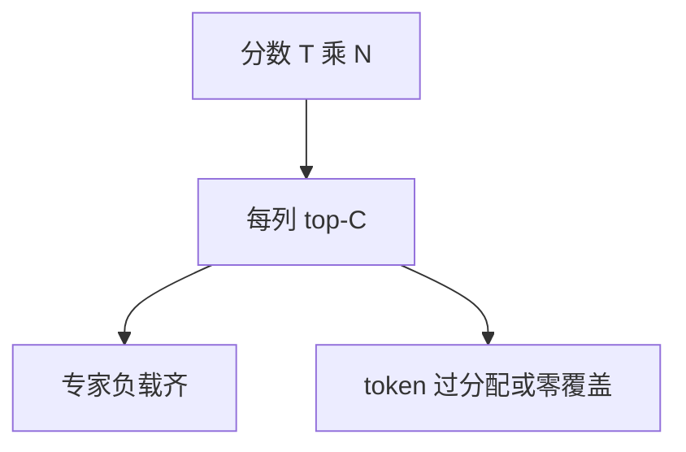

# Expert Choice 论文

让每个专家在自己的容量内挑选 token，专家维负载天然齐平；有的 token 会被抢多次，有的一次都轮不到。

<footer>—— Zhou et al., Mixture-of-Experts with Expert Choice Routing, NeurIPS 2022</footer>

[Switch 原文](/llm/fedus-switch) 是 token-choice：$k=1$ 时每行取 argmax，再用容量因子 drop。Zhou、Lei、Liu 等人把矩阵转过来：**每列（专家）取 top-$C$**。主干 [Expert-choice 路由](/llm/moe-expert-choice) 已写机制；本篇对照论文主张与实验边界，并提醒自回归解码的不一致是原文就必须面对的。

## 问题

Token-choice 的均衡靠辅助损失，失败则专家饿死或过载 drop。作者问：若约束直接写在专家配额上，还能否提高专家利用率与下游质量？分数矩阵 $S\in\mathbb{R}^{T\times N}$，列上 top-$C$、$C$ 由目标等价负载决定，则每个专家恰好 $C$ 个 token。

副效应：行和不再恒等于 $k$。过分配与零覆盖是论文必须处理的对象，不是实现 bug。

### 训练可见整段 $T$

编码器或训练期整句可见时，列 top 合法。逐步解码没有未来行。论文语境含预训练与理解任务；把它当 LLM decode 默认路由，需要近似，主干课已写。作者名单以 Yanqi Zhou、Tao Lei、Hanxiao Liu 等为主，Google 线。引用用论文题名，不要用内部别名当文献。

## 方法

### 列上 top-$C$ 与回退

对 $S$ 每列取 top-$C$，只在选中位置做专家 FFN。负载统计变为近乎常数，辅助损失可以减弱。对零覆盖 token 的回退（残差或强制分配）影响质量，属于实验选择。评测对比同参数 / 同计算下的 token-choice。覆盖率与下游应同时报，否则「利用率上升」只是负载直方图好看。

## 机制

竞争从「token 抢热专家」改为「专家抢高分 token」。利用率上升是直接推论；专业化方向取决于分数是否分列归一。论文用实验支持质量，而不是只报负载直方图。读者应同时看下游与覆盖率——原文若偏重利用率，工程复现仍要补覆盖日志。

与 Switch 的 drop 伤害对象不同：Switch 丢过载门口的人；EC 丢无人认领的人。长尾语言风险在论文的通用语料平均里可能被稀释。

容量 $C$ 在 EC 里是吃满配额，在 Switch 里是上限。同一符号，对照时必须说清等式还是不等式。

### 在对照链中的位置

下一篇 z-loss 对照稳定训练；EC 本身减轻均衡损失，但不自动解决 logit 爆炸。不要把「不用辅助损失」写成 EC 的全部贡献——那是负载几何，不是数值尺度。

## 边界与工程取舍

小 $T$（微 batch）时 top-$C$ 统计崩溃。packing 跨样本会让专家跨句抢 token，论文设定若为单句 / 规范 batch，搬到 LLM packing 必须加掩码。生成任务要用 token-choice 近似，训练–推理差是一等限制。

NeurIPS 2022 的数字绑定他们的模型与数据。Mixtral / DeepSeek 产品默认仍是 token-choice，说明工业默认并未翻转。对照价值是指出负载约束可以写在另一条轴上。

题名 *Mixture-of-Experts with Expert Choice Routing*。会议 NeurIPS 2022。

## 小结

- 原文把路由改为专家侧 top-$C$，专家负载齐、token 覆盖不齐。
- 针对 token-choice + 辅助损失 + drop 的配方提出替代几何。
- 自回归 decode 不能原样执行列选择。
- 利用率不是唯一验收；须看零覆盖与下游。
- 出处：Zhou 等，NeurIPS 2022。
