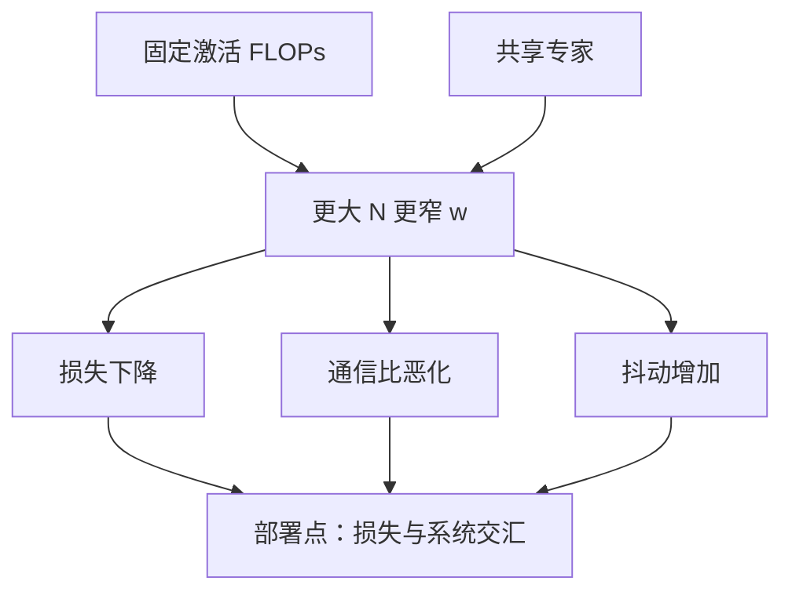

# 专家粒度与数量律

同样的激活预算，把一个宽 FFN 切成许多窄专家，有时比加几个宽专家更划算；系统账上窄专家却先把通信-计算比打穿。

<footer>—— Krajewski et al., Scaling Laws for Fine-Grained Mixture of Experts, ICML 2024；Dai et al., DeepSeekMoE, 2024</footer>

「架构进阶」最后一课把 MoE 单元收成一条可执行的律。[通信-计算比](/llm/moe-comm-compute-ratio) 要求专家别太窄；DeepSeekMoE 与细粒度缩放律声称更细更好；[PEER](/llm/peer-million-experts) 是细的极限。[注意力 MoE](/llm/attention-moe) 不在这条律的适用域。本课写 FFN 专家的宽度–数量权衡，并标明何时停止切细。Clark 等人把路由模型的有效参数与激活计算分开拟合，提醒不能拿稠密 Chinchilla 系数直接套。

## 问题

固定每次前向的激活参数（$k$ 个专家的宽度和），可以「少而宽」或「多而窄」。稠密缩放律不管这条轴。缺口是 MoE 自己的缩放：在激活 FLOPs 与数据量固定时，$N$ 增大、$w$ 减小，损失如何走，以及系统约束在哪一点把统计规律截断。

不要把「更多专家」写成「更大模型」。总参数可以涨而激活不变，那是稀疏；细粒度是在激活不变时改切法。两者在论文表里经常混报。共享专家是隐藏参数：常开宽枝把一部分 FLOPs 从 All-to-All 里拿出来，细路由枝才敢窄。

激活 FLOPs 不是总参数。律比较的是这条激活预算下的损失，不是「参数越多越好」。

## 方法

实验轴：固定 $k\cdot w\cdot d$（含共享），扫 $N$（因而 $w\propto 1/N$ 若总中间宽均分），画验证损失。再固定 $N$ 扫 $k$。第三条轴共享专家宽度。质量最优往往在较大 $N$、较小 $w$、$k>1$、加少量共享。然后叠加 $\rho$、探针 Jaccard、召回类任务。

取部署点：在损失曲线仍下降、$\rho$ 可重叠、抖动可控的最大 $N$。不是损失最低的实验室点。节点受限与层次在大 $N$ 上几乎是必选项。注意力专家宽度另算：上一课已说明 KV 与 $n$ 会先撞墙。

哈希能支撑大 $N$ 但不给内容特化，损失平台更高。Soft 不能把 $N$ 做大。预训练用细粒度，部署再按[剪枝合并](/llm/expert-pruning-merging) 收回 $N$，是一条兼容路径。

## 机制

更细的专家让门做更细的 Voronoi，组合数 $\binom{N}{k}$ 增大，同样激活下表达力上升——前提是门学得会、token 真的需要不同切片。过细时单个专家看不见连续短语，且 $\rho$ 变差、边界 token 更易抖。共享专家提供不必切片的公共基底，允许叶子更窄。

因此粒度不是单调的「越细越好」。有共享、节点受限、$k$ 足够时，细切窗口变宽；平坦 Switch、$k=1$、无共享时，窗口很窄。数据不够时大 $N$ 的叶子吃不饱，律逆转：宁宽勿细。报律必须声明这些配方。

这条律不迁移到注意力专家，也不迁移到 SSM 状态维。专家是 FFN 容量，不是 KV，不是序列记忆。

## 边界

不要在小规模代理上扫完细粒度就直接乘到万亿。不要把 PEER 的百万当成目标点。微调后最优会漂移；预训练的粒度要给剪枝留冗余簇。课序到此结束「架构进阶」。下一课转入预训练工程的分词器：[预分词正则](/llm/pretokenization-regex) 问序列怎么切，不再问专家怎么切。设计检查清单：激活预算、$N$ 与 $w$、共享、$k$、$M$、$\rho$、抖动指标、是否只 FFN 专家。

## 小结

- 同样激活 FLOPs 下，FFN 专家偏多而窄往往更参数高效，直到通信、抖动与叶子吃不饱截断。
- 共享专家是细粒度的配套；部署点不等于实验室最低损失。
- 律只覆盖 FFN 专家，不含注意力 MoE 与 SSM 状态。
- 剪枝可以训细推粗。
- 出处：Krajewski et al., ICML 2024；Dai et al., 2024；Clark et al. 对路由缩放的讨论。
