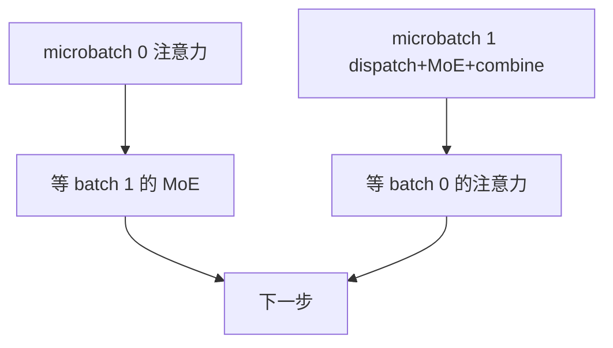

# Decode 侧 Expert Parallel

解码最小单元为 40 节点 320 GPU；MoE 走 EP320，每卡一个专家，分发与合并用 IB 点对点，并借助 IBGDA 压延迟。

<footer>—— DeepSeek-AI，DeepSeek-V3 技术报告部署节，arXiv:2412.19437，2024</footer>

训练和预填的专家并行，batch 里有足够多的 token，All-to-All 的 payload 能盖住启动开销，GEMM 也接近计算墙。自回归 decode 每步每个请求只追加一个 token，即使连续批把并发堆起来，每专家的 $M$ 仍常常落在「几百以下」。DeepSeek-V3 写过解码时每专家 batch 通常 **不超过 256 token**，瓶颈是访存不是算力。把训练拓扑（EP32、每卡多专家、分层 IB+NVLink）原样搬到逐步生成，会为几十字节的激活付一次集合通信的尾延迟。Decode 侧 EP 要单独设计：更宽的并行度、更少的每卡专家、点对点而不是大集体、以及和注意力重叠的调度。

## 问题

Decode 的工作集是「本步所有请求的一个新 token」加整段 KV。MoE 还要加上专家权重。若把 256 个路由专家复制到每张生成卡，HBM 先被专家库吃光，KV 与并发没地方；若仍用小 EP、每卡很多专家，则每张卡每步都要扫过许多未被选中的专家权重——稀疏的意义只剩下「没算 FLOPs」，带宽账与稠密 FFN 接近。EP 的价值在 decode 上首先是 **每卡只驻留少量专家，权重流量按 $1/E$ 降**，其次才是算力分摊。

通信形态却变差。预填 $T$ 大，dispatch 的 $\mathrm{bytes}\propto kTd/E$ 可观；decode 的 $T$ 等于当前 batch 里的活请求数，往往只有几十到几百。NCCL All-to-All 的启动延迟、跨节点的握手，会高过 GEMM。V3 因此在解码阶段改用 **直接点对点 IB**，并启用 IBGDA（GPU 直接发起 RDMA，少绕主机），目标是逐步延迟而不是峰值带宽利用率。

### 共享专家在解码里变成第九个必选专家

V3 把共享专家在解码时视为「永远被选中的重负载路由专家」，于是每 token 选 9 个专家。共享支路不再是「每卡本地一份、不算进 EP」的旁路，而要占物理槽位、进 EPLB 的负载向量。若实现仍在每张卡上复制共享专家，EP 的显存账又涨回去一块；若只放在少数卡上，所有 token 都要额外打到那些卡，它们成为永久热点。64 张卡专门承载冗余专家与共享专家，就是为这个结构付的固定税。

Mixtral 8 专家、top-2 的 decode 常常整模型 TP 或专家全复制，因为 $N=8$ 放得下，逐步 All-to-All 不值得。本篇的对象是 DeepSeek-V3 / R1 这一类 $N$ 到百、必须 EP 才能把权重铺开的解码。不要用 8 专家的延迟曲线外推 EP320。

## 方法

V3 公开的解码最小部署单元：

- 40 节点 × 8 GPU = 320 GPU。
- 注意力：TP4 + 序列并行，再叠 DP80。
- MoE：EP320。每卡一个专家；64 卡放冗余专家与共享专家。
- Dispatch / combine：IB 上的点对点，而不是训练时「IB 到同号 GPU 再 NVLink 转发」的两跳集体。

每卡一个专家使本地 MoE 变成「只加载一份 FFN」。V3 明确写：内存访问开销很小，即使用较少 SM 跑 dispatch+MoE+combine，也不怎么伤这段；注意力才是 decode 时间的大头。于是调度改成：两个计算量相近的 microbatch，一个在做注意力，另一个在做 dispatch+MoE+combine，并且后者只分到少量 SM，以免抢注意力的带宽。

### 通信后端从集合改成点对点

训练 / 预填：token 先 IB 到目标节点同号 GPU，再 NVLink 转发，warp 分工，吃的是带宽，SM 占用约 20 个里划出通信通道。解码：目的 rank 由「每卡一个专家」直接决定，路径是 GPU 到 GPU 的 RDMA。IBGDA 让 GPU 自己发描述符，减少 CPU 参与的 doorbell。延迟的主导项变成 HCA 往返与小消息速率，而不是 GB/s。实现若仍调用一次全局 `alltoall_v`，内部可能仍按全连接握手，对 $E=320$ 的小消息极不友好。

EPLB 在解码侧仍然周期更新冗余集合，但「每卡一个专家」意味着重平衡是换整卡的身份，而不是在卡内重排 8+1 个专家。动态冗余（每卡多驻留、每步只激活一部分）在解码里被报告写成「仍在探索」，因为选哪一份副本必须和 dispatch 核融合，否则每步的路由优化本身就拉高 TPOT。

## 机制

Decode 侧 EP 的屋顶线与预填相反。专家 GEMM 的算术强度约为 $O(d_{\mathrm{ff}})$ 量级的一次矩阵-向量（$M$ 小则接近 GEMV）。HBM 上扫一份专家权重大约是 $2\cdot d\cdot d_{\mathrm{ff}}$ 个元素（SwiGLU 再加倍）。EP 度升高，每卡扫的权重下降，这才是 decode 加速的主因。通信每 token 每层大约 $2k$ 次发送（去程 $k$、回程 $k$），消息大小 $d\cdot s$ 字节。$d=7168$、BF16 时一条激活大约 14 KB，相对一次集合启动并不大，所以 **消息速率和尾延迟** 决定 TPOT。

注意力与 MoE 的时间比也翻转。预填注意力是 $O(s^2)$ 量级的大 GEMM，MoE 也有大 $M$；解码注意力是读 KV 的带宽墙，MoE 是读专家权重的带宽墙。V3 说注意力占比更大，因此重叠时把 SM 留给注意力。若实现把 80% SM 绑在 MoE 通信核上，会得到「EP 很忙、生成反而更慢」。

MLA 压缩的是 KV 字节，不压缩专家权重。Decode EP 解决的是 MoE 参数铺不开、逐步通信延迟大；MLA 解决的是长生成时缓存铺不开。两者同时出现在 V3 的服务栈里，分母不同，不要合成一个「5.76×」。

### 连续批、PD 分离与 EP 度

连续批把不同请求的 decode 步拼成一个小 batch，是让每专家 $M$ 离开 1 的主要手段。但拼得越大，尾延迟越差：快请求要等慢请求的 MoE 通信。PD 分离让预填走 EP32 一类「算得满」的拓扑，解码走 EP320 一类「权重大、消息小」的拓扑，避免同一次 All-to-All 服务两种屋顶线。EPLB 的放置也因此分成两套：预填用层次装箱，解码用全局复制。把预填卡临时拿来跑 decode，EP 度与每卡专家数都不对，热专家会立刻露出来。

设备限制路由在解码仍有意义：一个 token 去太多节点，点对点连接数上升。V3 训练有「最多 4 节点」；解码每卡一专家时，9 个专家可能落在 9 个节点上，这是延迟预算必须包含的 hop 数。冗余专家的价值之一是让热点逻辑专家在拓扑上有多个落点，dispatch 可以选「更近或更空」的副本。

## 边界与工程取舍

不要在 $E$ 很大时假设 NCCL 默认 All-to-All 与 IBGDA 点对点等价。前者为训练吞吐调过，后者为小消息延迟调过。基准必须报 TPOT 分位数，而不是只报 tokens/s。单请求 $M=1$ 的延迟不能用满 batch 吞吐反推。

每卡一个专家使故障域变细：一张卡坏了，某个逻辑专家（若无副本）直接消失。冗余 64 卡是可用性，不只是均衡。检查点恢复、滚动升级都要先保证逻辑专家的覆盖，再谈负载。

小集群复制不了 320 路 EP。降 EP、每卡多专家，decode 会回到「扫多份权重」的带宽墙，这是硬件规模问题，不是把 IBGDA 开关打开就能假装 EP320。Mixtral 类小 $N$ 继续用 TP 或复制，是正确的工作点选择。

出处以 V3 报告第 3 节部署为准。开源框架里的 EP decode 是后续工程（vLLM、SGLang、TensorRT-LLM），通信后端名字会变，但合同仍是：小 $M$、宽 EP、点对点、与注意力重叠。不要把 DualPipe 训练重叠写成解码重叠——microbatch 的切法不同。

量化改变账本：专家走 NVFP4 后权重流量再降一档，EP 度可以略减仍放得下，但 dispatch 的激活若仍是 BF16，通信侧几乎不降。要对齐「权重精度」和「激活精度」，否则优化只发生在 GEMV，不发生在 IB。

## 小结

- Decode 侧 EP 的主收益是每卡少驻留专家、降低逐步扫权重的字节，而不是把 GEMM 做满。
- 小 $M$ 使集合通信的启动延迟不可接受；V3 用 EP320 + IB 点对点 + IBGDA。
- 注意力与 dispatch+MoE 分 microbatch 重叠，MoE 只占少量 SM。
- 共享专家按必选重负载专家占槽位；冗余卡同时服务均衡与容错。
- 连续批和 PD 分离是让两种屋顶线分开的调度，不是 EP 公式的一部分。
- 出处：DeepSeek-AI，*DeepSeek-V3*，arXiv:2412.19437；NVIDIA IBGDA 文档；Lepikhin *GShard* / Fedus *Switch* 作为 EP 语义对照。
