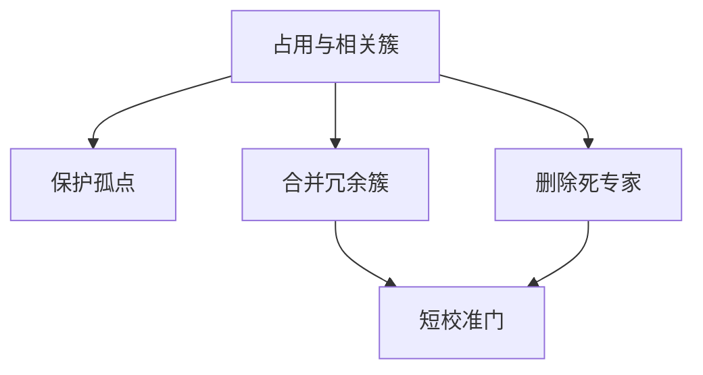

# 专家剪枝与合并

占用低或路由高度相关的专家可以丢掉或合成一个；部署参数量按活专家计，而不是按预训练宣称的 $N$ 计。

<footer>—— Lu et al., Not All Experts are Created Equal, 2024 一类工作；合并再压缩的思路亦见模型合并文献向专家轴的迁移</footer>

[上一课](/llm/moe-finetuning)可能已经把路由锁进热点。[专精化分析](/llm/expert-specialization) 给出冗余簇与孤点。本课动手：剪掉死专家，把冗余簇合并成更宽的一个，必要时再蒸馏回原宽度。目标是推理内存与通信，不是再刷预训练损失。后课 PEER 走向相反的百万专家；本课是把 $N$ 减小。

## 问题

预训练为了容量把 $N$ 开大，部署时大量专家占用接近 0，却仍占显存与专家并行的切分开销。缺口是在给定下游或给定验证路由统计上，**安全地减小 $N$**：哪些可以删，哪些只能合，合完门怎么改。

删比合简单：从路由表去掉该列，token 改走次优。合要把两个 MLP 的权重合成一套，并合并它们在门里的列。合成不是张量平均那么平凡——两个专家的内部基底可能旋转。

这里的合并是专家轴，不是训练基础课里整网 SLERP。整网合并假定同一架构同一下标；专家合并先改架构。

## 方法

剪枝：按验证集占用排序，删低于阈值的专家，或按干预跌点删「去掉也不疼」的。删后可短校准门。合并：对路由相关高的簇，把专家权重在适当对齐后平均或用 TIES 一类规则，门的 logits 列相加或再训一个 $N'\times d$ 的新门。蒸馏：用未剪教师对剪后学生做 KL，比纯平均更稳。

校准数据应覆盖下游。用预训练数据校准会复活已死的领域专家，与部署目标相反；用过窄下游又会误删仍有用的长尾专家。

### 与稠密化

把所有专家平均成一个 FFN 是极端合并，$k$ 与 All-to-All 都消失。质量通常明显掉，只适合极度缺硬件。本课默认的是减 $N$ 仍保持稀疏，而不是退回稠密。

## 机制

死专家占参数不占计算，剪它们几乎不改 FLOPs，但减内存与切分复杂度。冗余专家占计算，合并它们减 FLOPs 与通信。孤点既占计算又不可合，是下限 $N$。专精分析课的图在这里变成预算：先保护孤点，再合簇，最后剪死的。

门校准失败表现为负载重新崩到未剪专家，或质量断崖。短校准应用较小的 $\gamma$ 或辅助项，避免新崩塌。

剪完 $N$ 变了，节点受限的 $M$、放置算法都要重跑。不能只改检查点里的专家列表而沿用旧并行拓扑。

## 边界

预训练尚未收敛时不要剪，死专家可能只是还没学到。生成式长尾任务（罕见语种）的「死」是数据假象。下一课 PEER 把 $N$ 推到百万，剪枝逻辑反过来：默认几乎所有专家都极冷，检索式取出几个，不能先按占用剪到几十。本课的方法适用于 Switch / Mixtral 量级的 $N$。

## 小结

- 剪死专家省内存，合并冗余簇省计算与通信，孤点构成 $N$ 的下限。
- 合并要处理门列与专家基底对齐，常需蒸馏或短校准。
- 校准数据应对齐部署分布；拓扑与节点约束必须重配。
- 不适用于百万专家检索式 MoE 的默认冷启动。
- 出处：Lu et al., 2024 一类专家不等价与剪枝工作。
