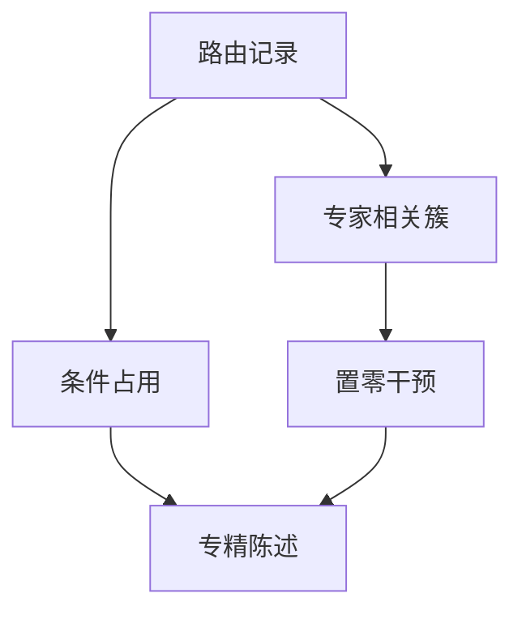

# 专家专精化分析

占用均匀只说明水位；专精化要看专家在数据类型、词类或任务上是否可分，以及关掉它是否可被其它专家顶上。

<footer>—— 综合 Fedus et al., Switch Transformers, 2021 对专家行为的观察；Dai et al., DeepSeekMoE, 2024 对细粒度专家特化的讨论</footer>

[上一课](/llm/sequence-level-balance)指出全局均匀会掩盖单序列扎堆，序列级均衡约束一条样本内的占用尖峰；过强会破坏短语级特化，短序列要缩放目标覆盖。缺口是那些均衡指标都不回答「专家 $i$ 在干什么」：要用路由条件分布、探针与置零跌点，把专家当成功能槽。可学习门的切片要测才知道，与 [哈希路由](/llm/hash-routing) 的人为切片不同。本课写专精化测量，不重写序列直方图的目标覆盖。后课微调与剪枝默认已经读完这条测量轴。

## 问题

序列级均衡回答的是一条样本内有没有占用尖峰。留下的是专家在干什么。可视化路由概率会得到一张热图，容易讲成故事。真正要的是可证伪的专精：在代码 vs 自然语言、标点 vs 实体、某种语言上，专家的接收分布是否显著偏离均匀；以及做因果干预——推理时禁止某专家，哪些任务掉点。缺口是把方法写进课序，避免 MoE 论文只报负载方差就声称「专家学会了分工」。

Switch 已经观察到部分专家 degeneracy。DeepSeekMoE 用更细的专家切分号称特化更清晰。本课不站队型号，只给测量轴。

专精化不是伦理上的「应该分工」。有的任务需要冗余专家抗抖动。测的是事实，剪不剪是下一课之后的工程。

## 方法

三层，与头分析平行。第一，条件占用：$p(\text{expert}\mid\text{域})$ 与 $p(\text{域}\mid\text{expert})$，域可以是语种、是否代码、token 频率桶。第二，专家输出探针：把专家 MLP 的激活对语言学标签做线性探针。第三，干预：将该专家的容量置零或替换成平均专家，测下游。三者一致才敢叫专精；只有热图不够。

比较应在相同均衡制度下进行。强序列级均匀会把专精冲淡，看起来「没有分工」，其实是正则禁止分工。报专精时要声明均衡配方。

### 细粒度专家

把一个宽 FFN 切成许多窄专家，同一「功能」可能摊到一组专家上。分析单位应允许**专家组**：聚类路由相关矩阵，再对簇做干预。否则会得出「单个窄专家无功能、整组有功能」的假矛盾。

## 机制

可学习门在内容空间划 Voronoi。数据长尾使少数专家吃高频功能词，多数专家吃稀疏语义。均衡偏置把高频挤开，专精从「词频」转向更细的内容。节点受限则专精对齐设备。因此专精是路由机制的产物，不是专家 MLP 先天的。换哈希，专精轴变成哈希切片，探针会换故事。

冗余：若干专家路由相关接近 1，干预其中一个跌点小。这是剪枝候选。孤点：相关低且干预跌点大，是不可合并核心。后课剪枝合并按这张图动手。

训练早期专精不稳定，分析应在损失平稳后做。中途热图不能当最终电路。

## 边界

探针标签体系会引导叙事：只标语种就只看见语种专家。干预在 top-$k$ 下会有其它专家顶上，跌点低估真实贡献，需要同时锁定量替代者。下一课微调会改变门，预训练上的专精图不能直接当指令模型的专精图。不要用本课给「MoE 一定可解释」背书。

## 小结

- 专精化要条件分布加因果干预，不能只看负载均匀或路由热图。
- 均衡与节点约束会塑造专精轴；分析必须声明这些配方。
- 细粒度专家应按簇解释；冗余簇是剪枝候选，孤点不是。
- 专精随训练阶段与微调漂移。
- 出处：Fedus et al., 2021；Dai et al., 2024。
