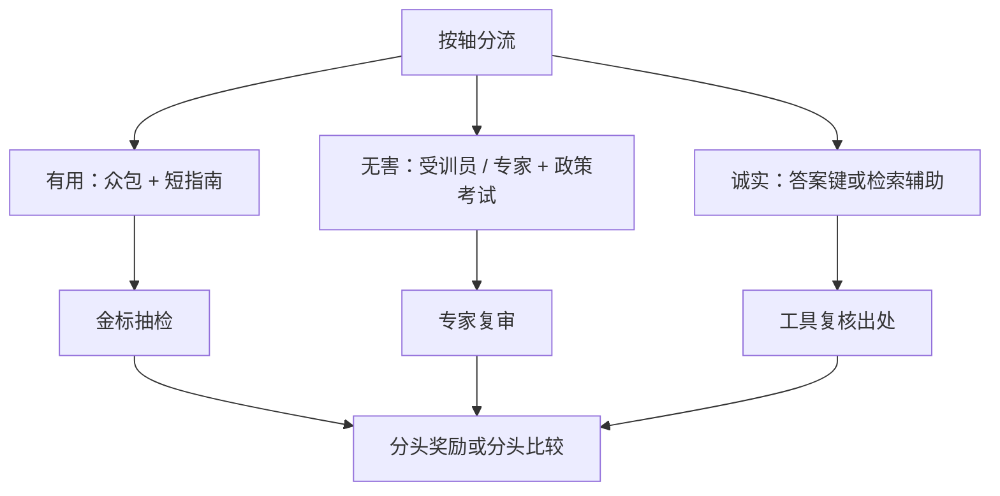

# 专家 vs 众包标注

谁来比「哪一条更好」，决定奖励模型学的是哪一种人类。众包便宜、覆盖日常有用；专家贵、覆盖政策与专业真值。混用而不写清协议，等于把两种噪声当成一种信号。

<footer>—— 对照 Askell 等把 HHH 写成实验室指南、Bai 等 HH-RLHF 用分头偏好与红队收集无害比较，以及 InstructGPT / Llama 2 对标注员培训与抽检的工程实践</footer>

偏好数据不是中性的成对比特。标注员池、培训、时薪与抽检规则，都会进 [Bradley-Terry](/llm/bradley-terry) 拟合的 $r(x,y)$。InstructGPT 用承包标注员按书面指南写示范、做比较；Llama 2 把有用性与安全性拆开采集，安全侧更依赖受训的红队与政策熟悉度。Askell 的 HHH 实验室把轴写清楚，但没有声称众包能同时当三轴的金标准。Bai 的 HH-RLHF 则表明：无害比较若仍按「谁答得全」来选，会与有用比较同源。本篇写专家与众包各自能标什么、协议如何分层、以及评测时如何避免「换一批评注员，模型就换人格」。

## 问题

众包的优势是规模与日常语感：开放写作、格式、是否听懂口语请求，众包与产品用户更近。劣势是政策分辨率低。无害类别的边界（合法安全研究 vs 可执行危害、新闻暴力 vs 煽动）、专业诚实（医学剂量、法律程序、论文是否存在），众包没有标准答案键时会靠文风投票。专家的优势是类别内一致性与真值；劣势是贵、慢、风格偏学术或偏审查员，有用轴上可能惩罚口语短答、奖励冗长免责。

把所有比较丢给同一市场，看起来「人类反馈」统一了，其实是把最贵的轴用最便宜的协议来标。反过来，把日常「总结这封邮件」也交给领域律师，会把有用头训成法律备忘录腔。问题是分层，不是「专家一定更对齐」。

### 一致率高不等于轴标对了

众包内部一致率可以很高：大家都喜欢列表、emoji、先道歉再答。这是风格共识，不是 [HHH](/llm/hhh-axes) 三轴都校准了。专家内部也会分歧，尤其无害边界与「应不应该给替代方案」。报告协议时应分开写：众包有用对的一致率、专家无害对的一致率、专家–众包交叉一致率。交叉低时，不能把两套标签平均成一条 $y_w$，否则 RM 拟合的是互相对抗的监督。

红队专家生产的是对抗性 $x$，不是自动更高质量的 $y$。无害比较的赢方仍要按政策写：拒、改写、给合法替代。只有 $x$ 很难、$y$ 仍是众包随手写的拒答模板，专家劳动被浪费在题面上。

## 方法

按轴选池。有用比较：众包或产品用户抽样，指南强调完成意图、澄清、不要为长度加分。无害比较：受训标注员或安全专家，先考政策再上岗，抽检由第二专家复审；题面可来自红队。诚实比较：需要答案键或检索证据，标「是否虚构、是否承认无知」，宜用具备领域知识的专家或工具辅助的流程，而不是纯文风比较。Bai 等人把有用与无害分头，正是承认同一批人很难同时当两套金标准。

培训不是发一页 PDF。有效做法是：金标标定集（专家先标一小套）、上岗考试、定期校准会、对困难项的申诉通道。众包侧用更短的指南加反例（「短而正确应赢过长而空」）。专家侧用类别清单与允许的反例，避免只记禁止词。时薪过低时，众包会加速点击，成对噪声上升，看起来像需要更大 RM，其实是标签熵。

成本上不要用「专家比例」一个数交差。应报：每轴的条数、每对的复标数、专家小时、众包小时、抽检通过率。HH-RLHF 类流程里，无害数据往往更贵、更少，RM 更容易过拟合拒答句式；有用数据更多，更容易过拟合长度。配额要按轴的失败代价定，不能按市场单价倒推。

### 金标、抽检与漂移

专家金标集用于：(1) 众包上岗；(2) 持续抽检；(3) 持有评测。金标要定期重标一部分，因为政策会改、标注员会疲。漂移表现为：同一对在三个月后胜者翻转率升高，或专家–众包交叉一致率下滑。发现漂移应停增数据、开校准，而不是继续灌进 RM 再靠早停。InstructGPT 类流水线把指南版本与数据版本绑在一起，换指南等于换数据集。

## 机制

BT 似然把标注员当成无偏的 logistic 噪声。池不匹配时，噪声是结构化的：众包在无害题上系统偏好「看起来在帮忙」，专家系统偏好「先挡」。$r$ 会学到一个随 $x$ 的题型而切换的幽灵标注员。策略沿 $r$ 优化后，日常题更像众包人格，敏感词附近突然切换到专家拒答腔——用户感觉到的「人格分裂」往往是池的拼接，不是解码温度。

专家少、众包多时，梯度以众包为主，专家标签变成正则。若把两套数据简单 concat，要按轴加权或分头，否则无害专家信号会被有用众包淹没。分头之后，组合权重 $\lambda$ 成为显式的「听谁的」旋钮，比把人藏进一个池更可审计。

领域专家不是单一物种。生物安全、网络滥用、儿童安全的专家指南不同，不能共用一个「安全专家」队列而不分队列。分队列等于再一次分头。

### 何时必须专家，何时众包足够

必须专家或等价工具：需要真值或法规边界的比较、无害政策的边界题、医疗法律财务的「能不能答」。众包足够：文风、结构、是否遵循多约束指令、是否漏了用户列明的格式。模糊区（表面敏感的科普）需要带允许反例的受训员，纯众包会过拒绝，纯审查专家会过拒绝得更厉害，要用 [过拒绝](/llm/over-refusal) 探针约束。AI 反馈可以减轻专家看有害全文的量，见 [AI 反馈](/llm/aif-as-preference)，但不能用教师模型的众包人格去冒充专家政策。

## 边界与工程取舍

专家也会有机构偏见：更怕漏报，于是无害轴整体右移，产品过拒绝。要用无害敏感但应回答的对照集做回归，而不是只听专家的一致率。众包会有文化与语言偏置：英语母语标注员对其他语言的「有用」判断不可靠，应按语言分层建池。

不要把产品用户的隐式点击直接当众包金标，见 [隐式反馈](/llm/implicit-feedback-prefs)。点击有位置偏置，且用户会奖励谄媚。专家与众包都是显式协议；隐式是另一套生成过程。三者可以做特征，不能偷偷平均成一对 $(y_w,y_l)$。

公开 HH 比较集的标注员构成与你的承包商不同。用 HH 预训练偏好头，再用自己的专家无害对做适应，要报告两段数据的轴覆盖，避免以为「已经用过人类反馈」即覆盖本产品政策。

## 小结

- 众包适合有用轴的规模与日常语感；专家适合无害边界与带真值的诚实。
- 一致率要分轴、分池报告；交叉一致率低时不要平均成一条总序。
- 按轴分流、金标考试、抽检与指南版本化，是协议，不是可选管理。
- 数据量不平衡时必须分头或加权，否则专家信号被众包梯度盖掉。
- 专家偏漏报会推高过拒绝；众包偏文风会推高长度与谄媚。
- 出处：Askell et al., 2021（HHH 坐标系）；Bai et al., HH-RLHF, 2022（分头偏好与红队）；Ouyang 等 InstructGPT、Touvron 等 Llama 2 的标注工程。
