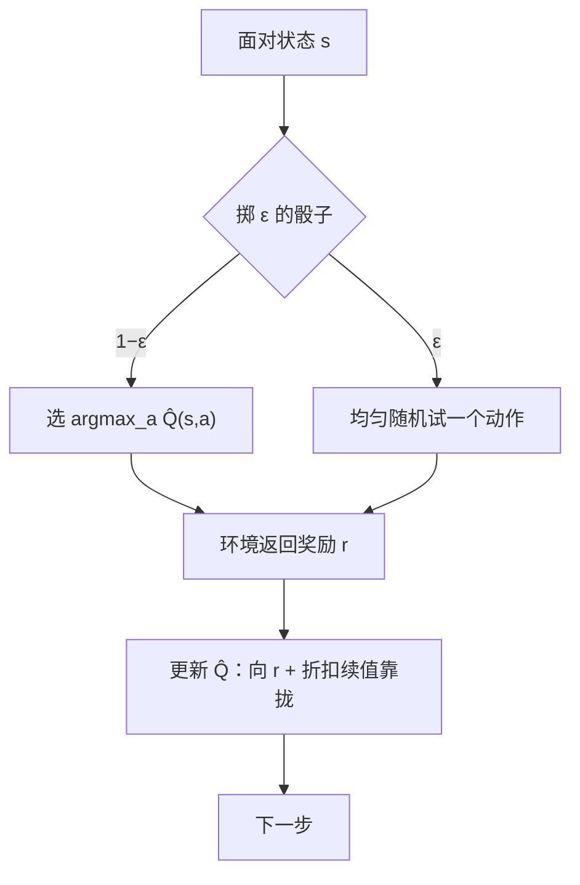

# 探索与利用：ε-贪婪与乐观

不吃当前最优的那家馆子，才有机会知道街口新开的那家更好；你学到的价值，只是你自己的动作流过得出的样本。

<footer>—— 据 Sutton &amp; Barto, Reinforcement Learning: An Introduction, 2018, 第 2 章；Auer, Cesa-Bianchi &amp; Fischer, 2002 整理</footer>

[上一课](/llm/llm-decision-view)把生成钉成了 MDP：状态是前缀、动作是 token、转移为恒等，维度灾难宣判了表格 DP 的死刑，课程转入无模型——只从策略自己采出的轨迹学习。本课补无模型更早的一个前提：轨迹由策略产生，策略不给的机会价值永远学不到。于是要谈探索-利用权衡，写 ε-贪婪与乐观初始化，再对照 LLM 采样的温度。本单元（MDP 与动态规划）到此收口，它留下的缺口——**无模型时怎么估计价值**——由下一单元开篇的蒙特卡洛策略评估接手。

## 问题

评估需要按当前策略采样的轨迹；但若策略只选当前估计的最优动作，次优动作的估值永远停在初值，而当前「最优」可能只是小样本噪声。最小案例是多臂老虎机：动作没有长期后果，每台机器有未知均值。每一步都在花同一份预算：选已知最好的（利用）拿眼前回报，选不确定的（探索）买信息。只利用会被初采样误差锁死，只探索则永远不兑现——这不是工程取舍，是学习问题的内置结构：**信息是动作的副产品**。

「多臂老虎机」就是把探索-利用剥到最简的玩具问题：你面前有几台中奖率未知的老虎机，每拉一次得一次奖励，拉哪台不影响之后的概率。没有状态、没有后续后果，唯一的纠结就是「继续拉现在最赚的那台，还是试试没拉过的」。

## 方法

**ε-贪婪**：以 $1-\varepsilon$ 概率选当前估值最优的动作，以 $\varepsilon$ 概率均匀随机探索。表格法的一致性由此买到：每个动作被无穷次访问，大数定律才能把 $\hat Q$ 拉到真值。代价也明码标价：$\varepsilon$ 不衰减时，学得再久仍有 $\varepsilon$ 概率踩次优动作；实战用 $\varepsilon_t$ 随访问次数或时间衰减，先重探索后重利用。

**乐观初始化**：把 $\hat Q$ 的初值设得比任何可能回报都高。没被试过的动作显得诱人，被试一次估值猛跌，于是策略系统性地先扫一遍所有动作，再收敛到最优——把「不确定」翻译成「看起来好」，用确定性的初始偏差驱动探索，不需要掷骰子。代价是需要奖励上界的先验，且只天然适配回合初、稀疏交互的场景。更进一步是按不确定度加偏置的置信上界（Auer 等 2002 的 UCB 一族），本课只作锚点，不展开遗憾界分析。

## 机制

与温度的对照要说准。LLM 采样温度把 logits 除以 $T$ 再 softmax，机制与角色见 [温度与 top-p 采样](/llm/sampling-temperature-topp)、训练期用法见 [RL 采样温度](/llm/rl-sampling-temperature)。它像探索，但有三个差距：其一，温度是逐步独立的扰动，不随经验收敛——ε-贪婪的探索随 $\hat Q$ 变准而自然失去意义，温度则永远同样地摇，退火要另加调度；其二，它不保证覆盖：温度升高后概率质量仍在头部打转，长尾 token 几乎不被采到，「试过」这件事没有保证，而 ε-贪婪与乐观法的关键产物恰恰是每个动作的无穷访问；其三，服务对象不同：推理期温度管输出多样性，训练期探索要服务价值估计的一致性，预算与判据不能共用。所以温度不是探索的完整答案，rollout 的覆盖还是要按「每个状态-动作被访问多少次」来盯。

ε-贪婪的渐近代价可以写成份额：$\varepsilon=0.1$ 不衰减时，无论学多久都有约一成动作花在均匀瞎试上，遗憾随交互次数线性增长；衰减调度的意义正是把这份预算从「永久保险」改成「前期投入」。

## 边界

本课的探索都是动作级的（试不同 token），不含定向探索（按计数或好奇心去没去过的状态），也不含 prompt 层面的任务多样性——那是数据配比的问题。乐观法在随机奖励、非平稳环境下会失效或需改造；UCB 与 Thompson 采样的遗憾界不在本课。还有一个本课刻意留下的缺口：ε-贪婪与乐观都假设**已经有了** $\hat Q$ 可以贪心、可以初始化——无模型时 $\hat Q$ 从哪来、采样轨迹怎么折算成估值，上一课维度灾难之后悬着的这个问题，下一单元从蒙特卡洛策略评估讲起。

后课默认：探索保证的是访问次数，估计由后面的方法负责；两笔账分开算。

## 小结

- 探索-利用权衡的根源：信息是动作的副产品，覆盖不到就学不到。
- ε-贪婪买访问次数：一致性有保证，代价是 $\varepsilon$ 份额的次优动作，用衰减调度消化。
- 乐观初始化把不确定翻译成有吸引力：确定性探索，需要奖励上界先验。
- 温度不是探索的完整答案：不随经验收敛、不保证覆盖、服务多样性而非估计。
- 本单元收口：五元组、回报、贝尔曼、DP、生成视角、探索备齐；无模型估计留待蒙特卡洛。
- 出处：Sutton &amp; Barto 2018 第 2 章；Auer, Cesa-Bianchi &amp; Fischer, *Machine Learning*, 2002。
