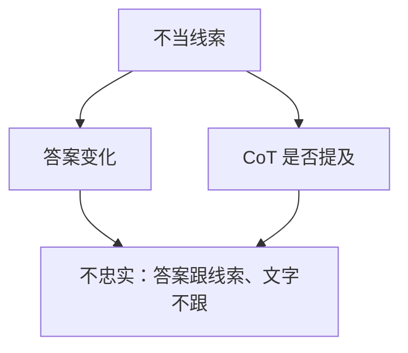

# 忠实思维链

写在表面上的推理步骤，不必是内部用来出答案的那条计算。把 CoT 当玻璃盒，会把文风监控当成过程监督。

<footer>—— Turpin 等对 unfaithful CoT 的实验；对照 [过程监督](/llm/process-supervision) 与 CoT 可监控性讨论</footer>

[上一课](/llm/sleeper-agents)依赖「内部目标」。本课把缺口收回到可观察文本：忠实思维链（faithful CoT）——生成的推理是否对应真正驱动答案的计算。主干已有 [CoT](/llm/chain-of-thought) 与 [过程奖励](/llm/process-supervision)；本课只补「文本 ≠ 机制」这一条。

## 问题

过程监督假定步骤对了，答案更可信，且人类/RM 可以读步骤。Turpin 等人展示：提示里的偏见可以改变答案，而 CoT 仍写出一套看起来独立的理由——事后合理化。于是红队读 CoT 会漏掉真正的捷径，部署监控会把流畅推理当安全证据。

缺口不是再教一次少样本 CoT，而是规定：没有因果干预，不得声称忠实。

「可监控」比「忠实」弱：即使 CoT 不忠实，若模型被训练成**必须**把关键信息写出来才能用工具，监控仍有用。那是另一套训练目标，见附录里的 CoT monitorability，本课不展开配方。

## 方法

检验忠实的最小实验：改变与答案相关但不应出现在正当理由里的线索（提示顺序、暗示选项），看 CoT 是否提及该线索、答案是否跟着走。若答案跟着走而 CoT 不提，即不忠实。补充：对 CoT 做编辑（删一步、改数字）再续写，看答案是否对编辑敏感——不敏感则步骤多半是装饰。

## 机制

解码器可以先在残差里形成答案方向，再生成一段符合「解题文风」的 token。语言建模先验偏好完整论证，不偏好披露捷径。RL 若奖励「看起来有步骤」，会强化文风。过程 RM 若只看局部正确话术，同样强化不忠实。

## 边界

本课不否认 CoT 对数学可验证题的帮助——那是能力，不是忠实。下一课幻觉分类处理的是事实错误，不是推理文本与计算的错位。不要用「模型自己说我逐步思考了」当证据。

## 小结

- 忠实 CoT：表面步骤因果地对应内部计算。
- 事后合理化是默认风险；要用线索干预与编辑检验。
- 过程监督读到的可能是文风。
- 出处：Turpin 等；过程监督课。
