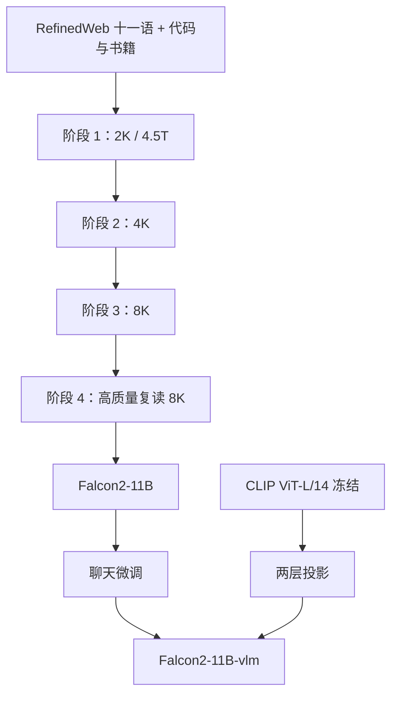

# Falcon 2

    
第二代 Falcon 把容量从 40B 收成 11B，用五兆 token、分阶段拉长上下文和一份视觉编码器，换更便宜的推理与多模态入口。

    <footer>—— Malartic 等，Falcon2-11B Technical Report，arXiv:2407.14885</footer>

阿布扎比技术创新研究所（TII）第一代 Falcon（7B / 40B / 180B）把 RefinedWeb 与宽松许可写进开源叙事。2024 年 5 月开源、7 月成文的 **Falcon 2** 不再追参数上限，而是放出 **11B 稠密解码器** 与同骨干的 **Falcon2-11B-vlm**。报告的主张很具体：在 Open LLM Leaderboard 当时设定下超过 Mistral-7B 与 Llama 3-8B、接近 Gemma-7B，并超过更大的 Falcon-40B；多语比例相对一代至少翻倍。本篇按 2407.14885 写 11B 与 VLM，不把后来的 Falcon Mamba（2410.05355）安到这一代注意力骨干上。

## 问题

一代 Falcon-40B 训在约 1T、上下文 2K，推理账单对终端不友好。Chinchilla 之后业界转向「更小模型、更长数据」：Llama 2/3、Mistral 7B、Gemma 7B 都证明 7B–13B 档可以打满日常任务。Falcon 2 要回答的是：在 **仍沿用并行 Transformer 块与 GQA** 的前提下，把深度保持在 40B 同级（60 层）、把宽度收到单卡 A10 24GB 可部署，再用超过 5T token 与分阶段 8K，能否在英语、多语和代码上同时超过自己的 40B。

第二问是可用性。只开底座不够接图文聊天。VLM 要把 CLIP 视觉塔接到已经聊过的 11B 上，并处理高分辨率细节，而不是另训一个多模态从头模型。

### 并行块与更深、更窄的 11B

Falcon 系列不用「先注意力再 MLP」的串行残差，而用并行块：一次 LayerNorm 之后，注意力与 MLP **同时** 加回残差。记输入为 $x$，

$$
x_{\mathrm{norm}}=\mathrm{LN}(x),\qquad \mathrm{ParallelBlock}(x)=x+\mathrm{MLP}(x_{\mathrm{norm}})+\mathrm{Attention}(x_{\mathrm{norm}}).
$$

11B：$d=4096$，**60 层**，查询头 32、KV 头 **8**（[GQA](/llm/gqa)），头宽 **128**（一代多为 64）。训练用张量并行 $\mathrm{TP}=8$。前三阶段绑嵌入；第四阶段解开嵌入与输出投影，参数大约再增 3 亿。RoPE 底数在长窗阶段取 $5\times 10^6+42$，第四阶段降到 $5\times 10^5+42$。注意力实现切到 FlashAttention-2，否则 8K 上 128 维头很难吃满吞吐。

60 层配 4096 宽，比「同样 11B 但更浅更宽」更容易在训练中尖峰。报告把尖峰归因于深度上的梯度爆炸风险，处理是回滚、跳数据、以及随学习率衰减而减少尖峰频率。不要把并行块理解成「层数减半」：层数仍是 60，只是块内两条支路并行。

## 方法

数据主干仍是处理后的网页（RefinedWeb 路线），自然语言覆盖英、德、西、法、意、荷、波、葡、捷、罗、瑞典十一语；另加 The Stack 中 43 种许可友好语言的代码、arXiv/PubMed、对话树、书籍与专利。多语网页占比在前三阶段约 **15%–17%**，至少是一代的两倍。对话树在 FlashAttention-2 不能随意改掩码的约束下，被展平成多条线程并在重复 token 上掩损失，计算开销主要落在 Reddit 等源，总量大约几个百分点，由 FA2 加速抵消。

### 四阶段：先 2K，再 4K / 8K，最后高质量复读

- 阶段 1：约 **4500 GT**（$10^9$ token），上下文 2048，英语网页约 69%，学习率余弦从 $3.7\times 10^{-4}$ 降到 $1.89\times 10^{-5}$。
- 阶段 2：250 GT，4096。
- 阶段 3：250 GT，8192。
- 阶段 4：500 GT，在高质量私有混合上多轮，仍 8192；学习率保持下限常数。

阶段 1 中为压噪声、减尖峰，把样本 batch 从 2048 **连续加倍四次** 到 32768。报告把损失陡降解释成优化温度 $T=\eta/\sqrt{B}$ 变小，与衰减学习率同类。AdamW 的 $\varepsilon$ 从 $10^{-8}$ 调到 $10^{-7}$。阶段 1–3 在 1024–1280 张 A100 上跑，数据并行加大、流水线并行为 1、张量并行恒为 8。

VLM：冻结的 CLIP **ViT-L/14** → 两层投影 → 接到 **Falcon2-11B-chat**。高分辨率走 LLaVA-NeXT 式动态切图。训练两段：先只训投影（约 55.8 万图文对），再解冻 LLM 与投影做 120 万量级图文指令（含多轮）。视觉编码器全程冻结。

## 机制

并行块让注意力与 MLP 共享一次归一化、两条残差同时写回，前向少一次串行依赖，和 PaLM 一类并行层同类。代价是两条支路的尺度要一起稳：60 层上任何一条支路爆炸都会直接加进 $x$。头宽 128 提高长上下文下注意力计算占比，FA2 才划算；这也是为何前三阶段把 $\theta_{\mathrm{RoPE}}$ 开得很大——先保证位置周期盖住目标窗，第四阶段再收到 $5\times 10^5$ 量级做质量微调。解开绑嵌入是在已经学好表示之后给输出头独立自由度，不是从头就用两套表。

分阶段拉长上下文，是因为 8K 全量 5T 的注意力 FLOPs 不可接受。短窗阶段仍混入被截断的长样本，减轻「一换窗数据分布突变」。VLM 的动态高分辨率针对小物体与幻觉：低分辨率切图会把细节平均掉，LLM 只能靠语言先验补，表现为看图胡说；切块提高的是编码器覆盖的像素，投影后的 soft token 数仍远小于像素数。

报告写 11B 可部署到单张 A10 24GB，指的是权重量级与设计目标，不是任意 8K 并发、任意量化方案下的服务承诺。服务账仍是 60 层 decode 深度加 8 套 KV。TII 许可是 Apache 2.0 底本加可接受使用政策，不是无条款 Apache。

### 和一代 Falcon、和同档开源怎么选

要 40B 级一代权重或 RefinedWeb 论文叙事，看 Almazrouei 等 *The Falcon Series of Open Language Models*（arXiv:2311.16867）。要 2024 年中可微调的 11B 多语底座与官方 VLM，看 Falcon 2。要状态空间、常显存长生成，那是 Falcon Mamba，架构已换，不能把 11B 的 GQA 配置拷过去。同档密集开源还有 Llama 3.1 8B、Gemma 2 9B/27B：选 Falcon 2 的理由是 TII 许可、十一语网页比例和现成 VLM，而不是默认它在所有英语榜上永远第一——Leaderboard 集合会变。

## 边界与工程取舍

阶段 4 的高质量混合是专有的，外部无法按报告复现最后 500 GT。Open LLM Leaderboard 分数是当时快照，引用要写任务集与日期。多语过滤规则从英语启发式改来，捷克、罗马尼亚等低资源比例仍薄。代码来自 The Stack 再过滤，不是专项代码模型。VLM 视觉塔冻结，OCR 与文档理解上限受 CLIP ViT-L/14 与切图策略约束，不要写成「原生多模态预训练」。

从一代 Falcon 微调检查点接到 11B 不可行：宽度、头宽、RoPE 底数、是否绑嵌入、上下文都变了。并行块的实现若被改成串行 Pre-LN，数值与开源 `config` 会对不上。对话树展平后的掩损失若在下游 SFT 里被关掉，模型会重复学习同一条父节点。

真实编号：Malartic 等，*Falcon2-11B Technical Report*，arXiv:2407.14885。不要给 VLM 另造一个不存在的论文号。LLaVA-NeXT 是动态高分辨率的引用对象。一代系列论文是 2311.16867，与 2 代不是同一份表。

## 小结

- Falcon 2 是 TII 的 11B 稠密模型：60 层、$d=4096$、GQA 32/8、并行 Transformer 块，训在超过 5T token 上，上下文经 2K→4K→8K。
- 设计目标是单卡可部署且超过本家 40B；许可为 TII Falcon 2 条款（Apache 底本 + AUP）。
- VLM 用冻结 CLIP ViT-L/14、两层投影和 LLaVA-NeXT 式高分辨率，接到 chat 档。
- 训练尖峰、batch 加倍与第四阶段解绑嵌入是报告里的工程事实，不是架构噱头。
- 出处：Malartic 等，arXiv:2407.14885，2024；一代对照 Almazrouei 等，arXiv:2311.16867。
