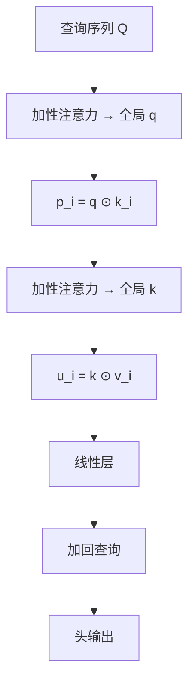

# Fastformer

    
不建两两位置的点积表，而用加性注意力把查询收成全局向量，再与键、值做逐元素交互——上下文建模可以是线性的。

    <footer>—— Wu、Wu、Qi、Huang、Xie，Fastformer: Additive Attention Can Be All You Need，arXiv:2108.09084</footer>

清华大学与微软亚洲研究院的 **Fastformer**（Chuhan Wu、Fangzhao Wu、Tao Qi、Yongfeng Huang、Xing Xie，2021）站在另一条加速路上：既不走 [Katharopoulos](/llm/katharopoulos-linear) 的核结合律，也不走 [Performer](/llm/choromanski-performer) 的随机特征，更不是 Longformer 式稀疏图。它用 **加性注意力做两次全局汇总**，中间用逐元素乘让每个位置与全局向量交互。复杂度 $O(Nd)$，参数比标准多头更少（可层间共享）。主场是长文本分类、新闻推荐与摘要，不是自回归语言模型。标题戏仿 Vaswani，但 *all you need* 在这里指加性全局交互，不是删掉前馈。

## 问题

标准自注意力对每个查询–键对打分，长文档（PubMed 平均三千词级、新闻正文、用户点击序列）先碰到显存与延迟。2021 年的加速器各有洞：稀疏注意力要很多可见位置才够全局，加速比有限；Linformer 的投影与内容无关；Reformer 的哈希常数大；线性核近似被本文批评为 **context-agnostic**。新闻推荐还要把「一条新闻的词」和「用户点过的许多条」做成层次编码器，长度叠加后二次注意力不现实。

需要一种对 $N$ 线性、仍让每个 token 看见某种全局摘要、且实现就是几次 GEMM 与逐元素乘的模块。加性注意力（Bahdanau 式打分后加权和）本来就能把序列收成一个向量，代价线性；缺的是「这个全局向量如何再调制每一个位置」，而不是停在句子向量。

### 层次推荐把长度问题乘了两次

MIND 上用户历史平均约 37 次点击，每条新闻又是一条标题或正文。NRMS 已经用多头自注意力做新闻编码与用户编码。把两边都换成二次注意力，训练和在线打分都会炸。Fastformer 的工程动机很大一块在这里：同一模块既编码新闻，也编码用户，线性代价才能进推荐系统的延迟预算。分类与摘要是为了证明它不是「只能推荐」的特化算子。

代码以 Hugging Face 风格发布在 `wuch15/Fastformer`。不要和后来各种同名「fast transformer」实现混淆；这篇的标识是加性全局查询/键 + 逐元素乘。

## 方法

每头仍先把嵌入变成 $Q,K,V\in\mathbb{R}^{N\times d}$。加性注意力用可学习向量 $w_q$ 对查询打分，

$$
\alpha_i=\mathrm{softmax}_i(w_q^\top q_i/\sqrt{d}),\qquad q=\sum_i\alpha_i q_i,
$$

得到全局查询 $q\in\mathbb{R}^d$。每个键与 $q$ 做逐元素乘 $p_i=q\odot k_i$，再用 $w_k$ 加性汇总成全局键 $k$。每个值与 $k$ 逐元素乘后过线性层，得到位置级的全局感知值，再与原查询相加作为该头输出。多头拼接。作者共享 $Q$ 与 $V$ 的投影以省参数，并 **跨层共享 Fastformer 参数** 以防过拟合、进一步减参。复杂度分析：两次加性注意力与逐元素乘都是 $O(Nd)$，每层参数约 $3hd^2+2hd$（共享后），对照标准头的 $4hd^2$ 量级（不计 FFN）。

数据集：Amazon Electronics 评论五分类（均长 133）、IMDB 十分制（均长 386）、MIND 新闻主题 18 类（均长 505）与推荐（161k 新闻、百万用户）、CNN/DailyMail 与 PubMed 摘要（PubMed 文档均长约 3016）。词向量 GloVe。分类用加性注意力把序列收成句向量。推荐按 NRMS：Fastformer 层次编码新闻与用户。

### 表上的分数怎么读

情感/主题分类（论文表 4）：Fastformer 在 IMDB 准确率 54.10，高于 Transformer 的 52.04 与多数高效变体；Amazon 上与 Linformer / BigBird 同档（约 66.1–66.2）；MIND 主题上略低于 Poolingformer 的 82.46，为 82.34。作者解释：二次 Transformer 必须截断，丢掉长尾上下文；线性模型能吃更长输入。这是 **有效上下文长度** 的胜利，不一定是同窗长下表达力的胜利。

推荐（表 5）：单模型 Fastformer AUC 69.11，高于 Transformer 68.22、NRMS 68.18；接进 PLM-NR 的用户编码器后 71.04；五模型集成 **72.68**，文中写当时 MIND 榜第一。摘要（表 6）：CNN/DM 上 Fastformer 与 Transformer、Poolingformer 接近（R-1 约 38.5）；PubMed 更长，Fastformer R-1 38.09，高于 Transformer 的 34.26 与多数稀疏/低秩基线。短摘要任务上稀疏方法相对 Transformer 并无优势——原文自己写了这一点。

## 机制

全局 $q$ 是查询的加权质心，不是某个 token。逐元素乘 $q\odot k_i$ 让键的每一维被同一全局查询调制，位置之间 **没有显式两两点积**。第二步全局 $k$ 再调制值。信息路径是「先压缩成 $d$ 维、再广播回去」，秩至多是全局向量能表达的那么多。堆多层被作者用来补「一次汇总不够」。这与核线性注意力不同：后者每个查询仍有自己的 $\phi(q)$ 去读累加状态；Fastformer 的查询在加性汇总之后，个体差异主要靠 $q_i$ 残差加回。

加性打分 $w^\top q_i$ 是内容的一维投影，不是 $q_i^\top k_j$。全局交互的「针对性」来自逐元素乘而非 softmax 竞争。因此精确检索（某词只应对准另一词）不是设计目标；主题、情感、用户兴趣这类 **可压缩全局语义** 才是。层间共享让深层不再各自学一套全局投影，容量更小、也更稳。

论文声称「据我们所知是最高效的 Transformer 架构」。这是 2021 年相对 Longformer / BigBird / Linformer / Reformer / Linear Transformer / Poolingformer 的墙钟观察，不是复杂度阶的定理，更不是相对 FlashAttention 的结论。

### 和核线性、和稀疏图

核线性：结合律保的是所有键的累加，查询仍个性化。稀疏图：局部窗口保留邻接，全局点保留锚。Fastformer：两次瓶颈都是单个 $d$ 维向量。失败模式是「两个位置需要彼此对准、而全局质心把它们平均掉」。PubMed 摘要仍能涨分，说明长文档压缩对 ROUGE 够用；代码与数学推导通常不够。

## 边界与工程取舍

### 不要放进因果 LM 主栈而不做消融

自回归语言模型依赖尖峰注意力做拷贝。Fastformer 没有行内 softmax 竞争，也没有因果扫描状态的标准实现。当新闻推荐模块用可以，当 GPT 主干用需要自己证明。GloVe + 浅层分类器的设定不能对照 BERT 微调。集成五模型的榜首更不能写成单模型架构胜利。权重共享会限制深层特化，极深网络未必适用。逐元素乘在 GPU 上带宽敏感，理论 $O(Nd)$ 仍要融合才快。

标题容易被读成「加性注意力取代点积」。原文比较的是高效 Transformer 变体在长文本上的质量–速度，不是否定 Vaswani 的 SDPA。Bahdanau 加性注意力用在机器翻译对齐时仍是二次对（每个查询对每个键一个 MLP）；Fastformer 的加性只用在 **汇总成全局**，二次项被消掉。两处「additive」不要混。

出处：Wu et al.，*Fastformer: Additive Attention Can Be All You Need*，arXiv:2108.09084，2021。MIND 榜名次以当时提交为准，会过期。

## 小结

- Fastformer 用两次加性汇总加逐元素乘做线性上下文建模，不物化 $N\times N$ 点积。
- 主场是分类、MIND 推荐与长文档摘要；集成模型曾登 MIND 榜。
- 全局瓶颈适合可压缩语义，不适合精确配对检索。
- 2021 年的「最高效」是相对当时高效变体的墙钟，不是跨时代核对比。
- 出处：Wu et al.，arXiv:2108.09084。
