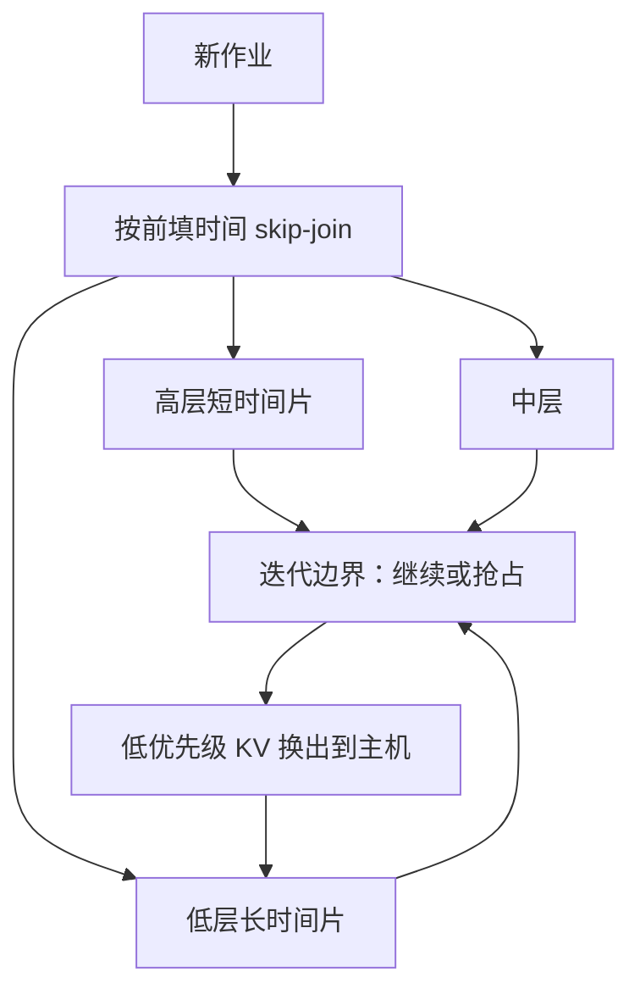

# FastServe

    
自回归让我们可以在每个输出 token 的边界抢占；再按已知的提示长度做 skip-join，MLFQ 才不会被第一次前填自己打穿。

    <footer>—— Wu et al., Fast Distributed Inference Serving for Large Language Models, arXiv:2305.05920</footer>

Orca 把调度粒度收到迭代，vLLM 把 KV 收成分页，两者默认的队列纪律仍是先来先服务（FCFS）：作业一旦进批，就跑到结束。真实对话的输出长度高度偏斜，长作业会把头阻塞在队列口，短作业的端到端延迟里排队能占到九成。Wu、Zhong、Zhang、Liu 等人的 FastServe 问的是：既然每一步只产一个 token，为什么不能在迭代边界抢占？系统用 skip-join 多级反馈队列（MLFQ）做抢占式调度，并用主机内存主动换入换出被降级作业的 KV。原型对照当时的 vLLM，在相同平均 / 尾延迟约束下报告吞吐最高约 31.4× 与 17.9×；NSDI 2026 的会议版标题改为 *Iteration-Level Preemptive Scheduling*，主结果数量级随设置收缩，读数字必须钉版本。本篇写这篇抢占论文，公平与抢占的工程对照见 [抢占与公平](/llm/preemption-fairness)。

## 问题

LLM 推理与 ResNet 一类一次性推理不同。后者执行时间主要由模型与硬件决定，Clockwork、Shepherd 可以靠画像做确定性调度。前者是自回归：迭代次数等于输出长度，事先不知道。FCFS 在长度同质时几乎没有排队；ShareGPT、Alpaca 这类偏斜负载上，长尾输出把短请求堵在门外。优化单步执行时间不够——它只占端到端的一小截，大头是排队。

连续批处理允许作业在迭代边界进出，但「进出」不等于「抢占」。FCFS 连续批仍然是 run-to-completion：批内成员可以变，却不会把一个已经开始生成的长作业拿下来，给刚到的短作业让路。GPU 显存与延迟 SLO 又限制了批不能无限膨胀，于是 hol blocking 从静态批平移到了连续批里。

### 半信息无关

经典 MLFQ 假设作业大小完全未知：人人先入最高优先级队列，跑超时间片再降级，用来逼近 SRPT。LLM 不是完全未知。输出长度未知，**提示长度已知**，而首 token 的前填时间由提示长度主导，往往远大于后续解码步。一条「长提示、短输出」的作业，一生几乎就是一次前填。若它仍从最高优先级进队，会把真正的短作业挤下去，然后自己因为前填太长立刻被降级——升降本身也有代价。FastServe 把这种设定叫做 semi information-agnostic，并据此改 MLFQ。

31.4× / 17.9× 来自 arXiv 原型相对当时 vLLM、在相同平均或尾延迟约束下的吞吐。NSDI 2026 文本里出现过约 6.1× 的对照。引用必须写清版本与约束，不能把预印本峰值抄成「FastServe 恒定三十倍」。

## 方法

抢占粒度是一次输出 token（一次迭代）。当前作业写完一个 token，调度器可以让它继续，也可以把它拿下来，换队列里另一条。Skip-join MLFQ 仍维护多级队列，级别越高时间片越短。新作业**不总是**进最高级：用提示长度估计前填时间，与各级时间片比较，直接加入合适的那一级，跳过更高、更短的队列，减少无谓降级。之后若输出迟迟不结束，再按经典规则逐级下降。短输出倾向于留在高层被尽快做完；长输出沉到低层，避免挡路。

抢占让「已开始但未结束」的作业变多，KV 不能只为当前批预留。低优先级作业的 KV 仍要保留，否则下次回来要重做前填。显存不够时，朴素做法是停止接纳新作业， hol blocking 换一种形式回来。FastServe 改为主动内存管理：预测低优先级队列即将用不满 GPU 时，把它们的中间状态换到主机内存；轮到它们之前再异步换回。流水线与异步拷贝用来遮住 DMA。

### 分布式下的流水线

模型放不进单卡时走张量并行与流水线并行。KV 按层或按设备切分，换入换出也要分布式一致。调度器让多个批在流水线里重叠，减小气泡。抢占发生在迭代边界，需要各卡在同一次迭代结束时一起做调度决策，不能出现「有的卡已经开始下一步、有的卡还在换 KV」。

Skip-join 用的是前填时间，不是输出长度。输出仍然未知，MLFQ 的降级机制还在。把 FastServe 理解成「已知全部作业大小的 SRPT」，会高估它避免误降级的能力。

## 机制

FCFS 优化的是公平到达序，在偏斜作业下牺牲的是平均与尾延迟。MLFQ 的直觉是：尚未证明自己很长的作业，按短作业对待。Skip-join 补上 LLM 特有的那一刀：前填已经证明「这一步不短」的作业，不要占用为短解码准备的最高优先级。于是队列里真正的短生成可以插队，而不必等长前填跑完。

换出是抢占的配套，不是锦上添花。没有主机内存当延伸，抢占集合的上限仍是 HBM 能同时钉住的 KV；集合一满，调度退回 FCFS。异步换入必须赶在作业回到 GPU 之前完成，否则抢占节省的排队被 DMA 等待吃回去。这与后来 PD 分离里「KV 在机间搬」是同一类税，只是 FastServe 的搬运发生在单机 GPU–CPU 之间，为的是时间片，不是阶段拆分。

### 和连续批、分页的关系

FastServe 建立在迭代级调度之上：没有迭代边界，抢占粒度就回到整条请求， hol blocking 解不开。分页 KV 让换出以块为单位，碎片比连续预留小。论文原型显式接了 PagedAttention。它不替代切块前填：长前填仍可能是一个很重的量子；与 Sarathi 结合时，时间片应对齐块长，否则 skip-join 的「前填时间」估不准。

评测负载必须保留输出偏斜。把输出截断成同长，FCFS 的排队项消失，FastServe 的倍数会塌。这是 Figure 1 的论点，不是附录里的边角。

## 边界与工程取舍

抢占伤害 CUDA Graph 与算子融合：图要按当前批编译，成员每步都可能变，捕获成本上升。实践上常折中为「只在队列压力高时开启抢占」，或把时间片拉长到若干 token。换出带宽受 PCIe 限制，KV 很大时主动管理自己成为瓶颈；此时应先压缩 KV 或限制并发作业数，而不是无限换。

MLFQ 对交互式短请求友好，对已经生成了很长、用户仍在看流式输出的请求不友好——它会被降级，TBT 出现周期性停顿。产品若把「打字流畅」放在「短作业完成时间」之上，FCFS 或 stall-free 混合批次更贴 SLO。FastServe 优化的是作业完成时间（JCT）与排队，不是 TBT 平滑。

分布式抢占要在 TP 组内同步。实现复杂度明显高于 FCFS 连续批，这也是后来许多生产引擎仍默认 FCFS、把优先级放到实例间迁移（Llumnix）或阶段拆分上的原因。不要把预印本的 31.4× 直接写进容量规划。

出处钉 Wu 等 *Fast Distributed Inference Serving for Large Language Models*，arXiv:2305.05920；会议版 *FastServe: Iteration-Level Preemptive Scheduling for Large Language Model Inference*，NSDI 2026。作者单位北京大学。不要与 DeepSpeed-FastGen 混名。

## 小结

- FastServe 在迭代边界抢占，用 skip-join MLFQ 处理「提示已知、输出未知」的半信息无关设定。
- 低优先级作业的 KV 主动换到主机，避免抢占集合把 HBM 打满后回到 hol blocking。
- 优化目标是排队与 JCT；TBT 可能因降级出现停顿。
- arXiv 原型相对当时 vLLM 报告最高约 31.4× / 17.9× 吞吐（同延迟约束）；会议版数字更保守。
- 与切块、分页、连续批相容，但不替代它们。
- 出处：Wu et al., arXiv:2305.05920；NSDI 2026 会议版。
