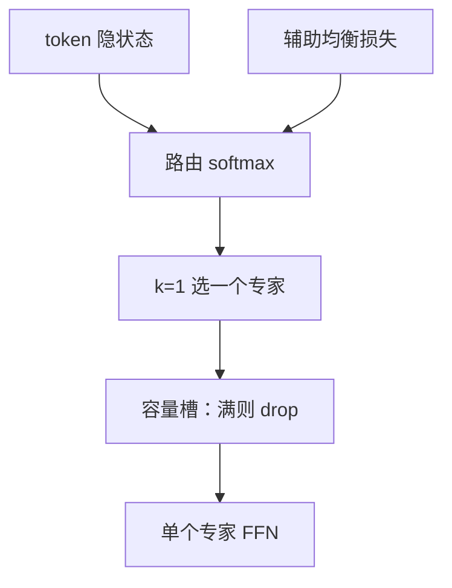

# Switch Transformer 论文

每个 token 只进一个专家。路由变简单，容量仍可随专家数线性涨，训练却不再被 top-2 的实现细节绑住。

<footer>—— Fedus, Zoph, Shazeer, Switch Transformers: Scaling to Trillion Parameter Models with Simple and Efficient Sparsity</footer>

主干已有 [Switch Transformer](/llm/switch-transformer) 课。附录对照 **Fedus、Zoph、Shazeer 原文** 的问题设定与稳定性配方：相对 GShard 的 $k=2$，他们把开关收到 $k=1$，并系统写容量因子、辅助损失、专家 dropout。上一篇附录是词表；本篇起 MoE 对照链。不把 GShard 公式再推一遍。

## 问题

GShard 已经把 MoE 接到 Transformer，但 $k=2$ 让调度、容量桶、通信更绕。作者问：$k=1$ 质量掉多少？若可接受，能否用更多专家把参数容量补回，同时保持与稠密模型同量级的 FLOPs？第二问是可复现的稳定训练：早期 MoE 的 NaN、崩溃、尺度爆炸。

万亿参数是标题中的尺度叙事：稀疏使参数与 FLOPs 解耦。评测含翻译、闭包式预训练任务，以及他们报告的不稳定案例。

### 为何 $k=1$ 仍叫 MoE

不同 token 仍走不同 FFN 参数，总库随 $N$ 涨。不是稠密 FFN。代价是选错没有第二专家插值。原文讨论是否把路由概率 $p_{i^*}$ 乘回专家输出——这正是主干[路由器梯度](/llm/moe-router-gradient)课的接口。附录只强调：论文把它当作稳定性与学习信号的一部分，而不是可有可无的实现。

## 方法

### $k=1$、容量与辅助损失

路由 softmax 后取 argmax 专家。容量因子截断过载 token。辅助损失拉专家频率与平均概率。他们还写了专家 dropout、较小的路由 z-loss 一类稳定项（与后文 z-loss 对照衔接）。实现在 TPU 上按专家分片。

## 机制

$k=1$ 降低通信与实现复杂度，使扩大 $N$ 更可行。稀疏度 $1/N$ 高于 Mixtral 式 $k=2,N=8$。论文用实验主张质量损失有限、可用专家数换回。稳定性来自配方组合，不是单一技巧：容量、辅助损失、精度、初始化一起上。

Drop 的 token 本层无专家贡献，见主干[容量因子](/llm/moe-capacity-factor)。原文把 $\mathrm{CF}$ 当作一等超参做了消融，而不是隐藏在代码里。

标题里的 trillion 是稀疏参数计数。引用「万亿模型」必须同时写激活 FLOPs 与专家数，否则与稠密万亿不可比。

### 与后续 Dropless / Expert-choice

原文默认有 drop 的静态容量。MegaBlocks 的 Dropless、Zhou 等的 Expert Choice 是后继对「不要丢 / 谁来选」的翻案。对照链下一篇就是 Expert Choice。不要把 2021 配方写成 MoE 的终点。

## 边界与工程取舍

TPU 切片、Mesh 与今日 GPU EP 的通信模式不同，吞吐数字不能直接搬。$k=1$ 在 Mixtral 一代产品里并未成为唯一默认——质量与实现栈变了。论文的贡献是简化开关 + 把稳定训练写成可抄的清单，以及参数–计算解耦的实证。

不要用标题数字当自家模型的参数声明。复现应锁辅助损失系数、$\mathrm{CF}$、$k$ 与精度。

文献名 *Switch Transformers: Scaling to Trillion Parameter Models with Simple and Efficient Sparsity*。作者 William Fedus、Barret Zoph、Noam Shazeer。期刊版本见 JMLR。

## 小结

- 原文主张 $k=1$ 的 Switch 路由，用更多专家换容量、保持 FLOPs。
- 容量因子、辅助损失、专家 dropout 是稳定性清单的一部分。
- 万亿指稀疏参数，须与激活量一起报。
- 后续 Dropless / EC 改的是本文化的 drop 与 token-choice。
- 出处：Fedus, Zoph, Shazeer, Switch Transformers。
