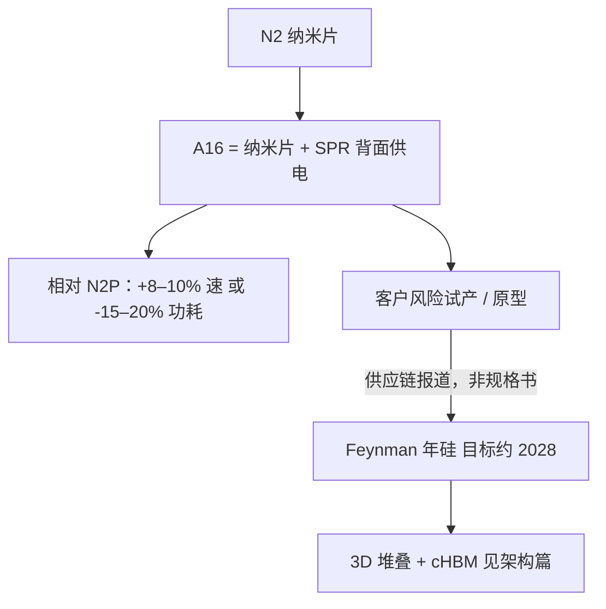

# Feynman A16 原型

    
A16 把纳米片晶体管与背面供电（Super Power Rail）做进同一节点：相对 N2P，官方给的是同压约 8–10% 速度，或同速约 15–20% 功耗，密度最多约 1.10×。

    <footer>—— TSMC 对 A16 / SPR 的公开 PPA 表述（含 VLSI 2026 相关说明）</footer>

[Feynman 架构](/llm/feynman-arch) 写的是 2028 年平台：堆叠、cHBM、Rosa。它**没有**在 GTC 产品规格里宣布「本 GPU 采用 TSMC A16」。把 Feynman 和 A16 连在一起的，是供应链与代工侧报道：NVIDIA 为下一代数据中心 GPU 做 A16 上的原型 / 风险试产，量产窗口与 Feynman 年对齐。本篇把两件事分开写——**A16 节点本身有 TSMC 公开 PPA**；**Feynman 硅在 A16 上的具体芯片规格公开信息有限**。不编造晶体管数、SRAM、也绝不把 TSMC 的节点增益写成 NVIDIA 的整卡加速比。

## 问题

先进工艺的选择已经不是「缩小一个节点就涨 30%」。N2 引入纳米片（GAA）；A16 在此之上加 **Super Power Rail（SPR）背面供电**，把 VDD/VSS 从正面金属挪到晶圆背面，正面金属改给信号。对超大 GPU 这种布线极密、供电极凶的芯片，节点故事从「更小的栅」变成「电源网络不再和信号抢轨道」。问题是：谁会做第一批 HPC 客户、风险试产何时、以及背面供电怎样改写物理设计流程。

Feynman 若走 A16，工程含义是：封装上的 3D 逻辑堆叠，与晶圆上的背面供电，是两层正交的密度手段。把它们混成一个「1.6nm 原型芯片」的参数表，会把 TSMC 的节点论文误当成 NVIDIA 的 SKU。

### A16 公开合同（代工厂）

TSMC 公开表述的要点：

- 晶体管：领先纳米片 + SPR。SPR 把正面布线资源留给信号，并降低 IR drop。
- 相对 **N2P**：相同 Vdd 下约 **8–10%** 速度；相同速度下约 **15–20%** 功耗；芯片密度最多约 **1.10×**。
- 量产节奏：公开材料把 A16 量产指向 **2026 年第四季度** 一档（具体以 TSMC 当时财报 / 技术论坛为准）。量产节点 ≠ 客户 GPU 上市；加速器从 PDK 到机柜通常还有数年。
- 设计方法：背面电源网络使 IR 签核、去耦、电源网格层次与 N2/N2P 正面供电不同。EDA 流程要为 SPR 重训，不是换一套 library 那么简单。

这些数字是**工艺节点 PPA**，测试条件由代工厂定义。它们不是某颗 Feynman 原型的测量，也不能与 GPU 动态功耗、HBM PHY、SerDes 直接相加。

「1.6nm」是 A16 的营销纳米档，不是物理栅长。对比对象必须写 N2P，不要拿 3nm FinFET 的经验去乘 8–10%。Intel 已在其它产品上做过背面供电；A16 是 TSMC 将 SPR 与纳米片组合量产的节点，不是「业界第一次背面供电」。

## 方法

对「Feynman A16 原型」只能用分层证据：

1. **代工厂公开**：A16 PPA、SPR、量产季度。这是硬的。
2. **NVIDIA GTC 公开**：Feynman 堆叠与 cHBM 与 2028 年，**未**在同一张规格表里写 A16。
3. **供应链报道**：NVIDIA 跳过对 N2 家族的主力投入、在 A16 上做 Feynman 相关原型，量产约 2028 下半年。这类报道用于「为何会有一篇 A16 原型笔记」，**不能**提供芯片 FLOPS。

原型阶段的真实工作（一般 ASIC 流程，不是泄漏）：PDK 进客户、标准单元与 SRAM 编译、背面 PDN 的试验芯片、再与 SoIC / CoWoS 一类封装流程联调。报道中出现的 SoIC 3D、CoWoS-L、面板级封装、COUPE 光学，属于先进封装菜单；Feynman 用其中哪几项、原型片是否已出电，NVIDIA 未发数据手册。本篇停留在菜单级，不画假的 floorplan。

### 背面供电改了什么物理问题

正面供电时，顶层厚金属既要送电又要走时钟与长互联，拥塞和 IR drop 绑在一起。SPR 把主电源路径放到背面：正面轨道释放给信号，电源路径更短、压降更小。对 GPU 这种到处是宽 SIMD 与 SRAM 阵列的芯片，密度增益可能来自「布得下」而不是「栅更小」。代价包括：背面工艺复杂度、与堆叠封装的热/机械耦合、以及设计团队要在 floorplan 早期就冻结 PDN——TSMC 相关说明强调方法论必须前移。

若再叠一层逻辑片，电源从背面进、热从另一面出，原型要验证的是三维的电-热耦合，而不是二维节点的 PPA 表。这是「A16 原型」比「换个工艺库重编译」重得多的原因。公开信息到此为止。

## 机制

为什么 NVIDIA 可能跳过把旗舰 GPU 压在 N2 上（报道口径）：A16 相对 N2P 的增益是结构性的（供电拓扑），不是同一 FinFET 曲线上的再缩一次。对多千瓦级模块，15–20% 的同速功耗下降是机房数字，不是跑分数字。但这仍是**动机推断**，不是已宣布的选型声明。官方产品句式应写成：「TSMC 已公布 A16；Feynman 的工艺节点以 NVIDIA 日后白皮书为准。」

与 [Feynman 架构](/llm/feynman-arch) 的正交关系：堆叠解决封装平面与片间线长；A16/SPR 解决单片布线与 IR。两者可以同时做，也可以只做其一。把「A16 原型」理解成「已经量产的 Feynman GPU」是时间错误：节点 2026 量产、加速器 2028 年一代，中间是多轮试产。

次级文章里出现过把 A16 与「数千亿晶体管单片」「数 GB 片上 SRAM」绑在 Feynman 上的写法。那些不是 GTC 规格，本篇删除。能写的只有 TSMC 的 8–10% / 15–20% / 1.10×，以及「原型存在于供应链叙述中」。

### 对软件与集群规划的含义（无假数字）

软件：工艺节点不改变 CUDA 编程模型。背面供电与堆叠可能改变频率曲线、boost 行为、以及多 chiplet 的亲和性，内核调优要等硅。集群：若 A16 的功耗增益兑现，同功率可多装计算；若 3D 堆叠把单封装功耗密度推高，机架 CDU 才是瓶颈。两种相反结局都还没有产品页可以裁决，规划应保留分支，而不是锁死一种 EFLOPS。

光学 CPO、定制 HBM 与 A16 同属 2028 菜单，量产风险独立：节点良率、HBM 底座、光学封装任何一项滑期，都会让「A16 原型成功」无法变成「Feynman 机柜到货」。

## 边界与工程取舍

本篇不写：Feynman 的 TFLOPS、HBM 容量、TDP、晶体管数、SRAM、NVLink 速率。不写「已流片成功」或具体步进编号——没有官方原型报告。不把 TSMC 相对 N2P 的 PPA 乘到 Rubin 的产品峰值上得到一张假的 Feynman 表。不把 Intel 18A 背面供电的产品经验直接当成 A16 GPU 的热设计。

引用供应链来源时标明「报道而非规格」。GTC 演讲是架构篇的一级来源；本篇的一级来源是 TSMC 节点公开材料。两级混用会造成「NVIDIA 宣布了 A16 GPU」的假记忆。

出处：TSMC A16 / Super Power Rail 公开 PPA（相对 N2P 的速度、功耗、密度）；量产季度以 TSMC 当时说明为准。Feynman 与 A16 的对应关系来自供应链报道，NVIDIA 产品规格书未发布。架构级公开点见 [Feynman 架构](/llm/feynman-arch)。

## 小结

- A16：纳米片 + SPR 背面供电；相对 N2P 约 +8–10% 速度或 −15–20% 功耗，密度最多约 1.10×。
- 节点量产窗口与 Feynman GPU 上市窗口不是同一件事；后者在路线图上是 2028 年一代。
- 「Feynman A16 原型」属于代工/供应链叙述，没有可引用的芯片规格表。
- 背面供电与 3D 逻辑堆叠正交，电-热耦合是原型要验证的核心，细节未公开。
- 禁止用节点 PPA 外推整卡 FLOPS 或机柜功耗。
- 出处：TSMC A16 公开材料；Feynman 平台叙事见 GTC 路线图专篇。
