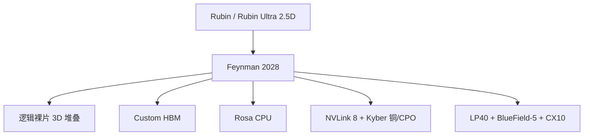

# NVIDIA Feynman 架构

    
Feynman 是 Rubin / Rubin Ultra 之后的下一代：路线图写在 2028，GTC 上确认的是逻辑裸片 3D 堆叠、定制 HBM，以及配套的 Rosa CPU 与 NVLink 8 / CPO 机柜组件。

    <footer>—— NVIDIA GTC 2025 路线图命名与 GTC 2026 主题演讲中的公开更新</footer>

Blackwell 之后，NVIDIA 把数据中心 GPU 改成年更：Vera Rubin 一代，然后 Rubin Ultra，再然后才是 **Feynman**。名字在 GTC 2025 的路线图上已经出现；GTC 2026 主题演讲把几件架构选择说清楚——**真正的逻辑裸片堆叠**、**custom HBM（cHBM）**、主机 CPU 从 Vera 换成 **Rosa**，并配齐 BlueField-5、CX10、Kyber 铜缆与共封装光学（CPO）的 scale-up。本篇只写这些已经在 GTC 公开叙事里出现的合同。峰值 FLOPS、HBM 容量、TDP、晶体管数均未作为可引用的产品规格发布；**公开信息有限，不编造数字**。

## 问题

2.5D 封装把 GPU 计算片与 HBM 立方并排放在中介层上，连线短，但平面尺寸随栈数和计算片数线性摊开。机柜要继续加带宽、加计算密度，中介层面积、凸点、以及片间延迟会先顶死。Feynman 要回答的问题是：下一代是否还在 CoWoS 式的「并排」里打转，还是把**多层逻辑硅**叠起来，让垂直互连承担过去由水平中介层走的那部分流量。

第二问是平台而不是单 GPU。NVIDIA 已经把「一颗 GPU」叙事改成「一台 AI 超级计算机」：[Rubin 六芯片](/llm/rubin-six-chips) 是 GPU+CPU+交换+网卡+DPU+以太。Feynman 年沿用同一逻辑，组件改名换代。只优化 GPU、不谈 Rosa 与 NVLink 8，机柜合同是残的。

### GTC 上确认了什么、没确认什么

已出现在公开路线图 / 演讲转述中的条目：

- 时间：目标 **2028** 一代，排在 Rubin（约 2026）与 Rubin Ultra（约 2027）之后。
- GPU：Feynman 架构；示意图相对 Rubin 更「厚」、平面更紧，与从 2.5D 并排转向堆叠一致。
- 封装：Jensen 在 GTC 2026 主题演讲中确认将堆叠多颗 GPU 逻辑裸片（报道指向演讲约 2:12:33）。这是相对 Hopper/Blackwell/Rubin 主流 2.5D 的代际变化。
- 内存：路线图从「下一代 HBM」改为 **custom HBM**。含义是 GPU 厂商参与底座逻辑 / PHY，而不是只买 JEDEC 商品栈。
- CPU：**Rosa**（公开解释为 Rosalyn 的缩写），不再沿用 Vera。
- 同代组件：与 Groq 合作的 **LP40** 推理向加速器、**BlueField-5**、**ConnectX-10**、**NVLink 8**、Kyber 铜缆 scale-up 与 **Kyber CPO**。演讲原话强调第一次同时用铜缆与共封装光学做 scale-up。

未作为规格发布的：**任何** TFLOPS、HBM GB、TB/s、TDP、SM 数、SRAM 容量、NVLink 端口速率的产品数字。次级报道里的猜测（含功耗上界）一律不采用。

Feynman 不是 2026 年可下单的 SKU。把它写进当年的机柜 BOM，是把路线图当成发货清单。近期容量仍按 Blackwell / Rubin 产品页；Feynman 只改变 2028 前后的封装与互连假设。

## 方法

规划上把 Feynman 当成**平台年**，而不是一张加速卡。计算：堆叠逻辑片提高密度、缩短片间路径。内存：cHBM 把控制器或近存逻辑往栈的 base die 推，主计算片腾出凸点与功耗预算——这与业界 cHBM / 定制底座的方向一致，但 NVIDIA 未公布 Feynman 用的是 HBM4E 改版还是更新一代。CPU：Rosa 接替 Vera 做编排、近端数据与智能体控制面，具体微架构未公开。互连：NVLink 8 + CPO 把 scale-up 的距离和功耗从铜缆的物理极限里松开；Kyber 名称出现在铜与光学两条 scale-up 路径上。推理侧 LP40 表明「通用 GPU + 专用低延迟芯」会在同一代机柜里并存，类似 Rubin 年把 Groq 路径补进平台。

软件假设应保守：CUDA 兼容性会延续，但 3D 堆叠改变的是片上拓扑与热设计，内核占用、NVLink 域大小、以及 CPO 交换机的集体通信原语，都可能与 NVL72 不同。不要把 [NVL72](/llm/vera-rubin-nvl72) 的 72 GPU 域大小外推成 Feynman 机柜的 GPU 数——该数字未公布。

### 3D 堆叠要付的物理账

逻辑叠逻辑的好处是线短、带宽密度高、封装平面更小。公开讨论里反复出现的代价是**下层散热**：中间那层逻辑的热要穿过上层或通过硅通孔/热柱导出。NVIDIA 未公布冷却方案。工程上只能记下约束：液冷、供电、以及可能更高的单封装功耗密度，会早于 FLOPS 成为机房问题。把「示意图更小」读成「整机柜功耗下降」没有根据；更小的封装往往意味着更陡的热梯度。

cHBM 同样没有产品表。合理预期（来自行业对定制底座的一般描述，不是 Feynman 规格）：底座可以放控制器、近数据处理，主片 PHY 更小。带宽与容量的具体增益未公布，不得写成「相对 HBM4E 提升百分之几」。

## 机制

从系统看，Feynman 年是 NVIDIA 把「年更 GPU + 两年一更 CPU」咬得更紧的一次：Rosa 表明 CPU 不再四年一跳。Scale-up 同时保留铜与 CPO，说明光学还不是唯一物理层——短距高功耗仍可能走铜，跨架或超高带宽走光学。这与「Feynman 等于全光学机柜」的简化相反。

对 LLM 工作负载的定性含义（无数字）：堆叠若缩短计算片之间的同步路径，宽张量并行与专家并行的片内/封装内部分会更便宜；若热限制迫使降频，峰值反而不可用。cHBM 若提高有效 $B$，decode 屋顶线右移；若只增加近存逻辑、针速不变，受益的是容量与控制器效率。这些都是分支，不是结论。验收只能等白皮书。

供应链文章常把 Feynman 与 TSMC A16、SoIC、CoWoS-L 绑在一起。工艺节点是[另一篇](/llm/feynman-a16)的主题；本篇不把未在 GTC 规格表出现的制程名称当成已宣布的产品参数。GTC 确认的是堆叠与 cHBM 与平台芯片名单。

### 不要用 Rubin 的表头填空

Rubin 的 HBM4 容量、NVFP4 峰值、NVL72 的 72 卡，都是那一代已经公开的产品数字。Feynman 没有对应列。用「每代翻倍」外推 2028 的 EFLOPS 或 NVLink TB/s，属于编造。LP40 的 NVFP4 支持出现在平台叙事里，也不等于 Feynman GPU 的精度集合已公布。

## 边界与工程取舍

本篇拒绝填写：晶体管数、SRAM、HBM 栈数、TDP、SM 数、NVLink 单端口速率、机柜 GPU 数、单卡 PFLOPS。次级媒体对「超过两千瓦」一类功耗的推测不引用。Intel 代工 / EMIB 等合作若未在 NVIDIA 产品材料确认，不写进架构合同。

对采购的唯一可用结论：2026–2027 按 Rubin 体系规划；把液冷、CPO 运维、以及「逻辑堆叠的热」列进 2028 的风险登记表。对研究人员：论文若讨论 Feynman，应标明信息来自 GTC 路线图而非数据手册。

出处：GTC 2025 路线图对 Feynman 的命名；GTC 2026 主题演讲及 NVIDIA 数据中心路线图公开更新（3D 堆叠、cHBM、Rosa、LP40、BlueField-5、NVLink 8 / CPO）。无产品规格书。

## 小结

- Feynman 是 2028 年一代 GPU 架构，位于 Rubin 与 Rubin Ultra 之后。
- GTC 公开点：逻辑裸片 3D 堆叠、定制 HBM、Rosa CPU、NVLink 8 与铜/CPO 双路径 scale-up。
- 同代平台还包括 LP40、BlueField-5、CX10 等，沿用「多芯片共设计」而不是单卡故事。
- 任何 FLOPS / HBM / TDP 数字目前都未形成可引用规格，不得外推。
- 热与供电是堆叠逻辑的一等风险，冷却方案未公布。
- 出处：NVIDIA GTC 公开路线图与主题演讲；制程细节见 [Feynman A16](/llm/feynman-a16)；当代机柜对照 [NVL72](/llm/vera-rubin-nvl72)。
