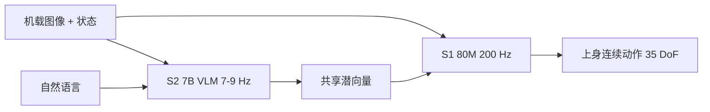

# Figure Helix 双系统

    
先前路线卡在权衡上：视觉语言模型泛但不快，机器人视觉运动策略快但不泛。Helix 用两个互补、端到端一起训的系统把这条权衡拆开。

    <footer>—— Figure AI, Helix: A Vision-Language-Action Model for Generalist Humanoid Control, 2025-02-20</footer>

Figure 在 2025 年 2 月 20 日的官方长文里发布 **Helix**：面向人形上身的通才视觉—语言—动作模型。它被明确写成 **System 2 / System 1** 双系统，而不是单网、单频率的 VLA。S2 是车载、互联网预训练的约 70 亿参数 VLM，7–9 Hz，负责场景与语言；S1 是约 8000 万参数的视觉运动 Transformer，200 Hz，把 S2 的连续潜向量译成手腕、手指、躯干与头部指令。整套在嵌入式低功耗双 GPU 上 onboard 跑，官方强调可进入商业部署约束。本篇只写这篇 Helix；2026 年 1 月的 Helix 02 把控制扩到全身并加 System 0，另是一条产品线。

## 问题

家庭里的物体种类无法用「每个技能几千条示范」穷举。启发式编程随博士工时线性涨；纯模仿学习随数据涨，仍要为每个新物体重新采。Figure 把曲线画成：若能把 VLM 里的常识直接变成动作，新技能的边际成本变成一句话。障碍是频率。70 亿级 VLM 做不到 200 Hz 闭环；200 Hz 的小策略又没有开放词汇。上身还有额外耦合：头和躯干一动，视野与工作空间一起变，历史上容易振。

第二个问题是多机协作与「一套权重」。先前 VLA 常为每个行为加头或再微调。Helix 主张：同一套权重同时做抓放、开抽屉与冰箱、跨机器人递物，并且两台 Figure 可以跑同一检查点、用自然语言分工。

### 家用缩放曲线要的是即时泛化

官方对比三种获技方式：手写启发式、示范模仿、语言指定。Helix 的评测合同是：训练里见过的物品全部排除出测试，用自动标注的事后指令做语言条件，看能否抓「沙漠相关物品」这种抽象类别，以及从未见过的杂乱桌面。数据规模被写成约 **500 小时** 高质量遥操作，相对先前超大规模 VLA 数据集「不到 5%」，更接近单任务模仿的采集量。这是在用人形高维动作空间换数据效率叙事，不是声称 500 小时已经覆盖家庭分布。

「Pick up anything」是系统测试里的观察：数千种新物体、杂乱场景、语言指令。它不是形式化的开放词汇抓取基准分数。协作买菜入库的视频是同一套权重在两台上同时跑，角色由语言指定（「把饼干递给右边的机器人」），不是隐式通信协议。

## 方法

S2：开源开权的 7B VLM，吃单目机载图像与机器人状态（手腕位姿、手指），投影进视觉—语言嵌入，再与自然语言指令一起压成**一个连续潜向量**，交给 S1。S1：8000 万参数的交叉注意力编解码 Transformer；视觉骨干是全卷积、多尺度，在仿真里预训练。S1 与 S2 看到同一图像与状态，但 S1 以更高频率处理。S2 潜向量投影进 S1 的 token 空间，与视觉特征在序列维拼接，作为任务条件。

动作是连续回归，不是离散 token。输出包括期望手腕位姿、手指屈伸与外展、躯干与头部朝向，控制频率 200 Hz，官方写 35 自由度。额外加一维合成的「任务完成百分比」，让模型自己预测终止，便于串多个已学行为。损失是标准回归，梯度经潜向量从 S1 回传到 S2，两端联合优化。没有按任务分头、没有第二阶段微调。

### 训练时的时间偏移对齐部署延迟

S1 与 S2 的输入在训练里被刻意错开一段时间，幅度对齐部署时两路推理延迟之差。部署时两块嵌入式 GPU 模型并行：S2 异步后台更新共享内存里的意图向量；S1 实时环路始终读最新观测与「当前能拿到的」S2 向量。训练—推理分布差被这个偏移压小。语言标签来自另一套 VLM 对切分视频的事后提问：「若要得到这段动作，你会下什么指令？」

## 机制

双系统把「语义意图」从「高频纠错」里拆出来。S2 慢，是为了让开放词汇与场景理解走得动；S1 快，是为了在协作伙伴突然伸手时改轨迹，而不必等 7B 模型下一次前向。共享的是低维连续向量而不是自然语言子任务：相对 π₀.₅ 那种「先说出下一步」的显式链，Helix 把接口留在潜空间，官方认为这样不必统一观测与动作表示就能分别迭代两套系统。

回归而非 tokenization，是针对人形动作维数的取舍。先前 VLA 在平行夹爪、低维末端上离散化有效；35 维、含手指的连续控制会把词表与校准一起撑爆。完成百分比把「何时松手、何时换下一句指令」学进同一策略，避免外部有限状态机。头—手协调在视频里表现为注视自己的手：这是视觉闭环，不是预录关节轨迹。

S1 的视觉骨干「完全在仿真里预训练」是官方原句。这解释了为何 80M 小网仍能抽多尺度特征，也划清边界：仿真外观必须能迁移到真实机载相机，否则 S2 的语义向量会条件在错的视觉统计上。

### 车载双 GPU 是架构的一部分，不是运维细节

若 S2 上云，7–9 Hz 会叠网络抖动，S1 的 200 Hz 环路无法用「刚过期的意图」稳定工作。Figure 把「立即商业部署」写成 onboard 低功耗 GPU，等于把延迟预算做成模型约束：S2 必须能在嵌入式上跑 7B，S1 必须小到 200 Hz。模型并行不是可选优化，是训练时就已经假设的部署图。

## 边界与工程取舍

Helix 原文覆盖上身，不含步行与全身平衡。500 小时是高质量监督，不是互联网视频。自动事后指令会把示范里的真实意图译错，语言泛化部分来自 S2 预训练、部分来自标注器的偏差。零样本物体是「小件家用物品」测试，不是任意工具使用。多机协作靠语言角色，没有显式协商协议；失败模式（抢同一物体、递接时序）没有以表格形式给出。回归损失对多模态动作分布的表达力弱于流匹配，官方用「简单架构」换部署，不声称动作分布建模更强。

Helix 02（2026-01-27 官方 *Introducing Helix 02*）增加 1 kHz 的 System 0 与全身控制，替换大量手写 C++。那是后续系统，不要把 S0、掌心相机与触觉写回 2025-02-20 的 Helix。也不要把 Kahneman 的 System 1/2 心理学当实验证据：这里只是频率分层的隐喻。

出处：Figure AI，*Helix: A Vision-Language-Action Model for Generalist Humanoid Control*，https://www.figure.ai/news/helix ，2025-02-20。对比时用官方当时写下的频率、参数与 500 小时，不要用演示视频反推未公布的层数。

## 小结

- Helix 是人形上身 VLA：S2（7B，7–9 Hz）出语义潜向量，S1（80M，200 Hz）出连续动作。
- 端到端回归、单套权重、无任务微调；动作含手指、腕、躯干、头与完成百分比。
- 训练用时间偏移对齐异步部署；双嵌入式 GPU 模型并行。
- 数据约 500 小时遥操作加 VLM 事后指令；测试物体从训练中剔除。
- 原文不到全身运动；Helix 02 是后来的全身版本。
- 出处：Figure 2025-02-20 官方博文。
