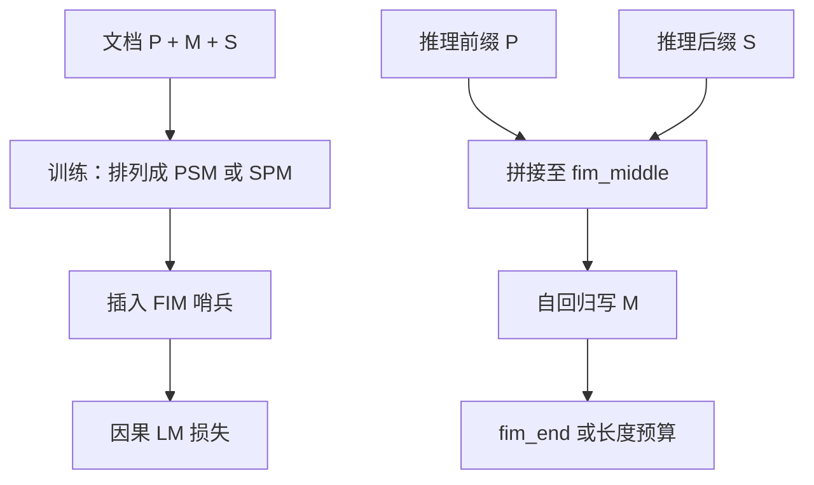

# FIM / fill-in-the-middle 解码

    
把文档切成前缀、中段与后缀，训练时按「前缀–后缀–中段」的顺序写中段：从左到右的语言模型不必改架构，就能学会填空。

    <footer>—— Bavarian et al., Efficient Training of Language Models to Fill in the Middle, 2022</footer>

代码补全很少只要「从光标写到文件末尾」。更常见的是：上面已有函数签名，下面已有调用方，中间缺实现；或文档里两段确定文字之间要插入一段。从左到右的因果模型默认只条件于左侧。Bavarian 等人给的 Fill-in-the-Middle（FIM）不改 Transformer 架构，只改训练时的拼接顺序：把中段挪到后缀之后写，并用哨兵 token 标明三段边界。推理时按同一格式喂前缀与后缀，模型在中段哨兵之后自回归，直到结束哨兵。Code Llama、StarCoder 等后续代码模型把这一目标做成标配。本篇谈 PSM/SPM 两种排列、FIM 率与左到右能力的权衡，以及解码时如何把「填中段」接回普通采样与约束解码。

## 问题

标准因果 LM 的似然是 $\prod_t p(x_t \mid x_{<t})$，位置 $t$ 看不见 $t$ 右侧。若把「右侧已有文本」只写进系统提示用自然语言描述，模型既没有在预训练里见过这种事件，也没有位置编码上的结构保证。把整文件当前缀、让模型从文件头重写到中段，则浪费前缀计算，且容易改掉本应冻结的后缀。

需要的是一种训练时就出现的事件：模型在写中段的每一步都能看见左上下文与右上下文。架构上可以上编码器或双向注意力，但那会放弃现成的因果解码栈。FIM 的问题设定是： **仍然用因果解码**，仅通过排列与哨兵，把后缀信息搬到中段 token 的条件前缀里。

### 切分必须在字符或 token 上可复现

训练时随机切出中段，切点若总落在行边界，模型会把 FIM 学成「填一整行」；若切在子词内部，哨兵两侧的碎片与推理时 IDE 的光标不一定一致。Bavarian 等人采用字符级随机跨度（再映射到 token），并混合普通从左到右样本，避免模型只会填空、不会续写。推理侧的光标位置应尽量用同一套规则落到 token 边界，否则前缀最后一个不完整 token 会污染第一段中段预测。

FIM 不是另一种注意力。因果掩码仍在：写中段时，中段内部仍不能看尚未写出的中段 token。它能看见的「右边」只是训练时挪到前面的那份后缀，不是任意未来。把它说成双向 Transformer 是类别错误。

## 方法

Bavarian 等人的 PSM（Prefix–Suffix–Middle）把一条训练序列排成：

$$
\texttt{<fim\_prefix>} \circ P \circ \texttt{<fim\_suffix>} \circ S \circ \texttt{<fim\_middle>} \circ M \circ \texttt{<fim\_end>}
$$

其中 $P,S,M$ 分别为前缀、后缀、中段。模型对整段做标准因果损失，但实践里常只在 $M$ 上计损失，或对三段都计损失——论文比较了变体，结论是适当比例的 FIM 对左到右困惑度伤害很小。SPM（Suffix–Prefix–Middle）把后缀放在最前；两种排列可以按一定概率混合，以减轻模型对「哨兵出现顺序」的过拟合。

哨兵必须是词表里的特殊 token，而不是自然语言里的标记字符串，否则文档里碰巧出现相同文字会破坏结构。推理时 IDE 传入 $P$ 与 $S$，服务端拼出前缀到 `<fim_middle>`，然后按普通 decode 采样，直到 `<fim_end>` 或到达长度预算。中段内部仍可用温度、top-p；也可以叠 [文法约束](/llm/grammar-decode)，例如强制中段是合法表达式——约束自动机只应作用在 $M$ 上，不要把哨兵与后缀重新掩码掉。

### FIM 率与课程

FIM 率是一条样本被改写成填空而非普通续写的概率。Bavarian 等人的关键经验是：中等 FIM 率（他们报告的工作点在一半附近，具体数字以论文表格为准）可以几乎不牺牲左到右性能，同时获得填空能力。率为 1 时，模型很少见到「没有后缀哨兵的普通文档」，聊天续写与普通补全会退化。率为 0 就是普通 LM。代码预训练常把 FIM 当作贯穿全程的随机变换，而不是只在后期 SFT 才插入，以免哨兵在深层表示里只是一层薄包装。

### 多文件与仓库级上下文

单文件 FIM 只条件于本文件的 $P$ 与 $S$。仓库级补全还要把其他文件放进前缀，此时 FIM 哨兵只包住当前文件的三段，其它文件当作普通前缀 token。位置编码与长上下文外推是另一层问题；FIM 不解决「后缀在另一文件」——那份内容应作为检索或拼接的前缀，而不是 `<fim_suffix>`，否则模型会以为中间空洞与那份跨文件文本在同一条空洞语义里。

## 机制

PSM 有效是因为因果条件 $p(M \mid P,S)$ 在排列后变成对中段 token 的标准下一词预测，而 $S$ 已经出现在注意力可见的左侧。模型学到的是：看见 suffix 哨兵之后的文本，应把它当作「写完中段之后会接上的内容」，从而在中段里提前满足后缀的约束（例如补上即将被调用的函数名、对齐即将出现的括号）。这是内容寻址，不是语法上的强制闭合；若要强制闭合，仍需约束解码。

训练目标与推理格式必须一致。SFT 若用聊天模板包住代码、却丢掉 FIM 哨兵，填空能力会被聊天分布冲掉。反过来，把聊天轮次误标成 FIM，助手回复会被当成「中段」，用户后缀会被当成必须满足的右上下文，行为难测。数据管线应把 FIM 变换限制在预训练/代码语料，产品聊天走另一套模板。

FIM 的「看见右边」有长度上限：后缀太长时，真正决定中段的信号被挤在中间位置，长上下文里的远端后缀衰减与普通 LM 相同。IDE 应截断后缀到语法相关的窗口（当前函数、当前块），而不是把文件尾全部塞进 suffix。

### 与 infilling 评测

评测应区分：单行填空、多行函数体、跨函数引用、以及「后缀与中段语义无关」的负例（此时模型应忽略误导性后缀或保守地短填）。只报 HumanEval 式从左到右生成，测不到 FIM。Bavarian 等人用 Humaneval-infilling 一类任务对照；后续代码模型各自有 infill 基准。比较时要钉哨兵名字、PSM 还是 SPM、以及是否允许中段为空——空中段是合法事件，对应「光标处什么都不用写」。

## 边界与工程取舍

FIM 不替代补丁模型或 diff 模型。它假设后缀原文在生成后仍然原样接上；若产品其实允许改后缀（重构、改签名），应改用编辑模型或让模型输出整段替换，而不是 FIM。多处空洞（两个光标）也不是单次 PSM 能表达的，需要多次 FIM 或专门的 multi-span 训练，Bavarian 原文以单跨度为主。

哨兵泄漏到用户可见输出是实现 bug：停止条件应在采样环里识别结束哨兵并剥离，而不是靠后处理正则碰运气。与量化、投机解码兼容：草稿模型必须认识同一套哨兵，否则投机接受率会在哨兵附近塌掉。不要把 FIM 写成「OpenAI 内部秘密算法」；论文是 2022 年公开的 arXiv:2207.14255。

中段采样仍会幻觉 API。后缀里出现的标识符会提高被复用的概率，这是条件作用，不是保证。对库函数名应用枚举约束，比把整个仓库塞进 suffix 更稳。

### 解码侧的停止与约束

停止应同时认结束哨兵、认「开始重复后缀原文」（模型把 suffix 抄进 middle 是常见失败模式）、以及长度上限。检测到中段开头复制了 $S$ 的前缀，应截断并视为失败，而不是交给用户。约束解码的自动机从 `<fim_middle>` 之后启动，在结束哨兵处进入接受；不要把 $P$、$S$ 重新跑一遍 JSON 文法。FIM 与 JSON 约束可以组合：中段被限制为表达式，前后是普通代码——自动机的字母表仍是子词，空洞问题与 [正则约束](/llm/regex-constrained-decode) 相同。

## 小结

- FIM 用哨兵把后缀挪到中段之前，使因果 LM 能条件于左右上下文填空，架构不变。
- Bavarian 等人给出 PSM/SPM 排列与中等 FIM 率：填空能力上升，左到右能力可基本保持。
- 推理格式必须与训练一致；哨兵是特殊 token，结束时要剥离。
- 单跨度假设后缀原样接上；多空洞、改后缀的编辑是另一类模型。
- 中段仍可采样、可叠加文法约束；看见后缀不等于类型正确。
- 评测要用 infill 基准，并截断到语法相关的后缀窗口。
- 出处：Bavarian et al., *Efficient Training of Language Models to Fill in the Middle*, arXiv:2207.14255。
