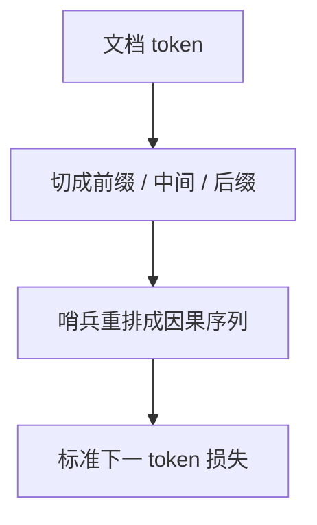

# FIM 训练目标

把一段文本的中间挖掉，放到后缀之后再预测，模型就能在已知左右上下文时填空，而不必只从左写到右。

<footer>—— Bavarian et al., Efficient Training of Language Models to Fill in the Middle, 2022</footer>

[上一课](/llm/repo-level-code-data)让相关文件出现在同一窗口。目标仍是标准的下一 token：总是预测最右端。编辑器里的补全却常常是「光标在函数中间，上面有签名、下面有调用」。本课不重讲仓库抽样。缺口是训练目标：Bavarian 等人的 Fill-in-the-Middle（FIM）用特殊哨兵把「前缀、后缀、中间」重排成仍可用因果 LM 训练的一条序列。后课长文档上采样改长度分布；本课改条件方向。

## 问题

因果语言模型天然适配「写到文件末尾」。对代码与文档编辑，缺失的是中间。若只靠指令微调教 FIM，预训练表征从未见过「后缀先于中间」的条件，样本效率差。需要在预训练里以一定概率把文档改写成 FIM 格式，且切分必须用已经冻结的 [特殊 token](/llm/special-tokens)：前缀、中间、后缀哨兵不能与内容 BPE 冲突。

Bavarian 等人表明，合理的 FIM 比例下，从左到右的能力不必崩。工程缺口是比例、跨度分布、以及与仓库级打包是否同屏做 FIM（在超文档上挖一段，还是只在单文件内挖）。

### 哨兵是协议，不是注释字符串

若用可读的 `<fim_prefix>` 而预分词没有先抽出，BPE 会把它切碎，训练与推理对不齐。FIM 符号应在词表扩展的协议区占位，预训练就要插入，以免嵌入成为 glitch。InCoder（Fried 等人）用另一套跨度填空；本课以因果 LM 上的重排 FIM 为主，不把编码器去噪整段搬回来。

数字逐位切分后，挖中间跨度应按 token 或按字符声明清楚。按字符挖再切分，边界可能落在数位中间，这其实无害，但日志里不要把它当成「切词 bug」。

## 方法

以概率 $p_{\mathrm{FIM}}$ 选择文档（或仓库超文档中的一个文件）。均匀或按长度偏置地采样两点，把序列分成 prefix、middle、suffix。输出排列为 prefix + 后缀哨兵 + suffix + 中间哨兵 + middle，或论文中的其他等价排列；损失仍只在需要预测的位置上计（通常预测 middle，有时也训其他段）。$p_{\mathrm{FIM}}$ 过低，编辑任务弱；过高，普通续写掉点。Bavarian 等人给出可参考的中等比例，落地时用代码探针与普通 perplexity 一起盯。

仓库级数据上，优先在单文件内 FIM，避免挖出来的 middle 落在两个无关文件的拼接缝上——那种「中间」没有编辑语义。跨文件 FIM 只有在排布已经保证强相关时才值得开。

### 推理格式必须与训练同一排列

补全 API 若改哨兵顺序，等于换任务。把排列写进词表卡片，与聊天模板并列。约束解码可以禁止在 middle 段之前结束，但那是推理课；预训练只要保证哨兵可学。

FIM 会改变有效长度：同样窗口，重排后注意力看到的「时间顺序」与源文件行号不同。长依赖评测应区分普通续写与填空两套。

## 机制

重排并不打破因果掩码：模型仍然只能看左边。它改变的是左边包含什么——填空时左边既有真正的前文，也有物理上靠后的后缀。于是中间 token 的预测能条件到双向的源文本信息，尽管计算图仍是单向的。这是数据变换，不是把 SDPA 改成双向。

## 边界

FIM 不是通用双向编码器，不能替代 T5 式跨度去噪的全部评测。对自然语言长篇，乱挖中间可能切断指代，收益小于代码。它也不增加真正的上下文长度——窗口仍满则仍截断。下一课处理的是：长文档在混合物里太少，模型在预训练里很少见到接近窗口上限的连贯文本。

## 小结

- 本课不重讲仓库抽样；只补因果 LM 上的中间填空目标。
- 用协议哨兵重排 prefix/suffix/middle，预训练就要插入，避免 glitch。
- 比例与挖空范围要同时盯续写与编辑探针；优先单文件内挖空。
- 仍是单向注意力，双向来自数据布局。
- 出处：Bavarian et al., 2022；Fried et al., InCoder, 2022。
