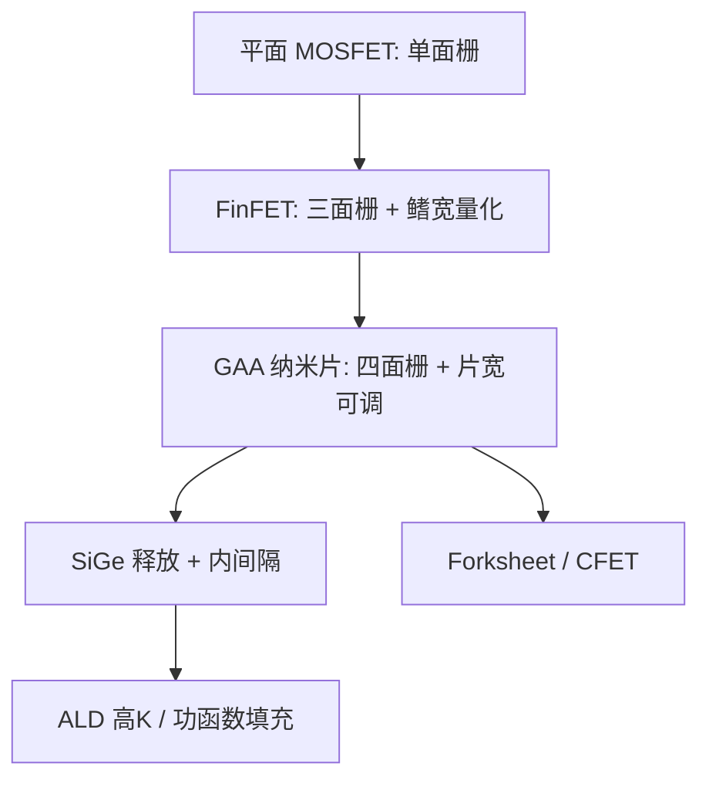

# FinFET 到 GAA / nanosheet

短沟道控制靠的是栅把沟道从更多方向包住。FinFET 用三面栅把平面 MOSFET 撑过了 20 nm 量级；再往下，需要第四面，以及可调的沟道宽度。

<footer>—— 对照先进逻辑静电学与代工厂公开的 GAA / nanosheet 论述</footer>

平面 MOSFET 的栅只从顶面调控沟道，沟道长度缩短后漏电场穿透，亚阈值摆幅与漏致势垒降低（DIBL）一起坏。FinFET 把沟道竖成鳍，栅包住顶与两侧，耗尽区从三面夹，让 22/16/14 nm 以及后续的鳍节距缩放成为可能。鳍宽被量化、寄生电容随鳍高涨、以及底部与浅槽隔离的泄漏路径，在 3 nm 类节点上把静电学余量吃尽。栅环绕（GAA）纳米片把沟道做成堆叠的水平薄片，栅从四面围住每一片，并用片宽连续调节有效宽度。这不是改个名字，是沟道拓扑与内隔离、释放刻蚀的一次重做，[ALD/ALE](/llm/ald-ale) 在其中变成必要工序而不是增强选项。

## 问题

FinFET 的有效宽度按鳍数一跳一跳地加。标准单元要更宽的驱动，只能加鳍，布线与脚打印一起涨；要更省电的弱器件，鳍数不能少于工艺允许的最小值。鳍高加得越高，电流密度好看，但栅电阻、寄生电容和填充难度一起升。底部的未栅控硅、以及鳍合并时的空隙，成为泄漏与变差的来源。多重鳍之间的局部布局效应让邻近单元互相调制阈值。

GAA 要解决的是：在更短的栅长下把自然长度压下去，同时让 DTCO 能连续选沟道宽度，而不是只在「几根鳍」上枚举。代价是工艺：必须长出 Si/SiGe 超晶格、把牺牲层挖空、在片与片之间做内间隔（inner spacer）、再把高介电与功函数金属填进纳米腔。任何一步的选择比不够，纳米片会断、会粘、会厚度发散。

### 自然长度与包栅

短沟道控制可用自然长度 $\lambda$ 粗看：$\lambda$ 越小，漏电场衰减越快。$\lambda$ 随沟道厚度和栅氧等效厚度降，也随栅包围程度降。FinFET 把厚度变成鳍宽；GAA 把厚度变成片厚，且四面栅进一步削 $\lambda$。片不能无限薄：迁移率、量子束缚和寄生电阻会报复。工程是在静电学、电流和变差之间选片厚、片数与片间距。

「GAA 一定比 FinFET 先进」只在同一代设计规则和同一套寄生电容模型下才有意义。一个做砸的纳米片（内间隔太厚、片释放损伤）可以比做好的 FinFET 更慢、更漏。比较应落在 Lg、DIBL、有效宽度与接触电阻，而不是架构商标。

## 方法

纳米片流程的骨架是：外延堆叠交替的硅与硅锗 → 浅槽与假栅 → 释放刻蚀去掉 SiGe（或按集成选定牺牲层）→ 内间隔形成 → 高介电 / 功函数金属的保形填充 → 替换栅与接触。片宽由设计在浅槽前定义，几乎连续可调，这是相对鳍量化的主要 DTCO 杠杆。片数（常见讨论为三至四片）在垂直方向加宽度，不增加平面脚打印。

接触与后栅：栅环绕让侧墙和接触的几何更挤，接触叠栅（contact over active gate）一类技术用来找回电阻。阈值调节靠功函数金属厚度与组成，在纳米腔里必须用 ALD 级保形，否则片与片之间阈值分裂。SRAM 与逻辑可能用不同片宽：宽片给性能，窄片给泄漏，这是 FinFET 鳍数枚举做不到的细粒度。

### 释放刻蚀与内间隔

释放是 GAA 的生死线：选择比不够会啃硅沟道；过蚀会让片下垂或断裂。内间隔决定栅漏寄生电容：太薄电容大、太厚有效沟道变差或填充窗口消失。这两步把 ALE、选择性干法/湿法推到前台。没有原子级循环，空腔尺寸的晶圆内变差会直接变成阈值变差。

## 机制

四面栅把沟道电位钉得更死，同样关态泄漏下可以更短的 Lg 或更低的阈值电压。驱动电流来自所有片的并联；片间距要给金属填充留空间，间距越大寄生越小但堆叠高度涨，后面的介质与平坦化更难。FinFET 的第三面栅在鳍顶，顶角圆化与鳍宽变差是历史痛点；纳米片的关键变差换成片厚、片宽和内间隔对称性。

从电路看，GAA 让单元库在同一高度下用片宽做 drive strength 的连续档，布线 congest 的形状与 FinFET 库不同。这会反馈到标准单元轨道高度、以及是否还能靠光刻做更紧的接触孔——前道静电学进步若被中段电阻电容吃掉，节点名上的「GAA」不会变成产品频率。先进封装与 [HBM](/llm/hbm-hybrid-bonding) 不替代这层，但大芯片上的功耗密度会决定 GAA 的工作电压还能降多少。

Nanosheet、MBCFET、RibbonFET 是各家对同一族 GAA 的产品名，细节（片数、是否 forksheet、是否已上 CFET）不同。写节点对比时用沟道拓扑与公开的 Lg/DIBL，不要把商标当成可换算的代数。

### 下一跳：forksheet 与 CFET

Forksheet 用介电墙把 N/P 更近地放，继续削单元宽度。CFET 把 N 与 P 堆叠，脚打印再减，但把释放、隔离和供电变成真正的三维布线问题。它们都建立在「会做纳米片释放与保形填充」之上。GAA 量产的意义之一，是为这些后续拓扑训练工艺肌肉，而不只是当前一代的 DIBL 数字。

## 边界与工程取舍

GAA 不自动减少 EUV 层数，也不取消多重图形：它改的是晶体管截面，金属节距仍由光刻与 [OPC](/llm/opc) 决定。寄生电阻、接触和中段 RC 可能吞掉静电学收益。缺陷模式从鳍断裂变成片粘连、空腔空洞、金属填充不全，检测与良率学习曲线按年计。

不要用「从 FinFET 到 GAA」当所有性能故事的主语。同一代里材料（应变、高迁移率沟道）、接触、以及是否用背面供电，往往与沟道拓扑同量级。GAA 是必要的静电学台阶，不是充分的产品台阶。

读代工厂幻灯片时区分：已量产的纳米片、风险试产、以及实验室 CFET。把后两者的截面图写进当前节点的功耗模型，会高估可交货的频率。

## 小结

- FinFET 用三面栅延长了 MOSFET 缩放；鳍宽量化与底部泄漏在更短 Lg 上成为墙。
- GAA 纳米片四面包栅，并用片宽连续调节有效宽度，代价是释放刻蚀与内间隔。
- 保形填充把 ALD 变成前道必要步骤；选择比不够会直接变成阈值变差。
- 电路收益取决于库的片宽档与中段 RC，不只取决于 DIBL 纸面值。
- forksheet / CFET 建立在同一套空腔工艺上，是后续脚打印手段。
- 沟道拓扑不替代光刻节距与封装供电。
- 出处：先进逻辑静电学；代工厂公开的 FinFET / GAA nanosheet 技术论述。
