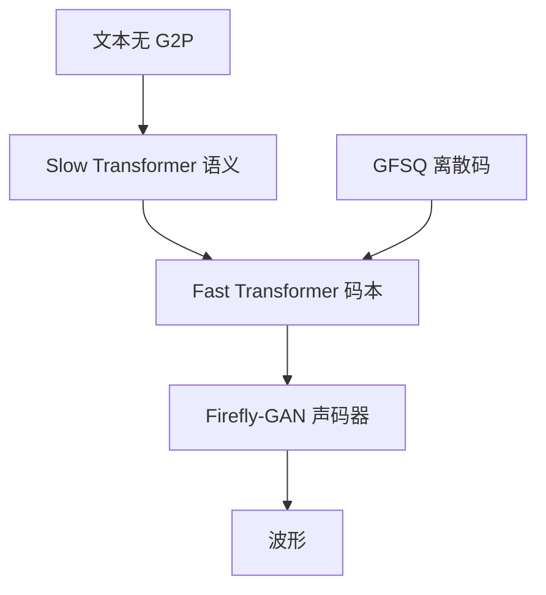

# Fish-Speech

    
我们用串行的快—慢双自回归结构稳定分组有限标量向量量化的序列生成，去掉 G2P，并在 72 万小时多语数据上训练。

    <footer>—— Liao et al., Fish-Speech: Leveraging Large Language Models for Advanced Multilingual Text-to-Speech Synthesis, arXiv:2411.01156</footer>

Fish Audio 的 Fish-Speech（arXiv:2411.01156）把 TTS 写成：用语言模型直接吃文本，用 **Dual-AR**（慢 Transformer 管语义、快 Transformer 管码本）稳定 **GFSQ** 离散码，再用 Firefly-GAN（FFGAN）声码器出波。官方博客 *Introducing Fish-Speech* 与论文一致：SoTA 向的自回归多语 TTS、近 100% 码本利用率、面向实时 Agent，首包延迟约 150 ms。开源实现 https://github.com/fishaudio/fish-speech 。本篇写 1.4 技术报告这条线；后来的 Fish Audio S2（更大规模、RL、开源权重另一篇报告）只在边界里点名，不把 10M 小时与 4B Slow AR 写进 2411.01156 的方法学。

## 问题

VALL-E、FastSpeech、VITS 等多依赖 G2P。多音字、语码混合、缺乏词典的语言会把错误发音焊进前端，维护 $N$ 套音素规则不可扩展。另一类系统把语义与声学拆开以提高稳，却削弱音色克隆对「这句话怎么说」的理解。扩散 / 流匹配 TTS 音质好，但多步 ODE 与首包延迟和 Agent 不对付。Fish-Speech 要的是：无 G2P 的多语、克隆稳、码本用满、消费卡上能实时。

量化侧，普通 VQ 容易死码。FSQ 与成组量化（GVQ）被组合为 GFSQ，目标是压缩比与**近 100% 码本利用率**。利用率高不等于听感好，但利用率低时 AR 很难学到稳定的离散语言。

### 双 AR 不是两套独立 TTS

慢编码器式 Transformer 看文本，出隐状态与语义 token logits；快 Transformer 吃隐状态与码本嵌入的拼接，出码本 logits。二者串行：慢的每步为快的提供条件，快的在组内展开码本。这针对「GFSQ 多码并行时 AR 易崩」的稳定性，而不是把声学再交给扩散。论文把相对 DiT TTS 的效率写成优势：消费级 RTX 4060 移动约 1:5 RTF，RTX 4090 约 1:15，加 KV cache 后首包约 150 ms。

72 万小时是这篇报告的数据规模。社区站点 fish.audio 上的说话人库是产品层，不等于论文训练集可下载。FFGAN 基于 GFSQ，相对 HiFi-GAN 一类波形 GAN，多了离散码条件。

## 方法

文本：LLM 式 tokenizer，无音素。慢 Transformer：$\mathbf{h}=\mathrm{SlowTransformer}(\mathbf{x})$，$\mathbf{z}=\mathbf{W}_{\mathrm{tok}}\mathrm{Norm}(\mathbf{h})$。快 Transformer：拼接 $\tilde{\mathbf{h}}=[\mathbf{h};\mathbf{c}]$，再 $\mathbf{y}=\mathbf{W}_{\mathrm{cbk}}\mathrm{Norm}(\mathbf{h}^{\mathrm{fast}})$。GFSQ 把潜条件编成组内 FSQ 码，FFGAN 解码为波形。训练目标是双轨交叉熵（语义 token 与码本），外加声码器的对抗与特征损失（论文以架构叙述为主，超参见代码）。多语、多情绪、克隆是同一套 AR，不另训语种专家。

推理：自回归出码，KV cache 加速慢/快两级。相对 Flow Matching，没有 NFE=10 的固定积分成本，延迟更可预测，但误差会沿时间累积——这是 AR TTS 的经典权衡。博客强调去掉扩散延迟。克隆通过参考音频编码进离散条件（实现细节以仓库当时模块为准），论文把它列为实验上相对基线更好的任务，不给「3 秒官方保证」——3 秒是 CosyVoice 报告的句子，不要混引。

### Firefly-GAN 要解决的是码本墙

若量化器只用掉码本的一小角，AR 的 softmax 再尖也学不到其余符号。GFSQ 把 FSQ 的无死码倾向与分组结合起来，FFGAN 在高利用率码上做对抗重建。论文称评估达 100% 利用率。这是量化器指标，不是 MOS=人类。高频与气息依赖 GAN 判别器；若码率过低，GAN 会「编」出不存在的齿音。

## 机制

无 G2P 的机制是：多音字的读音由上下文 token 决定，与 LLM 消歧是同一现象。代价是需要足够多的「同字不同音」上下文，72 万小时提供统计，不提供可审计词典。Dual-AR 把「句子级语言结构」和「帧级声学码」分成两个时间尺度，避免单一深层 AR 在长码本序列上的稳定性崩溃，也避免把全部声学细节压进慢模型的隐维。

与 CosyVoice 2 对照：Fish 没有独立流匹配 Mel 解码器，音色与细节更多走 GAN；CosyVoice 用监督 ASR token + OT 流。Fish 的 150 ms 与 CosyVoice 2 的 150 ms 数字相同量级，测试栈不同。Fish 论文明确点名 CosyVoice、Matcha-TTS 等为相关工作，定位自己为 Dual-AR + GFSQ，而不是混合 LM-CFM。

官方样本页与 fish.audio 在线合成是听感来源。论文没有把「超越所有闭源」写成主表标题；写进文章需带「作者自称 / 博客 SoTA」。加速数字绑定 4060 mobile 与 4090，换批大小与量化会变。

### Agent 就绪是延迟曲线，不是对话模型

「面向 AI 交互」指首包与 RTF，不是 Fish-Speech 自带 ASR 与对话策略。真正的 voice agent 仍要外接识别与 LLM。仓库若提供实时流式接口，那是工程封装。多情绪依赖训练分布与提示；没有像 CosyVoice 2 那样把「指令文本与零样本合并」写成同一套正式协议——Fish 博客更强调架构与码本。

论文把相关工作写成一条谱系：VALL-E 式 codec LM、VITS / FastSpeech 式声学模型、YourTTS 式克隆、以及 CosyVoice / Matcha-TTS 一流匹配。Fish-Speech 的差分是 Dual-AR 稳住 GFSQ，而不是再叠一条 Mel 扩散。评测叙述强调复杂语言现象与克隆相对基线更好；具体 MOS、WER 表以 PDF 实验节为准，博客的 SoTA 句不能替代表格。在线 playground 的社区音色是用户上传与授权问题，和论文训练集不是同一法律对象。

## 边界与工程取舍

AR 错误累积、句中崩溃、语码混合仍难。GAN 声码器在未见过的采样率或频响上会失真。无 G2P 不自动等于专有名词可读，仍可能要用户注音。开源许可与商用条款以 GitHub / 卡片为准。S2 Pro（后续技术报告 arXiv:2603.08823 一线）改数据规模与 RL，架构仍 Dual-AR，但不是本篇的 72 万小时模型。实时因子随量化、batch 与流式切块变化：论文的 4060 / 4090 数字只说明「可以不用 ODE 多步也能到交互延迟」，不能写成所有部署的 SLA。

不要把 EVA-GAN 论文（同一作者相关声码器工作）的 CAM 模块未经引用就画进 FFGAN。不要用第三方「最强开源 TTS」榜单代替 2411.01156。与 Whisper 无直接互逆关系。

出处：Shijia Liao et al.，*Fish-Speech: Leveraging Large Language Models for Advanced Multilingual Text-to-Speech Synthesis*，arXiv:2411.01156。博客 https://fish.audio/blog/introducing-fish-speech/ 。代码 https://github.com/fishaudio/fish-speech。

## 小结

- Fish-Speech 是无 G2P 的多语自回归 TTS：Slow/Fast Dual-AR + GFSQ + Firefly-GAN。
- 训练数据 72 万小时；官方称码本利用率近 100%，首包约 150 ms。
- 4060 mobile / 4090 上 RTF 约 1:5 / 1:15（论文环境）。
- 相对扩散 TTS，用 AR+GAN 换可预测延迟；相对 CosyVoice，不用流匹配 Mel。
- 后续 S2 系列是另一规模点，不改变本篇方法学引用。
- 出处：arXiv:2411.01156 与 Fish Audio 官方博客。
