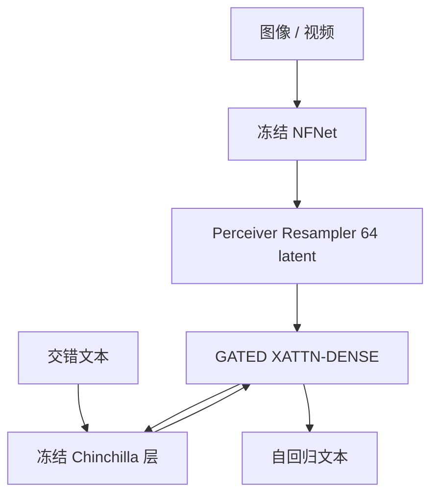

# Flamingo

冻住已经很强的视觉编码器和语言模型，只训练中间的重采样器与带门控的交叉注意力，交错图文提示就能少样本迁移到开放视觉任务。

<footer>—— Alayrac 等，Flamingo: a Visual Language Model for Few-Shot Learning，NeurIPS 2022</footer>

DeepMind 的 Flamingo 把多模态问题从「为每个视觉任务训一个头」改成「在冻结的大语言模型里做少样本提示」。输入是图像 / 视频与文本交错的序列，输出是自回归文本。视觉侧是对比预训练后冻结的 NFNet；语言侧是冻结的 [Chinchilla](/llm/chinchilla) 家族（1.4B / 7B / 70B），接上可训练桥之后分别叫 **Flamingo-3B / 9B / 80B**。桥有两块：把可变长视觉特征压成固定 **64** 个 token 的 Perceiver Resampler，以及插进 LM 层间的 **GATED XATTN-DENSE**。本篇按 arXiv:2204.14198 写这条少样本 VLM；它不是指令微调对话模型，不要用后来的 LLaVA 聊天模板去理解它的评测协议。

## 问题

2022 年视觉任务仍高度分裂：分类、检测、VQA、描述各用各的标注与头。语言模型已经展示了：换任务等于换提示，少样本就能做。视觉若要同一接口，必须接受**交错**输入——先给几对「图 + 问 + 答」，再给一张新图，模型续写答案——并且训练数据不能依赖每任务的人工标注。网络上的图文是弱对齐的，还夹着视频。

端到端把 70B 语言和视觉一起训，会冲掉已经花掉的语言算力，也极贵。Frozen 一类工作用视觉向量当软提示，表达力受前缀长度限制。需要一种插入方式：训练开始时模型仍等于原 LM（否则随机交叉注意力会立刻污染表示），训练结束后又能按图条件生成。

### 冻两端，只训桥

视觉编码器与 LM 权重冻结。可训练部分是 Resampler 与门控交叉注意力（以及它们的 LayerNorm 等）。三档模型共用同一视觉塔与同一 Resampler 规模，变的是冻结 LM 的宽度，以及门控层插入的密度：9B 大约每 4 层插一块，80B 每 7 层插一块——每层都插更好，但可训练参数与步时不可接受。消融写过：每 4 层插相对每层插，训练加速约 66%，总分约掉 1.9%。

3B/9B/80B 的数字包含了新插入的门控层，因此大于 Chinchilla 原参数。不要把 Flamingo-80B 写成「Chinchilla-70B 冻住不动、总参数仍 70B」。

## 方法

视觉骨干先在图文对上对比预训练，再冻结。对图像或视频帧抽出二维（加时间）特征图。Perceiver Resampler 持有固定 64 个可学习 latent，对视觉特征做交叉注意力，输出长度与分辨率、帧数解耦。随后，语言模型在生成第 $\ell$ 个词时，只交叉注意**当前这个视觉片段**对应的 64 个 token（交错掩码），而不是看见提示里所有历史图像的无界拼接——这样少样本里的第 $k$ 张图不会被第 $k-1$ 张的视觉 token 淹没，计算也不随「提示里有几张图」二次爆炸。

### tanh 门控：初始化即恒等

新块插在冻结 Transformer 层之间，形状是交叉注意力加前馈，残差写成

$$
x \leftarrow x + \tanh(\alpha)\,f_{\mathrm{xattn}}(x, v),\qquad
x \leftarrow x + \tanh(\beta)\,f_{\mathrm{ffn}}(x),
$$

$\alpha,\beta$ 每层一个标量，**初始化为 0**。$\tanh 0=0$，于是第一步前向与原 Chinchilla 逐 token 分布相同。训练过程中门逐渐打开，视觉条件才进入残差流。这比「随机初始化交叉注意力、指望小学习率」稳定得多。数据是网上交错图文（M3W 一类）、图文对（ALIGN、LTIP）与视频–文本（VTP）的混合，目标仍是语言建模：只在文本 token 上算损失。

## 机制

固定 64 个视觉 token 是算力阀门：交叉注意力代价与文本长度 × 64 成正比，而不是 × patch 数。高分辨率或视频帧先在视觉塔里变长，再被 latent 查询抽干。这与后来 LLaVA 把全部 patch 送进 LLM 相反：Flamingo 优先**少样本提示里塞得下多张图**，而不是把单张图的空间网格完整交给语言自注意力。交错掩码保证「这句文本只看这张图」，少样本示范才不会串台。

门控的机制是优化路径：若新层一开始就有 $O(1)$ 的随机输出，70B 的已训练流形会被推离；从恒等出发，等于在原 LM 的损失曲面上沿视觉方向微调桥。少样本能力来自预训练就看见「图–文–图–文」的交错统计，测试时把示范写成同一格式，无需梯度。这与 BLIP-2 / LLaVA 后来的「指令微调成聊天」不是同一评测：Flamingo 的主表是 0/4/32-shot 的开放生成与闭集准确率。

Perceiver 的 64 是原文默认。把它改成 32 或 128 会改交叉注意力成本与信息瓶颈，不能默认「开源 Flamingo 复现用了 64」。OpenFlamingo / IDEFICS 是社区再实现，数据与门控频率都可能不同。

### 和 Frozen、和后来的浅投影

Frozen 把整图收成软提示前缀，LM 内部结构不改。Flamingo 把视觉从侧路注入每一段文本，表达力在深度上重复，代价是可训练参数随插入频率涨。LLaVA 式浅 [MLP 投影](/llm/llava-projector) 解冻或微调 LM、把 patch 当词，更适合单图指令对话，少样本多图则吃窗口。三条路都引用「冻视觉塔」，但冻结的对象、注入点、评测协议不同。

## 边界与工程取舍

Flamingo 权重长期不开放，80B 不可当开源基线去微调。视觉塔分辨率与 NFNet 预处理是闭源配方的一部分。64 latent 对 OCR 与密集图表是瓶颈：细节在重采样时被查询选择丢掉，后来的 Q-Former 与 LLaVA 全 patch 都在回应这件事。少样本对提示里示范的排序与格式敏感，论文用的是任务内 in-context，不是聊天系统里的工具调用。

插入频率是显式旋钮：服务延迟与可训练体积随门控层线性涨。视频与图像共用 Resampler，时间维靠特征图上的时间轴，不是后来 Qwen2-VL 的 M-RoPE。不要把 Flamingo-9B 的「每四层」抄到 80B 上。许可与数据（网页交错）均不可再分发。

原文主张在当时 16 项多模态任务上少样本 SOTA。对照的是各任务专用模型与早期 VLM，不是 2024 年的 GPT-4V / Qwen2-VL。引用「Flamingo 最强」必须带 2022 年任务表。

## 小结

- Flamingo 冻 NFNet 与 Chinchilla，用 64-token Perceiver 与门控交叉注意力做交错图文少样本 VLM。
- tanh 门零初始化使训练从原 LM 恒等出发；3B/9B/80B 插入密度不同。
- 设计优先多图少样本与开放生成，而不是单图高分辨率 OCR。
- 开源复现（OpenFlamingo、IDEFICS）与原文数据、频率、视觉塔都可能不一致。
- 出处：Alayrac 等，*Flamingo: a Visual Language Model for Few-Shot Learning*，NeurIPS 2022，arXiv:2204.14198。
