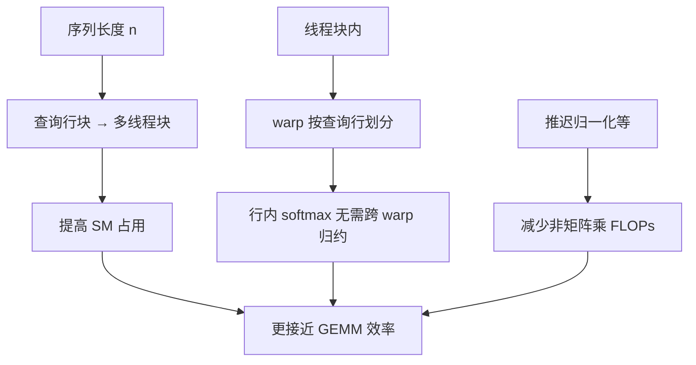

# FlashAttention-2

    
第一代分块已经不再写出二次矩阵，但线程块与 warp 之间的工作切分仍让占用率上不去、片上通信过多；更快的精确注意力首先是更好的并行与划分。

<footer>—— Dao, FlashAttention-2, 2023</footer>

[FlashAttention](/llm/flashattention) 把精确 softmax 注意力做成 IO 感知核之后，相对朴素物化实现已经大幅减少 HBM 往返。对照 GPU 上已经极致的 GEMM，它仍然只吃到理论峰值的一小截——作者给出的观察是约 25–40%，而不是接近矩阵乘的效率。瓶颈从「写不写得出 $A$」变成「同样的分块循环，活怎么分给 SM 和 warp」。FlashAttention-2 仍是同一条精确算法：在线 softmax、SRAM 分块、反向可重算。改的是并行维度、warp 布局，以及非矩阵乘 FLOPs 的削减。

## 问题

第一代实现主要沿 batch 和头数开线程块。序列很长时，为了塞进显存，batch 往往很小，头数也可能有限（再叠加 GQA）。SM 数量远大于「batch×头」这份并行度时，大量多处理器空转，HBM 带宽也喂不满。这不是公式问题，是占用率问题：同一条长序列的查询行彼此独立，却被塞在少数线程块的外层循环里串着扫键。

线程块内部，第一代常见划法是 split-K：若干 warp 分切键值块，各算一片 $QK^\top$，再在共享内存里同步、归约。Softmax 与乘 $V$ 的部分结果要跨 warp 相加，片上通信和栅栏把本该喂给张量核的时间吃掉。非矩阵乘的逐元素缩放、归一化若每一步都做满，也会在总 FLOPs 里占掉可观比例，而这些操作不走张量核峰值。

### 三个彼此独立的低效来源

占用率低、warp 间通信、非 GEMM FLOPs 过多，必须分开治。只加大块而不改并行维，小 batch 仍然填不满芯片；只改算术顺序而不改 split-K，共享内存同步还在；只减 FLOPs 而不增加序列维并行，长上下文的 SM 仍闲。FA2 的命题是三处一起动，并且保持数值上的精确注意力。

「2」不是新的注意力定义。评测应对齐：同一因果掩码、同一精度、同一是否 dropout。把 FA2 的加速解释成模型变了，会和真正的近似注意力论文打架。

## 方法

并行上，把查询行块 $Q_i$ 分给不同线程块，即使只有一个头、一个 batch，只要 $n$ 足够大，也能铺满 SM。每个线程块仍按键值块循环做在线 softmax，块间独立，无需为输出做跨块归约——因为每个查询行只属于一个线程块。这与 [FlashDecoding](/llm/flashdecoding) 沿 **键** 维切分相反：FA2 的序列并行切的是查询，适合 $n_q$ 与 $n_k$ 同阶的训练和前填；解码 $n_q\approx 1$ 时这条路铺不开，要另切 KV。

Warp 划分改为 split-Q：同一线程块内，各 warp 领取不相交的查询行，共享装入的 $K_j,V_j$ 瓦片。Softmax 沿行进行，warp 拥有完整行，不必为归一化做跨 warp 归约，也少写共享内存。第一代 split-K 的「各 warp 一片键、再相加」被拿掉。作者还调整算法，把部分归一化推迟，减少不能映射到张量核的逐元素运算，让总时间更接近 GEMM 屋顶线。

### 反向与端到端训练

反向同样受益于查询维并行和更少的片上同步。训练场景里序列长、dropout、要重算中间量，占用率问题更尖锐。作者报告在 A100 上相对第一代大约再快一倍量级，峰值 FLOPs/s 提到约一半到七成的理论值，并用 GPT 式端到端训练展示模型 FLOPs 利用率可以接近同一硬件上优化 GEMM 的舒适区。这些数字绑定当时的实现与形状，后续 cuDNN、FA3 会改写对照表，但工作划分的三条线索不变。

## 机制

查询行之间没有 softmax 依赖：行 $i$ 的最大值不进入行 $k$ 的分母。因此沿查询切并行在数学上免费，只要每行自己扫完全部键（因果时扫到合法前缀）。这与沿键切不同：沿键切必须在最后按 log-sum-exp 合成，那是 FlashDecoding 的归约。FA2 选择免费的那条轴，专门救「$n$ 大、$B$ 和头数不够」的训练/前填。

Split-Q 的机制是数据复用形状变了。$K,V$ 瓦片对块内所有 warp 广播式复用，每个 warp 用自己的 $Q$ 行做私有累加。共享内存主要用于存放被广播的键值，而不是存放待归约的部分分数。同步点减少后，编译器和占用率更容易把寄存器留给 MMA。非 GEMM FLOPs 的削减则让时间从「指数和缩放占一截」回到「张量核占主导」——softmax 不能取消，但可以少做几遍与最终结果等价的重缩放。

若某硬件上共享内存极快、warp 归约很便宜，split-K 未必永远更差。FA2 的选择针对的是当时 A100 上测到的通信税。移植到新架构时，划分要重测，这也是为何会有 [FlashAttention-3](/llm/flashattention-3) 针对 Hopper 再写一版。

### 与变长、因果、多查询的接口

变长 batch 用 `cu_seqlens` 一类前缀和把若干序列拼成一条，线程块仍按查询行映射，只是行可能跨越不同请求的边界——实现必须按边界停住，不能让注意力跨样本。因果掩码在查询块与键块的下标关系上跳过整块，FA2 同样适用。GQA 时查询头多于 KV 头，并行度仍由查询头×查询行决定，KV 瓦片被多组查询复用，与 split-Q 同方向。这些都不改论文的三条优化，但决定生产里能不能走 FA2 核而不是回退。

## 边界与工程取舍

FA2 救不了解码短查询：查询维没东西可切。长上下文、batch=1 的生成要靠 FlashDecoding 或后续在 KV 维的 split。它也不引入低精度注意力；INT8/FP8 是 SageAttention 或 FA3 的命题。头维不在支持列表、需要自定义掩码、需要稀疏图案时，仍可能回到 xformers 或物化路径。把「已安装 flash-attn 2.x 包」当成「一定在走 FA2 最优核」不可靠，框架还有形状启发式与回退。

占用率优化在 batch 已经很大时收益缩小：SM 早已铺满，再切查询维只增加核启动与尾块不齐。短序列上 FA2 相对融合 GEMM 的优势同样变小。选型应按 $(B,n,h,d)$ 分桶测量，不要用论文里长序列训练图代替聊天解码图。

文献年份：预印本 2023，会议版本见 ICLR 2024。引用写 Dao, *FlashAttention-2: Faster Attention with Better Parallelism and Work Partitioning* 即可，不必叠造文号。

## 小结

- FlashAttention-2 保持精确分块注意力，针对占用率、warp 通信与非 GEMM FLOPs 做工作划分。
- 沿查询行块增加线程块并行，适合长序列、小 batch 的训练与前填。
- 块内改为 split-Q，行完整地属于 warp，去掉 split-K 式归约。
- 解码 $n_q\approx 1$ 时查询维并行失效，需要沿 KV 的 FlashDecoding。
- 加速倍数相对第一代、相对 GEMM，均依赖形状与硬件，不能当常数。
- 与 FA3 的异步/低精度、与 SageAttention 的量化，是后续不同轴。
- 出处：Dao, *FlashAttention-2*, 2023（ICLR 2024）。
