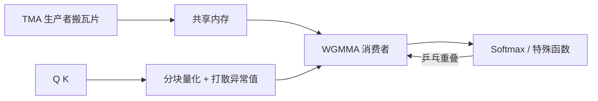

# FlashAttention-3

    
在 Hopper 上把张量核与 TMA 的异步用起来：数据搬运与计算重叠，块内的矩阵乘与 softmax 交错，并在 FP8 下用分块量化与 incoherent processing 控制误差。

<footer>—— Shah et al., FlashAttention-3, NeurIPS 2024</footer>

[FlashAttention-2](/llm/flashattention-2) 把精确注意力的工作划分做到 Ampere 上接近 GEMM 的舒适区。换到 Hopper（H100 一类）后，同一套同步式 MMA 吃不满新硬件：作者给出的对照是 FA2 大约只到峰值的三成多。Hopper 提供 warpgroup 级 MMA（WGMMA）和张量内存加速器（TMA），二者都是异步的——发出指令后，计算单元或拷贝引擎可以与别的工作重叠。FlashAttention-3 的核心不是再发明一种 softmax，而是为这条异步流水线重写注意力核，并加入 FP8 路径。

## 问题

注意力核内部有两类节奏不同的活。一类是大块矩阵乘，Hopper 上应由 WGMMA 打满吞吐；一类是 softmax 的指数、归约、重缩放，走特殊函数单元，吞吐低得多。若按 FA2 的同步风格「先 GEMM 完再 softmax 再 GEMM」，特殊函数阶段张量核空转，TMA 本可以在后台搬下一块 $K,V$，也被栅栏堵住。新硬件的峰值建立在重叠之上，旧划分等于主动放弃重叠。

低精度是第二条压力。Hopper 对 FP8 矩阵乘提供更高吞吐，但注意力对异常值敏感：某一通道的大值会在量化后毁掉整块 softmax 的相对关系。直接把 $Q,K$ 按张量级缩放到 FP8，误差往往不可接受。需要与分块算法匹配的量化粒度，以及把异常值打散的预处理，才能让低精度路径配得上「仍可用于训练/推理」的宣传。

### 为何不能只换指令、不改调度

把 MMA 换成 WGMMA、把 `cp.async` 换成 TMA，若 warp 仍同时负责搬数和计算，异步发行的优势有限。Warp 特化（一部分 warp 当生产者发 TMA，一部分当消费者做 WGMMA）才能让拷贝与计算真正重叠。块内若只有一条流水线，softmax 仍会卡住下一发 GEMM。需要 warpgroup 之间的乒乓，以及同一 warpgroup 内 softmax 与异步 MMA 的交错。这些是调度问题，指令手册不会自动发生。

FA3 绑定 Hopper 一类能力。在只有 Ampere 指令的卡上，正确的对照仍是 FA2 或厂商融合核，而不是「装了 FA3 源码就同样快」。反向亦然：用 H100 上的 FA3 数字去贬低 A100 上的 FA2，是跨代比较。

## 方法

三条技术对应论文标题里的 asynchrony 与 low-precision。第一，warp 特化加 TMA：生产者按描述符从全局内存搬 $Q,K,V$ 瓦片进共享内存，消费者在张量核上做 WGMMA，用异步屏障握手，而不是全体 warp 同步拷贝。第二，块级流水：warpgroup 之间乒乓，一组在做 softmax 时另一组在做 GEMM；组内再用两段流水把指数与下一发矩阵乘重叠。动机来自周期账：在典型头维与块大小下，指数单元消耗的周期可以到 GEMM 的可观比例，FP8 时两边更接近，不重叠就等于腰斩。

第三，FP8 路径采用分块量化，并配合 incoherent processing：在量化前用正交变换（实现上常见为 Hadamard 一类）打散通道异常值，使块内动态范围更适合低精度格子，再在后续把变换吸收进线性代数，使数学上仍对应原注意力的一个良好近似。作者报告相对朴素的张量级 FP8 注意力，数值误差明显更小；BF16/FP16 路径则保持与 FA2 同级的精确注意力误差，中间统计仍用较高精度累加。

### 精度路径要分开报

FA3 至少应看成两条产品：高精（FP16/BF16）异步核，以及 FP8 核。前者的命题是利用率；后者的命题是吞吐换误差。把 FP8 的 PFLOPs 写进「精确注意力加速」会误导——那是低精度注意力。训练是否全程 FP8 注意力、推理是否只在部分层用 FP8，属于部署选择，论文提供的是核与误差对照，不是一条必须全网启用的配置。

## 机制

异步能藏延迟，是因为注意力的外层循环本来就是「下一块 $K,V$ 与当前块的 GEMM/softmax」这种流水结构。FA1/FA2 在逻辑上已经分块，但发行模式是同步的；FA3 把逻辑流水映射到硬件流水。Pingpong 的正确性仍依赖在线 softmax：一组 warpgroup 产出的局部统计要按同一套 $(m,\ell)$ 规则合并，不能各算各的 softmax 再平均。屏障用错会出现静默的数值漂移，比慢更危险。

Incoherent processing 的直觉是：异常值若集中在少数通道，均匀量化格子会为那几个通道牺牲其余通道的分辨率。正交打散后能量更均匀，量化噪声更接近各向同性，softmax 的相对顺序更稳。它不取消量化误差，只改变误差的结构。块级缩放比全张量缩放更贴近 Flash 家族已经在用的瓦片，这是算法与实现的对齐，而不是新的注意力定义。

厂商 cuDNN 在 Hopper 上也有高吞吐注意力。FA3 论文在长序列等设置下与之对照。生产选型应在目标形状上实测，而不是从「开源论文一定更快」或「厂商库一定更快」里选边。本篇只记 FA3 自己的三条技术。

### 与 SageAttention 不是同一条低精度路线

[SageAttention](/llm/sageattention) 面向的是消费级 GPU 上 INT8 张量核更快、以及即插即用的推理量化；平滑的是 $K$ 的通道均值，PV 常留 FP16。[FA3](/llm/flashattention-3) 的 FP8 走 Hopper 硬件，配分块量化与 incoherent processing，目标包括训练场景下的低精度注意力。二者都动 $QK$ 的表示精度，但硬件、数值手法和是否宣称「与 FA2 同级误差」不同。不要把 INT8 Sage 的速度数字写进 H100 FA3 表格，也不要把 FA3 的 PFLOPs 写进 4090 的 INT8 表格。

## 边界与工程取舍

没有 TMA/WGMMA 的设备跑不了这条调度的原意。头维、因果、dropout、变长、paged KV、解码 split-KV，每一项都要单独有核或回退；FA3 论文的主舞台是长序列前向（及反向）利用率，不是服务引擎里所有形状的万能核。FP8 路径要看层与数据：异常值打散对多数层有效，不保证每一层每一时间步都可无条件降精度。黑盒替换时应用任务指标而不是只看内核 TFLOPs。

版本与集成滞后于论文。框架默认注意力可能仍是 FA2 或 cuDNN，需要显式打开才走 FA3。基准测试必须写 GPU 型号、精度、序列长度和是否因果。作者给出的相对 FA2 约 1.5–2.0×（高精前向）以及 FP8 更高吞吐，是 H100 上的报告区间，随形状变化，不应抄成跨硬件 SLA。

作者包括 Shah、Bikshandi、Zhang、Thakkar、Ramani、Dao。年份 2024，会议 NeurIPS。不要把尚未在本系列展开的更新架构（若存在后续版本）写进本篇的方法节。

## 小结

- FlashAttention-3 为 Hopper 的异步 TMA/WGMMA 重写精确注意力调度，目标是利用率而不是改 softmax 定义。
- Warp 特化让搬运与计算重叠；乒乓与组内流水让 GEMM 与 softmax 重叠。
- FP8 路径使用分块量化与 incoherent processing 控制误差，应与 FP16/BF16 精确路径分开叙述。
- FA2 在 H100 上利用率低，是换代的动机，不是 FA2 在 A100 上失败。
- 与 SageAttention 的 INT8 消费级路线、与 FlashDecoding 的 KV 维并行，都是不同轴。
- 生产中需按形状在 FA3、cuDNN 与回退核之间实测。
- 出处：Shah et al., *FlashAttention-3: Fast and Accurate Attention with Asynchrony and Low-precision*, NeurIPS 2024。
