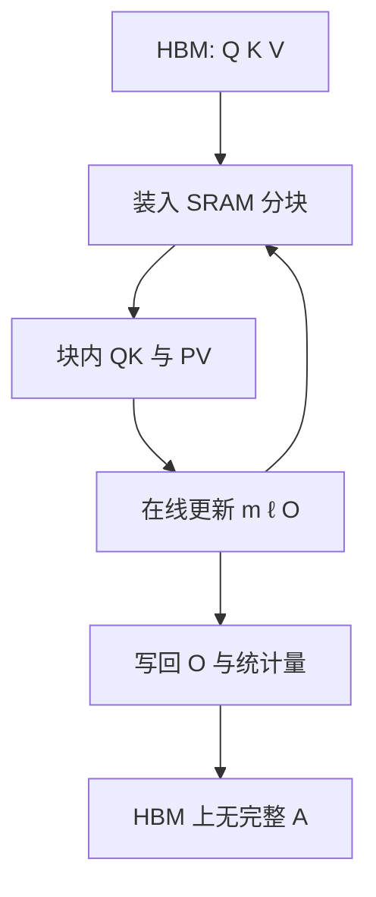

# FlashAttention

    
我们提出一种输入输出感知的精确注意力算法，用分块减少 GPU 高带宽存储与片上 SRAM 之间的读写，而不把 softmax 注意力改成近似。

<footer>—— Dao et al., FlashAttention, NeurIPS 2022</footer>

缩放点积注意力的数学对象是分数矩阵 $S=QK^\top/\sqrt{d_k}$ 再 softmax 后乘 $V$。朴素实现把 $S$ 和权重 $A$ 物化在 HBM 上，长度 $n$ 一涨，二次存储与二次搬运先于算术把系统拖死。FlashAttention 的命题是：精确结果可以不经过这张完整的 $n\times n$ 表。它利用 GPU 存储层次——HBM 大而慢、SRAM 小而快——按块装入 $Q,K,V$，在片上完成打分、归一化与加权，只把输出和少量统计量写回。复杂度阶仍是 [二次](/llm/attention-quadratic-cost)；变的是 IO，不是公式。

## 问题

一次 SDPA 若写出 $S$、$A$ 再读入做 $AV$，对 HBM 的访问是 $O(n^2)$ 量级的元素往返，外加 $Q,K,V$ 与输出的 $O(nd)$。现代 GPU 上算术吞吐远高于 HBM 带宽，注意力于是变成内存墙：单元闲着等分数矩阵。训练还要把 $A$ 留给反向，显存直接按 $n^2$ 涨，长序列在优化器之前先 OOM。

近似注意力（核函数线性化、稀疏图案）可以降阶，但改的是模型，预训练权重对不上，质量合同要重做。服务与训练更需要的是：同一条 softmax 注意力，少搬、少存，数值与朴素算法一致。问题因此是 IO 感知的精确算法，而不是新的相容性函数。

### 在线 softmax 为何必要

softmax 的分母依赖整行。若按键块逐块计算，块 $j$ 的局部 $\mathrm{softmax}(S_{:,j})$ 不能直接与块 $j+1$ 的结果相加，因为两边的最大值和指数和不同。必须维护行统计量：到目前为止的最大值 $m$，以及按该最大值缩放后的指数和 $\ell$。来了新块，若新最大值更大，旧的加权输出与 $\ell$ 要按指数差重缩放，再累加新块贡献。这套递推（在线 softmax）让分块与精确归一化相容。缺了它，分块注意力就是错的。

FlashAttention 不是「更快的近似」。作者强调 exact：在合理浮点误差内与物化算法同类。速度来自少访问 HBM，以及把 softmax 与矩阵乘融进同一核，而不是丢掉序对。

## 方法

把 $Q$ 按行切成块（每块 $B_r$ 条查询），$K,V$ 按列切成块（每块 $B_c$ 个键值）。对每个查询块，循环扫过所有键值块：从 HBM 装入当前 $K_j,V_j$ 到 SRAM，与驻留的 $Q_i$ 做乘加，更新 $m,\ell$ 与输出累加器 $O_i$。扫完键值后，$O_i$ 已是该查询块的最终加权，写回 HBM。SRAM 容量限制 $B_r,B_c$；理论分析给出 HBM 访问可降到与 $n,d$ 及片上块大小相关的更低阶主导项——仍含二次计算，但二次张量不再落盘。

因果掩码在块级即可跳过严格位于下三角之外的键块，大约减半前填计算。Padding 同理。反向不保存 $A$：用保存的 $Q,K,V$、输出和归一化统计量，再扫一遍块把注意力重算出来以传播梯度。用更多算术换更少存储，符合「计算相对搬运更便宜」。这与层间梯度检查点是不同粒度：这里重算的是注意力核内部，对象是 $n\times n$ 中间量。

### 融合核与实现边界

算法要落成一个（或少数几个）CUDA 核，才能避免块循环把中间分数写回 HBM。核内还要把 softmax 的减最大值、指数保持在较高精度，以免半精度溢出——这与 SDPA 的数值卫生是同一件事，只是发生在 SRAM 里。头维度、是否因果、是否有 dropout、是否变长序列，都会派生出不同模板。第一代实现把并行主要放在 batch 与头维：序列很长、batch 与头数不够时，占用率上不去。这是 [FlashAttention-2](/llm/flashattention-2) 要补的工作划分，不是 2022 年论文已经做完的事。

## 机制

IO 收益来自算术强度。每个 $K_j$ 块被装入后，与当前 $Q_i$ 的 $B_r$ 条查询做完再换下一块；查询块驻留期间，键值块被充分复用。物化路线则是：写出 $n\times n$，几乎没有对 $S$ 的数据复用就进入下一阶段。FlashAttention 把三阶段合成对 SRAM 的多次复用，HBM 只看见 $O(nd)$ 量级的主张量进出，外加统计量。$n$ 越大、相对片上块越「需要很多键值块」时，相对朴素实现的加速通常越明显；极短序列上核启动与融合开销可能让不上物化 GEMM。

精确性来自行统计量的结合律：两段键的 $(m,\ell,O)$ 可以合成全局的 $(m,\ell,O)$，等价于一次性 softmax。浮点顺序不同会带来尾差，但目标是与标准实现同级误差，而不是另定义一种注意力。Dropout 要在重算时用同一掩码，否则反向对不上；训练核因此比推理核更重。

把 FlashAttention 理解成「注意力终于线性了」是错的。HBM 占用可以对 $n$ 接近线性（不存 $A$），计算仍是 $\Theta(n^2 d)$。长上下文的时间墙还在，只是不再先被显存墙以 $n^2$ 的方式击倒。

### 与服务侧解码的错位

训练和前填的查询长度与键长度同阶，分块沿两维都有活干。解码时查询长度往往为 1，并行度只剩 batch×头数，第一代内核容易吃不满 SM，加速从「少写 $n\times n$」变成「小核能不能喂饱机器」。这要靠 [FlashDecoding](/llm/flashdecoding) 沿 KV 维再切，而不是指望 2022 年的前向循环自动变快。Paged KV 的非连续块也需要核支持页表，那是 [PagedAttention](/llm/paged-attention) 与注意力内核的接口问题，FlashAttention 原文假定的是常规布局。

## 边界与工程取舍

FlashAttention 不改变模型质量合同，但改变工程合同：必须有对应头维与掩码的核；没有核时框架会回退到物化实现，长序列再次 OOM。反向重算增加训练步时，换来的是能跑的 $n$。若 SRAM 不够大、头维过宽，块变小，IO 收益下降。窗口、稀疏、线性注意力若仍走自己的连通性，不能假冒成 FlashAttention；它们可以借用分块实现，但那是另一条算法。

不要用某一张 A100 上相对 PyTorch 朴素实现的「2–4×」去推断今天所有硬件。基线、序列长度、是否因果、是否已经融合 GEMM，都会改倍数。后续 FA2/FA3 的意义正是：同一算法家族在占用率与新硬件异步单元上还有很大头。2022 年论文解决的是 IO 感知与精确分块这一层。

引用时应写 Dao, Fu, Ermon, Rudra, Ré，NeurIPS 2022。不要把后来的 FA2 工作划分或 FA3 的 TMA/WGMMA 写回这篇论文。本系列后两篇分开记。

## 小结

- FlashAttention 用 SRAM 分块与在线 softmax 计算精确 SDPA，避免物化 $n\times n$ 分数与权重。
- 渐近计算仍二次；主要收益是 HBM 流量与训练激活显存。
- 反向重算注意力块，用算术换存储。
- 并行原语以 batch 与头为主，长序列小 batch 时占用率有限，留给后续版本。
- 解码短查询、分页 KV、新硬件异步指令，都不在 2022 年论文的核心命题里。
- 与近似注意力不同，它不改预训练相容性。
- 出处：Dao et al., *FlashAttention: Fast and Memory-Efficient Exact Attention with IO-Awareness*, NeurIPS 2022。
