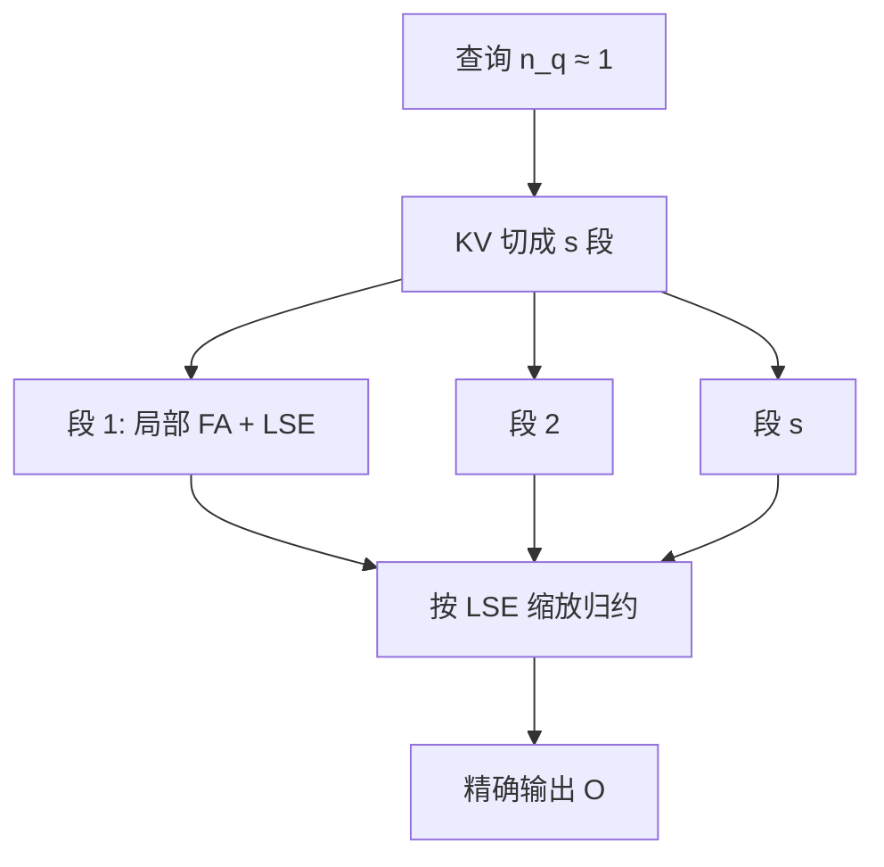

# FlashDecoding

    
训练时沿查询长度并行；解码时查询往往只有一条，必须把键值序列再切开，让更多线程块同时去搬 KV，再用 log-sum-exp 合成精确输出。

<footer>—— Dao 等，Flash-Decoding（2023 年技术说明）</footer>

[FlashAttention](/llm/flashattention) 与 [FA2](/llm/flashattention-2) 的并行主轴是 batch、头、以及查询行。自回归解码每步 $n_q$ 通常为 1，长上下文又逼得 batch 变小，于是「查询维」几乎没东西可切。A100 上百余个 SM，若只有「batch×头」份活，注意力核发出的加载指令填不满带宽，生成在长 KV 上会显著慢于前填时同长度的单位计算。Flash-Decoding（常写 FlashDecoding）给同一套在线 softmax 增加第三维并行：把 KV 沿序列切开，各切片用 FlashAttention 算局部注意力，再按 log-sum-exp 归约成精确的一行输出。

## 问题

解码步的注意力是「一条（或一个小 batch 的）查询 × 长度为 $t$ 的 KV」。计算量 $O(t d)$，数据搬家同样 $O(t d)$ 量级，本应是带宽问题：多发加载才能接近 HBM 峰值。FA2 式查询并行在 $n_q=1$ 时退化成每个头一个线程块（再乘 batch）。头数 32、batch 1 时，只有数十个块在发加载，远少于 SM 数，带宽利用率低下。上下文越长，本该越好喂饱总线，却因为并行度不够而喂不进去——这是长上下文生成特有的尴尬，不是公式突然变慢。

朴素的 split-KV 若不做正确归约，会变成各段各自 softmax 再拼，那是错的注意力。必须把每段的输出向量和每行的 log-sum-exp 写出来，用与在线 softmax 相同的代数合成全局结果。FlashDecoding 的贡献是把这件事做成与 FlashAttention 同一家族的实现：段内仍分块、少写中间矩阵；段间只多写极少的统计量。

### 何时根本不必切

若 $B\times h$ 已经大于 SM 数，再沿 KV 切只会增加归约核和部分结果的写回，可能更慢。实现里常用启发式：`num_splits=0` 表示让库根据 GPU、batch、头数决定切不切、切几份。硬编码一个很大的 split 数，在高并发解码上会负优化。GQA 时并行度按查询头算，KV 头更少并不自动意味着必须切——查询头够多时同样不必 split。

FlashDecoding 不是另一种服务调度，也不分页。它是单步注意力核的并行策略。与 [PagedAttention](/llm/paged-attention) 组合时，切的是逻辑序列上的 KV 段，物理上仍通过页表取块；没有页表时切的是连续缓冲。

## 方法

对每个查询行：（1）将 $K,V$ 分成 $s$ 段；（2）$s$ 个并行作业各自对该段跑 FlashAttention，写出局部输出 $O^{(i)}$ 与该段的 $\mathrm{LSE}^{(i)}=\log\sum\exp(\cdot)$；（3）归约

$$
\mathrm{LSE}=\log\sum_{i}\exp\bigl(\mathrm{LSE}^{(i)}\bigr),\qquad
O=\sum_{i}\exp\bigl(\mathrm{LSE}^{(i)}-\mathrm{LSE}\bigr)\,O^{(i)}.
$$

实现上再减一次 $\max_i\mathrm{LSE}^{(i)}$ 以防溢出。段内已经用过在线 softmax；段间是同一结合律的第二层。因果解码下，当前步的查询只看见 $t$ 个历史位置，切段在合法前缀上做即可。

启发式的目标是让线程块数够喂饱 SM 和内存控制器，又不要多到归约和尾段不齐占主导。上下文极长、batch 为 1 时 $s$ 应增大；batch 与头已经铺满时 $s=1$，退回普通 FlashAttention。公开说明里给出过长序列生成相对未切分路径的显著加速（技术博客中的「数倍」绑定当时形状与硬件），工程上应以本机 `flash_attn_with_kvcache` 一类接口实测为准。

### 与 FA2 查询并行如何分工

前填：$n_q$ 大，FA2 沿查询切足够，通常不必再 split-KV。解码：$n_q\approx 1$，查询切失效，split-KV 接上。混合批次里同一拍既有前填 chunk（$n_q=C$）又有解码（$n_q=1$），内核可能要分发两条路径，或把解码 query 做成单独调用。这是服务引擎的细节，不是 FlashDecoding 论文式博客需要规定的调度器。

## 机制

Softmax 对键维可结合，是一切「先局部、后合成」的前提。局部 $O^{(i)}$ 是该段键上的加权值，权重尚未按全局质量归一；$\mathrm{LSE}^{(i)}$ 编码了该段的质量。指数差把各段重新放到同一尺度上，合成后等于一次完整 softmax。若丢掉 LSE、对各段输出做简单平均，长上下文里最大值所在段会吃亏或占便宜，生成会 silently 错。

带宽机制是「更多线程块同时发加载」。同一份 KV 被切成多段后，各段由不同 SM 从 HBM 读，内存控制器看到更多 outstanding requests，更容易接近峰值。代价是局部 $O$ 与 LSE 的写回以及第二次归约核。$s$ 过大时，每段工作太小，启动开销与写回压过加载收益。因此 split 是带宽优化而不是算法降阶：总 FLOPs 几乎不变（归约是 $O(s d)$ 小项），只改延迟隐藏。

技术说明里举过 A100 的 SM 数与「batch 小于 SM 数则吃不满」的例子。换 H20、H100、消费卡时 SM 数不同，启发式必须跟设备走。把某一个 num_splits 抄到所有机器上，是常见的负优化。

### 和推测解码、多查询

推测解码一次前向可能有 $n_q>1$ 的草稿长度，查询维并行部分回归，是否还要 split-KV 取决于 $B\times h\times n_q$ 够不够。树状注意力、beam 会让查询条数增加，FlashDecoding 的动机变弱，可能要换树注意力核。这些是延伸，公开的 Flash-Decoding 说明针对的是标准逐 token 生成。不要把树注意力论文的数字写进本篇。

## 边界与工程取舍

FlashDecoding 不降低 KV 占用，也不减少每步必须读的 KV 字节——它只让这些字节读得更并行。KV 太大时，根本问题仍是 [缓存体积](/llm/kv-as-long-context)；量化、GQA、淘汰才减流量。页表不连续时，split 边界最好落在页边界附近，否则段内核更碎。启发式若按「分配的最大缓存长度」而不是真实 `seq_len` 估 $s$，短序列占着长缓冲会被过度切分，需要引擎传入真实长度。

它也不能替代 [chunked prefill](/llm/chunked-prefill)：前填的问题是作业过大阻塞别人，解码的问题是作业太瘦吃不满自己。两者常一起出现在长上下文服务里，优化对象不同。FA3 在 Hopper 上的异步加载可能改变「要不要 split」的阈值，但结合律归约这一层仍然适用。

出处是 2023 年的技术博客与 FlashAttention 库中的 split-KV 实现（Stanford CRFM / PyTorch 博客，Dao 等）。它不是单独一篇 NeurIPS 论文，引用时不要编造会议论文题目或文号。

## 小结

- FlashDecoding 在解码短查询上沿 KV 序列切分，用第二层 log-sum-exp 保持精确 softmax。
- 目的是提高加载并行度、喂饱 SM 与 HBM，而不是减少 FLOPs 或 KV 体积。
- $B\times h$ 已够大时不应切；切多少应由设备启发式或实测决定。
- 与 FA2 的查询维并行互补：前填切 Q，解码切 KV。
- 归约必须带 LSE；丢掉统计量就不再是同一条注意力。
- 与分页、混合批次、推测解码正交，组合时要重看 split 启发式。
- 出处：Dao 等，Flash-Decoding for long-context inference（2023 年公开技术说明与开源实现）。
