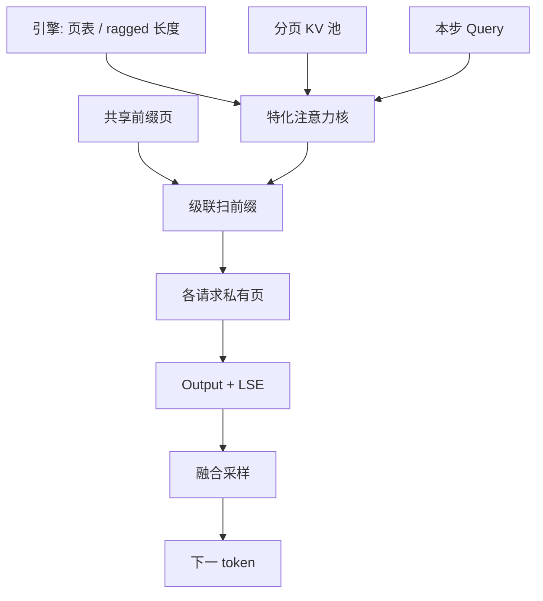

# FlashInfer 内核库

服务侧注意力不是一张整齐的 $n\times n$ 方阵，而是变长、分页、带共享前缀的ragged 张量；内核库要把这些布局当成一等公民，而不是训练核上的补丁。

<footer>—— Ye et al., FlashInfer, 2024</footer>

FlashAttention 证明了精确注意力可以不物化分数矩阵。服务推理紧接着问第二件事：同一套在线 softmax，如何对着分页 KV、变长 batch、decode 单 token 与 prefill 长前缀同时跑得快。Ye 等人的 FlashInfer 把答案收成一个可组合的 CUDA 内核库——面向 LLM 推理的注意力与采样原语，而不是再发一篇「更快的训练注意力」论文。它被 [SGLang](/llm/sglang) 等引擎当作默认后端之一：调度器负责请求何时进、KV 存在哪一页，FlashInfer 负责按页表把缩放点积算完。

## 问题

训练核假设一个稠密、对齐的 $Q,K,V$：同一 batch 里序列等长，KV 在序列维连续，头数与维度编译期已知。服务不是这样。[PagedAttention](/llm/paged-attention) 把 KV 切成固定 token 数的物理页，逻辑位置要经页表 gather；连续批处理让同一 step 里各请求的 query 长度从 1 到整段 prefill 不等；多轮与 few-shot 又让许多请求共享一段前缀 KV。若每次把这些不规则布局先 gather 成连续缓冲再调训练核，搬运税会吃掉融合带来的收益。

decode 与 prefill 的算术强度也不同。Prefill 是 query 与 key 都长，接近训练时的 SDPA，算力能喂饱 Tensor Core；decode 每条请求只来一个新 query，带宽墙立刻出现，还要按页跳跃读 KV。一套「只为方阵优化」的模板，在 ragged batch 上不是占用率崩掉，就是为最短序列垫出大量无效计算。问题因此是：在精确 softmax 注意力的约束下，为服务侧的布局与负载写一组可定制、可即时编译的核，而不是让引擎去迁就训练核的形状假设。

### ragged batch 的负载不均衡

设一个 step 里有 $B$ 条请求，第 $i$ 条的 query 长度为 $q_i$、KV 长度为 $k_i$。朴素按请求划 CTA，短 decode 的 CTA 很快结束，长 prefill 的 CTA 拖住整个 grid。按 query 行划块则同一 CTA 可能碰到完全不同的页表与因果边界。FlashInfer 要处理的调度对象，是「行块 × KV 块」在不规则形状上的任务图，而不是固定的 $B\times H\times n$ 网格。

「支持 PagedAttention」只说明能按页表读 $K,V$。能不能在页表之上保持 FlashAttention 级的 SRAM 复用、能不能把共享前缀的 KV 只读一遍，是另一层问题。FlashInfer 的卖点在后一层：把分页、级联、变长当成核的输入约定。

## 方法

FlashInfer 把注意力拆成可组合的模板：布局（连续 / 分页 / ragged）、阶段（prefill / append / decode）、掩码（因果、sliding window、自定义 bit mask）、头结构（MHA / GQA / MQA）。调用方声明这些枚举，库用即时编译或预先实例化的特化核去跑，避免一个巨核用运行时分支去覆盖所有情况。数学对象仍是 [SDPA](/llm/sdpa)：块内 $QK^\top/\sqrt{d_k}$，在线维护行最大与指数和，再累加 $PV$。变的是 $K,V$ 从哪里来、任务怎么切。

分页路径上，核持有 `block_table`：逻辑 token 槽映射到物理页。装入一个 KV 块时，按页表把可能不连续的页搬进 SRAM，再与驻留的 query 块做 MMA。级联注意力（cascade）把共享前缀和私有后缀拆成两段：前缀 KV 对一组请求只扫一次，各请求的私有页再各自累加，在线 softmax 的统计量跨段衔接。这直接对应 RadixAttention 一类前缀树：树节点上的 KV 是被多条请求共享的物理页，核必须能「先共享、后私有」地归约，而不能把共享段复制成每条请求一份再算。

### 采样与融合算子同库

服务热路径不只注意力。Logits 上的 temperature、top-$k$、top-$p$、约束掩码，若各起一个核，短 decode 上启动税比算术还贵。FlashInfer 把采样与若干逐元素融合算子放进同一库，使引擎可以少做框架级的 tensor 往返。注意力核负责「读页表、写 output 与 LSE」；采样核负责「在 vocab 维上做带约束的离散分布」。二者的共同约束是：形状以请求为 jagged，不要先 pad 成方阵。

## 机制

速度来自两处。一是 IO：分页 gather 发生在核内 SRAM 边界，而不是先做一次全局 `index_select`；共享前缀的 KV 在级联路径上被多条 query 复用，HBM 流量按「唯一页」而不是「请求数 × 前缀长度」计。二是特化：因果、GQA 的头比、页大小、头维度在编译期固定后，寄存器与 MMA 形状可以对齐 Hopper / Ampere 的指令，避免通用核里一长串 `if`。即时编译把「这个服务实例实际会用到的组合」实例化出来，代价是首次调用的编译延迟，通常用 warmup 摊掉。

负载均衡则靠把不规则任务切成更细的 tile，再按 tile 调度 CTA，而不是一个请求绑死一个 CTA。长 prefill 被切成多个 query 行块，短 decode 被打包进同一波次。这与训练 FlashAttention 按均匀 $B_r,B_c$ 切块是同一思想，只是块的有效面积随请求变化，需要额外的任务队列或 prefix-sum 做映射。

LSE（log-sum-exp）随输出一起写回，不是装饰。级联第二段、chunked prefill 的下一块、以及某些投机解码的修正，都要靠这段统计量把已经写出的部分输出按新的最大值重缩放。丢掉 LSE，分块就只能重算整行。

### 与训练 FlashAttention 的分工

训练核优化的是等长、可反向、可 dropout 的完整注意力；FlashInfer 优化的是前向、变长、与 KV 池布局耦合的注意力。数值上两者都应在合理浮点误差内对齐朴素 SDPA。工程上不要互相替代：训练仍走 FlashAttention / cuDNN；服务若已经把 KV 做成页表，再 gather 回连续布局去调训练核，是在倒退。Ye 等人强调 customizable：窗口注意力、稀疏块、额外的 logit 偏置，应以模板参数接入，而不是让每个引擎 fork 一份注意力 CUDA。

## 边界与工程取舍

FlashInfer 不负责页分配、抢占与前缀树插入，那些是调度器的事。核再快，页表抖动、错误的 cascade 分段、或把不共享的 KV 标成共享，都不会被内核「优化掉」。头维度、页大小若与编译模板不一致，会落到较慢的通用路径或直接失败。极短序列、极小 batch 上，特化核的启动与 JIT 摊销可能不如一个简单的 CUDA Core 核。

跨硬件的可移植性弱于 Triton：FlashInfer 的高峰来自对 NVIDIA 指令与存储层次的特化。Ascend 或其他后端需要另一套内核，不能指望这份 CUDA 模板直接编译过去。API 层面把布局与阶段暴露清楚，反而有利于各硬件各自实现同一约定。

把 FlashInfer 理解成「又一个 FlashAttention」会低估它。FlashAttention 改的是算法的 IO；FlashInfer 改的是服务系统与核之间的契约——页表、ragged、级联、采样都在契约里。引擎作者应该先对齐契约，再谈微秒。

## 小结

- FlashInfer 是面向 LLM 服务的可定制内核库，主对象是分页、变长、带共享前缀的注意力，而不是训练用的方阵 SDPA。
- 数学仍是缩放点积加在线 softmax；速度来自核内 gather、级联复用前缀 KV，以及对布局与阶段的编译期特化。
- 级联注意力让共享前缀只扫一遍，LSE 负责跨段精确归一化。
- 采样与融合算子同库，避免短 decode 上的框架级核风暴。
- 它不替代调度器、页分配器或前缀树；契约对齐之后，核才能吃满带宽与 Tensor Core。
- 与训练 FlashAttention 分工：一个管等长可反向，一个管 ragged 前向。
- 出处：Ye et al., *FlashInfer: Efficient and Customizable Attention Engine for LLM Inference Serving*, 2024。
