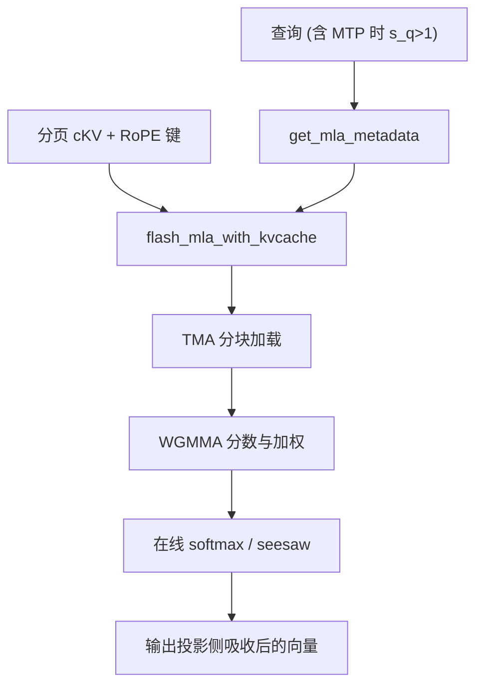

# FlashMLA

    
MLA 把 decode 要缓存的对象收成潜向量加小 RoPE 键；核必须按 576/512 这类头宽、分页块和 Hopper 的 TMA/Tensor Core 来写，不能把 GQA 的 FlashAttention 改个形状就当完成。

<footer>—— Li, Liu，FlashMLA；算法定义见 DeepSeek-AI，DeepSeek-V2 / V3 中的 Multi-head Latent Attention</footer>

[MLA](/llm/mla) 在数学上已经把 decode 缓存从满宽 $K,V$ 换成 $c^{KV}$ 与解耦 RoPE 键。服务若仍走通用注意力核，就要先展开再当 MHA 算，缓存红利和吸收后的矩阵乘全部吐回去。FlashMLA 是 DeepSeek 开源的 MLA 注意力核库，服务 DeepSeek-V3 及后续稀疏注意力变体：Hopper（SM90）上的稠密解码、以及后来 SM90/SM100 上的稀疏与 FP8 KV 路径。作者在仓库 bibtex 里署 Jiashi Li、Shengyu Liu。本篇写核要匹配的形状与调度，不把 MLA 公式再推一遍。

## 问题

V2/V3 的 MLA 在 MQA 模式下，键头宽与值头宽并不对称：常见部署是 `head_dim_k = 576`（内容潜向量与 RoPE 拼接后）、`head_dim_v = 512`，查询头数可以到 128。这与 FlashAttention 默认的 $d_k=d_v\in\{64,128,256\}$ 不是同一套 tile。分页 KV 的块大小在 FlashMLA 稠密解码路径上常用 64。decode 一步 $s_q$ 很小（1，或 MTP/投机时略大），KV 很长，核必须在「访存墙」和「算力墙」两头都接近 H800 的屋顶线。仓库早期数字：访存约 3000 GB/s（H800 SXM5 峰值约 3350 GB/s）、算力墙约 580 TFLOPS 量级；后续 seesaw 调度与稀疏 FP8 核另有 410 TFLOPS 一类配置数字。引用必须绑 kernel 种类与 `batch, heads, seq`。

没有专用核时的失败模式有两种。一种是吸收没做，缓存按满宽走，MLA 名存实亡。一种是吸收做了，但用一串小 GEMM 拼 softmax，L2 与启动开销把带宽红利吃掉。FlashMLA 的对象是第二种：在已压缩的 KV 布局上做融合注意力。

### Prefill 与 decode 不是同一核

Prefill 的 $N_q\approx N_{kv}$，矩阵乘天然更饱满，甚至可以走 MHA 模式的头宽（V3.2 文档里 prefill 可用 `head_dim_k` 192/128）。Decode 才是 576 维 MQA 模式加 KV cache。稀疏注意力（DeepSeek Sparse Attention / V3.2-Exp）再加 top-k 选择与 FP8 KV，访存不规则，dequant 可能比 MMA 还重。FlashMLA 因此是一组核，不是一个 `flash_mla()` 走天下。调用序列通常是先 `get_mla_metadata` 做 tile 调度元数据，再在解码循环里 `flash_mla_with_kvcache`。

576 维来自潜向量与 RoPE 旁路的拼接宽度，不是「把头切成 576 个」。实现若把 MLA 当成 GQA 且 $d=128$，数值对不上 V3。附录与 V2 报告里的吸收公式决定缓存里到底有哪些张量。

## 方法

### Seesaw：一套输出上的乒乓

FlashAttention-3 一类 ping-pong 用双缓冲在 Tensor Core 与 CUDA Core 之间重叠。FlashMLA 的 deep-dive 把他们的调度写成 seesaw：数学上仍是在线 softmax，但在寄存器极度紧张的 576 维下只用一套输出矩阵，两组 warpgroup 交错做 MMA 与 softmax/TMA。细粒度 TMA：例如 $64\times 576$ 的 K 块拆成多次 $64\times 64$ 拷贝，第一次拷完即可启动第一段 GEMM，提高对内存延迟的容忍。Cache hint（如 `EVICT_FIRST`）减少 KV 污染 L2。Split-KV 与 combine 之间用 programmatic dependent launch 重叠。Tile scheduler 把请求与块派到 SM，避免长尾请求独占。

这些是 Hopper 特有原语（TMA、WGMMA、PDL），不是可移植的 PyTorch 实现。正确性仍归到分块 softmax 与因果掩码；性能归到 576 维能否把 Tensor Core 喂饱。

### FP8 KV 与集群共享内存交叉

V3.2 把上下文推到 128K 时，单请求 KV 按他们给出的公式可到约 8.72 GiB 量级，逼出 FP8 KVCache。稀疏解码的 dequant 在 CUDA Core 上，周期可能超过 MMA。他们用 CTA cluster + Distributed Shared Memory：两个 CTA 各反量化一半 KV，`st.async` 写入对方共享内存，同步后再各自做全量 MMA。H800 上某配置从约 250 TFLOPS 提到约 410 TFLOPS。这是用片上交叉换 dequant 次数，不是改 MLA 公式。

## 机制

### 为什么通用 FA 不够

FlashAttention 的 tile 假设 $d$ 能放进片上，且 $K,V$ 同宽。MLA decode 的 $d_k\neq d_v$、缓存是潜向量、可能 FP8、可能稀疏 top-k。强行 pad 到 576×576 会浪费 MMA 与带宽。吸收后的分数是查询侧矩阵与 $c^{KV}$ 的乘，核必须按这个收缩后的几何来切 K 块。分页块 64 与 TMA 对齐，乱改块大小会让调度元数据失效。

$s_q\gt 1$ 出现在投机校验、MTP 闭环、或某些并行解码。核若只优化 $s_q=1$，投机路径会退回慢实现，接受长度再高也被注意力核钉住。FlashMLA 把 $s_q$ 当一等维度，和 [Hydragen](/llm/hydragen) 的「多查询打同一 KV」在精神上同类，但几何是 MLA 的潜向量，不是 MHA 前缀分解。分页块表必须与引擎一致：块大小 64、逻辑槽到物理页的间接层，都要进 metadata，否则 TMA 会读到错误的 $c^{KV}$。

早期 blog 把 580 TFLOPS 和 H800 BF16 峰值 260 TFLOPS 写在一起，容易误导：Tensor Core 峰值与稀疏/稠密核不是同一口径。以仓库 README 当时表格与 deep-dive 为准，并写 SM 代数。

### 与 DeepEP / DeepGEMM 的分工

一步 Transformer：注意力 FlashMLA → 若 MoE 则 DeepEP dispatch → DeepGEMM → DeepEP combine。三者争 SM 与 HBM 带宽。V3 解码部署把少量 SM 给 dispatch+MoE，把注意力当大头，正是因为 decode 的 MLA 更吃带宽。关掉 FlashMLA 只换「更快 MoE」会测错瓶颈。投机或 MTP 把 $s_q$ 抬到 2 附近时，核从纯访存墙往算力墙挪一截，seesaw 的重叠更值钱；只拿 $s_q=1$ 的带宽数字去给校验路径做容量规划会偏乐观。

## 边界与工程取舍

FlashMLA 需要 SM90 或 SM100、足够新的 CUDA。A100 没有 TMA/WGMMA 这条路径，不能把仓库核当可移植后端。分页块大小、KV 精度、稠密还是稀疏、MQA 还是 MHA 模式，必须与检查点以及 [MLA](/llm/mla) 吸收后的权重 layout 一致。吸收若漏做，核按潜向量读、权重却按满宽 $K$ 训，位置与内容会静默错。不要把 FlashMLA 当成任意模型的「更快 FlashAttention」，GQA 的 Llama 仍应走 FlashAttention 系列。

与 DeepEP、DeepGEMM 争 SM 时，解码应以 MLA 为带宽大头：V3 部署把少量 SM 给 dispatch+MoE，就是这个判断。基准要报是否含 MTP 的 $s_q$、是否 FP8 KV、上下文长度，否则 580 TFLOPS 与 410 TFLOPS 会被抄成互相矛盾的「官方峰值」。预填充核与解码核不要混用同一组 metadata：头宽模式（MQA 576 对 MHA 128/192）一旦张冠李戴，TMA 形状对不上，轻则性能崩、重则越界。

出处：Li & Liu，*FlashMLA: Efficient Multi-head Latent Attention Kernels*，https://github.com/deepseek-ai/FlashMLA；MLA 定义见 DeepSeek-V2，arXiv:2405.04434，以及 V3 报告 arXiv:2412.19437。稀疏 FP8 细节见仓库 2025-09-29 deep-dive。不要伪造独立会议论文号。

核表会随 V3.2-Exp 等发布增加行。写系统对照时应列出：GPU 代数、MLA 模式（MQA/MHA）、KV 格式（BF16/FP8）、prefill 还是 decode。

## 小结

- FlashMLA 是 MLA 的融合注意力核，匹配 576/512 头宽、分页 KV 与 Hopper 原语。
- Prefill、稠密 decode、稀疏 FP8 decode 是不同核；先取 metadata 再进解码循环。
- Seesaw 与 TMA 细切解决 576 维的寄存器与延迟；DSM 交叉缓解 FP8 dequant。
- 与 DeepEP/DeepGEMM 组成 V3 服务的计算-通信三角。
- 出处：deepseek-ai/FlashMLA；DeepSeek-V2/V3 报告与仓库 deep-dive。
