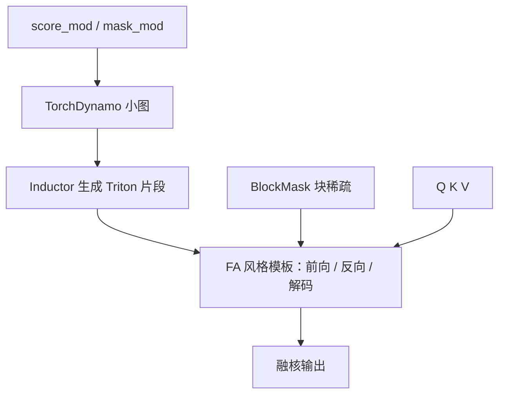

# FlexAttention

<div class="epigraph">
    <p>多数注意力变体可以写成对分数矩阵的修改；用几行惯用的 PyTorch，由编译器生成融核，而不是为每种变体手写一份 FlashAttention。</p>
    <footer>—— Dong, Feng, Guessous, Liang, He, Flex Attention, MLSys 2025</footer>
</div>

[FlashAttention](/llm/flashattention) 把 SDPA 融进一个 IO 感知核，也把接口收成少数几种官方变体。滑窗、文档掩码、ALiBi、softcap、PagedAttention，以及它们的组合，构成组合爆炸：没有核，研究就掉进「软件彩票」。Dong 等人的 FlexAttention 不把变体枚举进 API，而把变体定义成 `score_mod` 与 `mask_mod`，在 `torch.compile` 里注入手写注意力模板。本篇写编程模型，不重写 FA 的分块 softmax；ALiBi 公式见 [原文笔记](/llm/press-alibi)。

## 问题

注意力变体改的几乎都是 softmax 之前那张分数表：有的把部分位置设为 $-\infty$（因果、滑窗、文档、PrefixLM），有的加偏置或非线性（ALiBi、softcap）。手写核要把在线 softmax、反向、解码、GQA 全部再做一遍。通用编译器又很难自动完成「两次 GEMM + 在线 softmax + 反向」这条注意力专用改写。结果是：Mistral 的滑窗、Gemma 2 的 softcap、MPT 的 ALiBi，谁先进了 FA 谁就能训得动。

组合是第二道墙。PrefixLM 是前缀双向或上因果；滑窗加 ALiBi 是掩码加分数偏置。为每对组合再写核不可扩展。需要一种能嵌套、能布尔组合、还能利用块级全掩码跳过计算的表示。

<span class="marginnote">Flex 论文把 Differential Transformer 列为超出 score_mod 合同的例子：它改的是两路 softmax 再减，不是单张分数表上的点修改。能写进 `score_mod` 的，仍是「一张 $QK^\top$」家族。</span>

### 掩码为什么要单独成 API

任何 `mask_mod` 都能写成把分数乘 0/1 的 `score_mod`，但那样会真的去算被屏蔽的点，并且丢掉「整块可跳过」的语义。独立的布尔掩码让编译器生成 BlockMask：以 tile 为单位标记全掩 / 部分掩 / 全保留。全掩块不加载；部分掩块仍用逐点 `mask_mod` 保语义。BlockMask 的索引向量还可以兼做 PagedAttention 的页表映射。

## 方法

统一写法：

$$
\mathrm{Flex}(Q,K,V)=\mathrm{softmax}\bigl(\mathrm{mod}(QK^\top/\sqrt{d_k})\bigr)V.
$$

用户提供

```python
def mask_mod(b, h, q_idx, kv_idx) -> bool
def score_mod(score, b, h, q_idx, kv_idx) -> Tensor
```

因果是 `q_idx >= kv_idx`；滑窗再加距离上限；文档掩码比较 `doc_id[q_idx]==doc_id[kv_idx]`；ALiBi 是 `score + slope[h]*(q_idx-kv_idx)`。`and_mask` / `or_mask` 组合布尔函数，PrefixLM 就是前缀全连接或上因果。PyTorch API 在 `torch.nn.attention.flex_attention`：`flex_attention(q,k,v,score_mod=...,block_mask=...)`，GQA 用 `enable_gqa=True`。

降低过程：TorchDynamo 抓住小型 mod 图，TorchInductor 生成 Triton 片段，注入前向 / 反向 / 解码三份手写模板。模板里已有在线 softmax、分块、GQA。反向由 autograd 对 mod 图生成，不必手写每种变体的 VJP。`create_block_mask` 用 `vmap` 从 `mask_mod` 预计算块稀疏表。



## 机制

### 软件彩票被平移到编译缓存

灵活性的代价是：mod 闭包里的 Python 对象若被当成编译常量，稍微改窗口长度就会重编译。官方实践是把运行期变量（偏移、页表）做成 CUDA 张量传入，避免图断裂。第一次 `torch.compile` 有开销；稳定后的核，论文报在常见变体上达到 FA2 的约 0.68×–1.43×，解码相对 FAKV 约 0.93×–1.45×。gpt-fast 里 16K 上下文端到端约 2.04×；torchtune 训练约 2.4×。这些数字是相对未融合或未特化路径，不是宣称全面超过 FA3 手工核。

PagedAttention 把 KV 放在非连续页上。Flex 用 BlockMask 当间接表，论文称额外开销可忽略。这比在 FA 上再维护一份分页 fork 更接近「同一编程模型」。

<span class="marginnote">BlockMask 的粒度是注意力 tile，不是 token。窗口大小与块大小不对齐时，边缘块永远是「部分掩」，稀疏收益变薄。选窗长应同时考虑语义与 tile。</span>

### 组合爆炸变成函数组合

嵌套 `score_mod` 与布尔掩码让「滑窗 + ALiBi + 文档」不再是新核名。这是对研究迭代的真实帮助：变体的墙钟差不再主导是否做实验。它不能表达换状态更新规则的层（DeltaNet、Mamba），也不能表达两路差分注意力。边界就是 SDPA 的代数：仍是一张分数、一次 softmax、一次加权值。

## 边界与工程取舍

原型特性：API 仍可能改（`return_lse` 已转向 `return_aux`）。性能随 GPU 代数与 Triton 版本变；相对 FA3 在 Hopper 上手调的核，Flex 通常是「够用且可组合」，不是绝对最快。动态形状、极度不规则的掩码会让 BlockMask 变稠，退回接近稠密 FA。`score_mod` 过重（大 MLP 打分）会撑爆融合预算，那是 indexer 类设计，应走 DSA 一类专用路径，而不是塞进点修改。

训练与解码是不同模板。只在训练图里 compile，服务期仍可能落到 SDPA。页式推理要同时提供 BlockMask 与正确的 KV 布局，缺一就静默变慢。不要在没有 `torch.compile` 的 eager 路径上谈 Flex 的加速——那只是正确性参考。

与 [SageAttention](/llm/sageattention) 等量化注意力也不是替代：Flex 改的是分数定义与掩码，Sage 改的是低比特 GEMM。可以组合，但要各自验证数值。

研究迭代里，Flex 的真实价值是把「先写核还是先做实验」换成「先写四行 Python」。Neighborhood Attention、文档打包、软封顶，都可以在同一套反向与解码模板上跑通，不必等 FA 仓库接受 PR。组合掩码（因果且滑窗且同文档）若用手写，分支与索引会迅速不可维护；`and_mask` 把逻辑留在 Python 侧，核侧仍是同一套 BlockMask。代价是调试从 CUDA 挪到编译图：第一次跑慢、错误信息经过 Inductor，需要用小形状先验证 `mask_mod` 是否与朴素 `triu` 一致，再放大到训练。

解码模板（FlexDecoding）针对单查询、长 KV，和训练时 $Q$ 与 $KV$ 等长不是同一占用。报 16K 上相对 SDPA 的 2.04×，分母是 gpt-fast 路径上的 SDPA，不是 FA3。70B 级、短上下文上加速可能接近 1，因为核启动盖过稀疏与融合收益。选型规则与 FA 相同：先看长度与是否自定义掩码，再看是否值得支付编译复杂度。

<span class="marginnote">评测必须声明变体是否已有手工核。对 FA 已支持的因果注意力，Flex 的目标是持平附近；对 FA 不支持的组合，对照应是 SDPA 或未融合实现，否则「2×」没有分母。</span>

## 小结

- FlexAttention 把注意力变体收成 `score_mod` 与 `mask_mod`，编译进 FA 风格模板。
- BlockMask 用块级稀疏跳过全掩 tile，并可用于 PagedAttention 映射。
- 布尔组合与嵌套修改用来消化变体的组合爆炸。
- 在已支持变体上接近 FA2；在 gpt-fast 16K 等端到端设定上相对 SDPA 路径可到约 2×。
- 合同限于单张分数表上的 SDPA 家族，不含差分注意力或线性状态层。
- 运行期参数应走张量，避免无谓重编译；加速数字绑定 `torch.compile` 后的核。
- 出处：Dong et al.，*Flex Attention: a Programming Model for Generating Optimized Attention Kernels*，MLSys 2025，arXiv:2412.05496。
