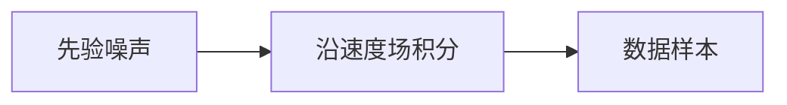

# 流匹配

不必把生成写成几百步马尔可夫去噪。学一条从噪声到数据的速度场，沿常微分方程积分即可。

<footer>—— Lipman 等 Flow Matching for Generative Modeling；对照 Liu 等 Rectified Flow</footer>

[上一课](/llm/ddpm)把生成钉在离散时间去噪。缺口是连续时间：路径可以选得更直，训练目标是匹配速度而不是逐步高斯后验。后课潜空间默认：无论扩散还是流，都仍可能先在像素上太贵，要压到 VAE 潜变量。

## 问题

DDPM 的 $T$ 步与噪声日程是设计负担；采样是随机微分方程或离散高斯链。流匹配构造概率路径 $p_t$，其速度场 $u_t$ 把简单先验（高斯）推到数据分布。网络 $v_\theta(x,t)$ 回归 $u_t$（或条件速度），训练是回归，不是对抗。Rectified Flow 强调用直线路径连噪声与样本，积分更少步。

与理解侧 [CLIP](/llm/clip) 无关：这里没有图文对比，只有连续状态上的向量场。条件生成同样把文本嵌入送进 $v_\theta$。

流与扩散在连续时间极限下可互通；产品差异是：训练目标（速度 vs 噪声/分数）、路径是否近直线、采样器是 ODE 还是随机。少步生成仍常靠蒸馏，见后课。

## 方法

抽数据 $x_1$、先验 $x_0$、时间 $t$，在路径上取 $x_t$，回归条件速度。采样解 ODE $\dot x_t=v_\theta(x_t,t)$。评测仍是 FID 与条件遵守，不要用下一步交叉熵——那是离散 token 的账。

## 机制

若路径是噪声与数据之间的直线，速度近似恒定，$v_\theta$ 更容易、积分步数可少。弯曲路径则把难度推给网络与求解器。这解释了为何同参数量下「直的流」少步更稳，而不是魔法替代了表示学习——表示仍由骨干与数据决定。

## 边界

流不自动给出离散视觉词表，接自回归 LLM 仍要量化或另做连续头。下一课先把昂贵的像素生成挪到潜空间。

## 小结

- 流匹配学速度场，用 ODE 从先验走到数据。
- 直路径减少积分步，与 DDPM 的长链不同。
- 目标是回归，不是词表 CE。
- 出处：Lipman 等 Flow Matching；Liu 等 Rectified Flow。
