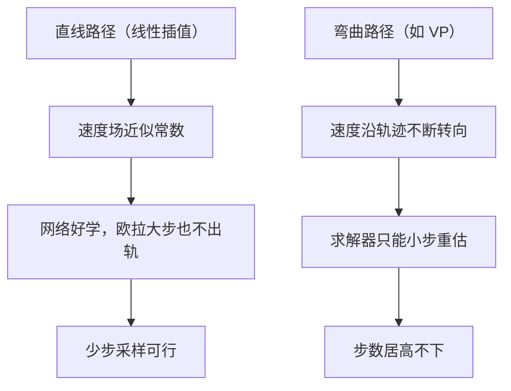

# 流匹配

不必把生成写成几百步马尔可夫去噪。学一条从噪声到数据的速度场，沿常微分方程积分即可。

<footer>—— Lipman 等 Flow Matching for Generative Modeling；对照 Liu 等 Rectified Flow</footer>

[上一课](/llm/ddpm)把生成钉在离散时间去噪。缺口是连续时间：路径可以选得更直，训练目标是匹配速度而不是逐步高斯后验。后课潜空间默认：无论扩散还是流，都仍可能先在像素上太贵，要压到 VAE 潜变量。

## 问题

DDPM 的 $T$ 步与噪声日程是设计负担；采样是随机微分方程或离散高斯链。流匹配构造概率路径 $p_t$，其速度场 $u_t$ 把简单先验（高斯）推到数据分布，沿 $\dot x=u_t(x)$ 的 ODE 积分即可采样。困难在于 $u_t$ 没有闭式、无法直接回归；流匹配的解法从条件路径出发：抽一对 $(x_0,x_1)$（先验样本与数据样本），沿插值

$$
x_t=(1-t)\,x_0+t\,x_1,\qquad t\in[0,1]
$$

条件速度就是常数 $v=x_1-x_0$——线性插值（独立耦合；Rectified Flow 称 OT 路径）的导数与 $t$ 无关。网络 $v_\theta(x,t)$ 回归这个条件目标，其期望恰是边际速度场 $u_t(x)=\mathbb E[x_1-x_0\mid x_t=x]$：对条件目标回归与对边际场回归给出同一个梯度，所以不必知道 $u_t$ 的闭式，采三元组 $(x_0,x_1,t)$ 就有无偏回归目标。可积性一句钉住合法性：边际分布 $p_t$ 是各条件路径的混合，故沿拟合出的场积分，确实把 $\mathcal N(0,I)$ 推到数据分布。训练是回归，不是对抗。Rectified Flow 强调用直线路径连噪声与样本，积分更少步。

与理解侧 [CLIP](/llm/clip) 无关：这里没有图文对比，只有连续状态上的向量场。条件生成同样把文本嵌入送进 $v_\theta$。

直觉类比：把生成想成从「噪声停车场」开车去「数据目的地」。扩散模型给的是几百段带随机抖动的导航指令，走一步抖一下；流匹配直接学一张速度地图——每个位置该往哪开、开多快——沿着路积分到底就到了。

流与扩散在连续时间极限下可互通；产品差异是：训练目标（速度 vs 噪声/分数）、路径是否近直线、采样器是 ODE 还是随机。少步生成仍常靠蒸馏，见后课。

## 方法

抽数据 $x_1$、先验 $x_0$、时间 $t$，按插值取 $x_t$，回归 $x_1-x_0$。采样解 ODE $\dot x=v_\theta(x,t)$，从 $t=0$ 积到 $t=1$，欧拉步之外可换自适应求解器，步数是质量-延迟旋钮。与扩散对照着选路径：扩散的 VP 路径可写成同一插值族的非线性特例——系数 $\bar\alpha_t,\bar\sigma_t$ 随 $t$ 弯曲，DDPM 的离散链是它的随机离散化；直线版把「位置–速度」关系拉平，曲率小，欧拉法少步仍准。日程设计的负担从 $\beta$ 换成插值系数，但直线情形常只有一档，不必扫。评测仍是 FID 与条件遵守，不要用下一步交叉熵——那是离散 token 的账。

数字实例：取 $t=0.25$、$x_0$ 为全零图、$x_1$ 为某张真实图片，插值样本就是 $x_t=0.75\times 0+0.25\times x_1$——相当于原图以 25% 透明度叠在黑底上。网络要回归的目标 $x_1-x_0$，就是「从当前位置直指真实图片」的方向向量。

```mermaid
flowchart LR
  N["先验噪声"] --> ODE["沿速度场积分"]
  ODE --> D["数据样本"]
```

## 机制

若路径是噪声与数据之间的直线，速度近似恒定，$v_\theta$ 更容易、积分步数可少：直线下 $x_t$ 对 $t$ 线性，网络要学的场在整条轨迹上近似常数，对没见过的 $(x,t)$ 插值也稳；弯曲路径则把难度推给网络与求解器——速度沿轨迹旋转，求解器每步都要重新评估，步数下不来。这解释了为何同参数量下「直的流」少步更稳，而不是魔法替代了表示学习——表示仍由骨干与数据决定。轨迹还不够直时，可把训好的模型自己采样出的配对再当训练对重训（reflow 类操作），逐次拉直，为一步生成铺路。

```mermaid
flowchart TD
  A["直线路径（线性插值）"] --> B["速度场近似常数"]
  B --> C["网络好学，欧拉大步也不出轨"]
  C --> D["少步采样可行"]
  E["弯曲路径（如 VP）"] --> F["速度沿轨迹不断转向"]
  F --> G["求解器只能小步重估"]
  G --> H["步数居高不下"]
```

为什么重要：路径越直，速度场越接近常数，采样用大步也不出错；弯曲路径每步都要小心翼翼，几十步起步。这就是 Rectified Flow、Flux 一类「直线流」敢主打少步快采样的全部底气——不是模型更聪明，是路修得更直。

## 边界

流不自动给出离散视觉词表，接自回归 LLM 仍要量化或另做连续头。少步若还不够，蒸馏在后课。下一课先把昂贵的像素生成挪到潜空间。

## 小结

- 流匹配学速度场，用 ODE 从先验走到数据；回归目标 $x_1-x_0$ 无偏可采。
- 边际速度场可积，混合条件路径即概率路径，训练只需三元组。
- 直路径减少积分步，与 DDPM 的长链不同。
- 目标是回归，不是词表 CE。
- 出处：Lipman 等 Flow Matching；Liu 等 Rectified Flow。
