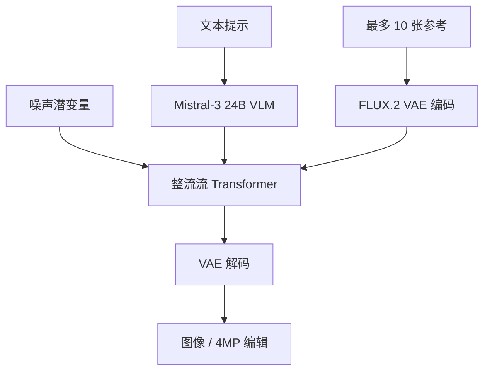

# FLUX.2

    
我们从零重训潜空间，同时提高可学性与图像质量，朝「可学性—质量—压缩」三难问题迈进一步。

    <footer>—— Black Forest Labs, FLUX.2: Frontier Visual Intelligence, 2025-11-25</footer>

Black Forest Labs 在 2025 年 11 月 25 日发布 **FLUX.2**，官方博客标题是 *FLUX.2: Frontier Visual Intelligence*。相对 [FLUX.1](/llm/flux-dev) 的文生图套件，这一代被写成生产工作流：多参考一致性、结构化提示、可读排版、品牌与灯光约束，编辑分辨率到约 4 百万像素。骨干仍是潜空间流匹配，但条件侧换成 **Mistral-3 24B** 视觉语言模型，生成侧是整流流 Transformer；潜空间本身用新 VAE 从零重训。开源档 **[dev]** 是 32B 检查点，文生图与多图编辑落在同一套权重。技术细节以官方博客与同期 *Analyzing and Enhancing the Latent Space of FLUX* 为准，不把第三方拆层当规格。

## 问题

FLUX.1 证明了混合多模态 Transformer 加流匹配可以在开源与 API 两条腿上同时接近当时闭源画质。产品缺口在别处：角色与产品跨图不一致、复杂排版不可用、编辑与生成要两套模型、潜空间「好看」却难学。BFL 把后一项收成三难：**可学性**（生成器在潜空间里好不好训）、**质量**（解码保真）、**压缩**（潜变量维数）。FLUX.1 的自编码器相对 Stable Diffusion 系提高了重建，却把生成 FID 推差；另一类语义自编码器（如 RAE）学得快，重建掉细节。FLUX.2 要同时动条件模型、生成器与潜空间，而不是只加参数。

第二个问题是工作流而不是演示。生产要吃最多约 10 张参考、守构图约束、在高分辨率上改局部而不散架。把编辑写成另一个 checkpoint，等于把身份与风格先验训了两遍。官方主张：所有 FLUX.2 变体都在**同一个架构**里做文生图与多参考编辑。

### 开核分级，不是三套骨架

发布族谱是 **[pro]**（托管质量与成本）、**[flex]**（步数与引导可调，排版与细部更听超参）、**[dev]**（32B 开源权重，非商用许可）、以及当时预告、后于 2026 年 1 月放出的 **[klein]**（从基座蒸馏、Apache 2.0）。VAE 单独以 Apache 2.0 上 Hugging Face。这是许可证与服务形态的分级，公开叙述里共用潜空间流匹配与 VLM 条件，不要画成互不相干的四套网络。

[dev] 可在消费级 GPU 上跑官方 fp8 参考实现（与 NVIDIA、ComfyUI 合作），不等于训练数据与教师轨迹公开。商用走 API 或另购许可。Klein 的发布日志在 GitHub `black-forest-labs/flux2`，不要倒填进 11 月 25 日那篇「即将推出」的句子里。

## 方法

生成器是潜空间整流流：噪声与数据之间走近似直线路径，网络预测速度场，推理用欧拉积分。条件来自 Mistral-3 24B VLM，官方句子是：VLM 提供世界知识与上下文，Transformer 负责空间关系、材料与构图。多参考把最多 10 张图与文本一起编进同一次生成；输出与编辑最高约 4MP。提示遵从、灯光与空间逻辑被写成「更接地」的世界知识，而不是另接检索。

潜空间是独立论文级博客的对象。他们在多种自编码器的冻结潜变量上训同一套 DiT-XL 流匹配，用生成 FID 当可学性、LPIPS 当保真。条件流匹配损失写成

$$
\mathcal{L}_{\mathrm{CFM}}(\theta)=\mathbb{E}_{t,u,\epsilon}\bigl\|v_\theta\bigl((1-t)E(u)+t\epsilon;\,t\bigr)-(\epsilon-E(u))\bigr\|^2,
$$

其中 $E$ 是冻结编码器。为公平比较，时间分布 $p(t)$ 与采样网格对每种表示单独搜索。结论图上 FLUX.2 AE 同时低于 FLUX.1 / SD 的 gFID 与 LPIPS；相对 FLUX.1，可学性与保真一起改善，而不是用重建换生成。

### 步数是 flex 的产品旋钮

[flex] 暴露采样步数与引导强度。官方示意：6 / 20 / 50 步同时改变排版可读性与纹理锐度。这是推理预算，不是另训一个「排版专家」。[pro] 把质量—延迟折中收进托管端点；[dev] 给本地与第三方 API（FAL、Replicate 等）同一套开源权重。编辑与生成共用 checkpoint，参考图走同一潜空间，避免「生成器一套 VAE、编辑器另一套」的错位。

## 机制

流匹配把扩散的随机去噪换成沿概率路径的向量场。整流流偏好近直线路径，采样步可以比早期 DDPM 少，但步数仍决定高频细节——flex 的示意就是在积分精度上花钱。VLM 条件的机制含义是：专名、品牌约束、空间介词不再只靠 T5 类文本编码器的浅对齐，而靠一个已经在图文上做过视觉问答的 24B 模型。这解释官方为何把「世界知识」与「提示遵从」并列，而不是只报 FID。

三难的机制不是口号。压缩过头，解码糊、生成器却可能好训（低频语义空间）；重建过头，潜变量频谱变尖、流匹配要学高频噪声。FLUX.1 AE 偏后一极；语义 AE 偏前一极。FLUX.2 AE 被写成在二者之间重训，使 $E(u)$ 既可解码到生产可用的像素，又让 $v_\theta$ 的学习曲线不至于像 FLUX.1 那样拖。表示博客用 ImageNet 256、批 256、学习率 $10^{-4}$ 的受控实验隔离「表示」这一变量，不声称那就是 32B 生产模型的训练配方。

「最多 10 张参考」是产品能力上限，不是注意力可以无代价拼接任意长图序列。分辨率 4MP 针对编辑；文生图的常用边长仍受显存与 VAE 下采样约束。不要把 playground 里一张 4K 样张写成所有档位的默认输出。

### 生成与编辑同权，靠的是上下文而不是第二套扩散

Kontext 一代已经把「上下文里的图」当成流匹配条件；FLUX.2 把多参考、排版与更高分辨率收进同一基座。机制上，参考图经同一 $E$ 进潜空间，与噪声潜变量、文本 token 一起走 Transformer，而不是先用 IP-Adapter 另训一个投影。官方未公开交叉注意力块数或双流/单流表——讨论架构时停在「VLM + 整流流 Transformer + 新 VAE」，把层表标成未知。

## 边界与工程取舍

博客是产品与方法学叙述，不是可复现的 32B 训练报告。未写：数据配比、教师轨迹、默认采样器、VLM 如何注入（交叉注意力或适配器）。三难分析在 ImageNet 代理上成立，不自动等于生产模型的 FID 榜。开源 [dev] 非商用；[pro]/[flex] 的权重不可下载。后续 Klein 改变尺寸与许可证，必须另文，不要把 Apache 蒸馏档的延迟写回 32B。

不要把 FLUX.2 写成机器人世界模型。官方「世界知识」指生成里的物理观感、灯光与空间逻辑，评测是图像工作流，不是动作条件预测。与 [Sora](/llm/sora)、[Cosmos](/llm/cosmos-world-model) 的世界模拟器修辞相邻，任务不同。也不要用社区对 Klein 4B/9B 层数的非官方表填空。

出处：Black Forest Labs，*FLUX.2: Frontier Visual Intelligence*，https://bfl.ai/blog/flux-2 ；潜空间：*FLUX.2: Analyzing and Enhancing the Latent Space of FLUX*，https://bfl.ai/research/representation-comparison 。GitHub `black-forest-labs/flux2` 给出 2025-11-25 [dev] 与 2026-01-15 [klein] 的发布记录。流匹配见 Lipman et al.；整流流见 Liu, Gong & Liu。

## 小结

- FLUX.2 是潜空间整流流图像模型：Mistral-3 24B 条件 + 新 VAE + 文生图与多参考编辑同权。
- 产品族：[pro]、[flex]、32B [dev]、后来的 [klein]；VAE 单独 Apache 2.0。
- 能力主张：最多 10 张参考、约 4MP 编辑、排版与结构化提示、更强的空间与世界知识。
- 潜空间博客用受控 DiT 实验论证三难，FLUX.2 AE 同时改善可学性与保真。
- 32B 训练配方未公开；开源不等于可复现预训练。
- 出处：BFL 2025-11-25 官方博客与同期 VAE 技术博文。
