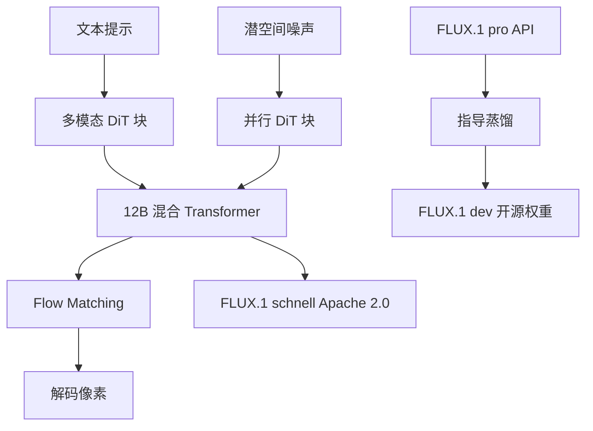

# FLUX.1

    
公开的 FLUX.1 都基于多模态与并行扩散 Transformer 块的混合架构，缩放到 120 亿参数；我们用流匹配训练，并用旋转位置编码与并行注意力提高性能与硬件效率。

    <footer>—— Black Forest Labs, Announcing Black Forest Labs, 2024-08-01</footer>

Black Forest Labs 在 2024 年 8 月 1 日开公司博客里同时宣布实验室与 **FLUX.1** 文生图套件。团队履历写在同一篇：VQGAN、潜空间扩散、Stable Diffusion XL、Stable Video Diffusion、Rectified Flow Transformer、Adversarial Diffusion Distillation。FLUX.1 要解决的产品问题是：在细节、提示遵从、风格多样性与场景复杂度上把开源与 API 两条腿同时放到当时 SOTA 附近。官方把模型分成三档：**[pro]** API 最强；**[dev]** 从 pro 指导蒸馏出的开源权重、非商用；**[schnell]** Apache 2.0，面向本地与个人。架构以这篇博客为准；文中承诺的更详细技术报告若未在当时发布，就不把第三方拆解当官方规格。

## 问题

潜空间扩散已经把像素生成变成对 VAE 潜变量去噪，但开源默认骨干长期是 U-Net。创始团队自己的 SD3 / Rectified Flow 路线表明：Transformer 加流匹配可以在文生图上继续涨。剩下的工程问题是分级发布：完全闭源无法建立生态；完全 Apache 又难以用最强档覆盖训练成本。指导蒸馏要把大模型的采样轨迹压进同尺寸、更少引导开销的学生模型，还不能把预训练多样性蒸馏没。

评测问题同样尖锐。FID 对提示遵从、排版、极端宽高比不敏感。博客因此改用人工向的对比轴：视觉质量、提示跟随、尺寸/宽高比可变性、字体排版、输出多样性，并把对照写成 Midjourney v6.0、DALL·E 3（HD）、SD3-Ultra。这是官方主张，不是一张可下载的公共榜单协议。

### 三档是许可证与蒸馏，不是三套骨架

[pro]、[dev]、[schnell] 被明确写成**同一套公开架构描述**上的变体。dev 是 guidance-distilled，直接从 pro 蒸馏，追求相近质量与提示遵从、同尺寸下更高效。schnell 是少步快速档，博客称其不仅超过同级少步模型，也超过未蒸馏的 MJ v6 与 DALL·E 3 HD——这是很强的广告句，引用时必须带上「官方自评」。权重：dev 与 schnell 上 Hugging Face；推理代码在 GitHub 与 Diffusers；ComfyUI 声称 day-1。pro 走 API（当时 Replicate、fal.ai，企业另洽 `flux@blackforestlabs.ai`）。

博客写「将发布更详细技术报告」。在报告落地前，不要用社区对 MMDiT 块数、VAE 来源的猜测填空。公开句已经够用来区分：混合多模态块 + 并行 DiT 块、12B、流匹配、RoPE、并行注意力。

## 方法

所有公开 FLUX.1 都是 **12B** 的混合架构：多模态扩散 Transformer 块与并行扩散 Transformer 块。流匹配（flow matching）被写成包含扩散作为特例的一般训练方法，相对先前 SOTA 扩散模型的改进点。位置用旋转编码；注意力用并行层，以提高硬件效率。宽高比与分辨率覆盖约 0.1 到 2.0 百万像素。多样性被写成针对预训练输出多样性做了专门微调，避免蒸馏把模式塌缩掉。

方法学停在这里。未写：具体 VAE 是否沿用 SD3、隐空间通道、patch 大小、双流块数、分类器自由引导的默认系数、蒸馏教师的采样步。dev 的「指导蒸馏」只说明学生更高效，没有给出蒸馏损失公式。schnell 与 ADD（Adversarial Diffusion Distillation）的关系，博客只在团队履历里点名 ADD，没有写 schnell 就是 ADD 的直接产物——不要自行划等号。

### 文生图套件被写成视频的地基

博客末节 *Up Next*：FLUX.1 是文生图，也是「即将到来的文生视频套件」的基础，目标是高清、可编辑、更快。这是路线图，不是 2024-08-01 已发布的视频模型。写 FLUX.1 时把视频能力算进本文，越界。Seed 轮融资 3100 万美元（a16z 领投等）属于公司叙事，与 12B 的训练算力账单无公开换算关系。

## 机制

流匹配把生成写成从噪声到数据的常微分方程，训练预测速度场；扩散是其特例。对服务来说，这意味着采样器是 ODE/积分器超参，而不是只能 DDPM 的 1000 步。并行注意力与 RoPE 是把语言模型里已经规模化的器件搬进 DiT：RoPE 便于多分辨率，并行注意力便于把 QKV 与 MLP 的内存墙打穿。多模态块负责文本与图像 token 的交互；并行 DiT 块负责视觉内部的全注意力——博客用「hybrid」概括，未给块图。把 [HunyuanVideo](/llm/hunyuan-video) 的「20 双流 + 40 单流」抄过来当 FLUX，是张冠李戴。

指导蒸馏的机制含义：推理时少做或不做空条件前向，降低 CFG 的双倍算力。代价通常是分布锐度与多样性；官方用「专门微调以保留预训练多样性」来对冲。少步 schnell 把积分区间切粗，质量换延迟。API 档 pro 不公开是否与 dev 同权、只是不同许可证，还是另有未蒸馏教师——只知道 dev 从 pro 蒸馏而来。

官方对照轴含 Typography。这是相对 SD3 早期排版弱的明确主张，仍可能在小字、弯折文字上失败。宽高比 0.1–2.0 MP 是训练/微调覆盖，不是任意 8K 原生长边。

### 开源权重不等于可复现训练

dev 可下载、可在 Diffusers / Comfy 里跑，不等于数据、优化器状态与蒸馏教师公开。二次开发（LoRA、ControlNet 类条件）是社区在冻结骨干上接模块，成功不回溯成 BFL 官方架构。商用要走许可或 API，dev 的非商用条款以当时 Hugging Face 卡片为准。

## 边界与工程取舍

无公开训练配方。自评 SOTA 未附可复现协议。dev 非商用；schnell 更快但官方也承认是少步档。后续 FLUX1.1 [pro]（2024-10-02 博客）是另一产品点，不要把 1.1 的速度与价格写回 8 月 1 日的 FLUX.1。视频模型当时未发布。安全、水印、训练数据来源本篇博客几乎不谈。

不要用「Stable Diffusion 3 换皮」一句代替 hybrid 架构。不要发明 12B 的层表。与 Wan / Hunyuan 比的是文生图对文生视频，任务不同；可复用的只有流匹配 + Transformer 这一代际共性。

出处：Black Forest Labs，*Announcing Black Forest Labs*，https://bfl.ai/blog/24-08-01-bfl （2024-08-01）。后续 API 与 FLUX1.1 [pro] 见 2024-10-02 *Announcing FLUX1.1 [pro] and the BFL API*。流匹配传统见 Lipman et al.；DiT 见 Peebles & Xie。

## 小结

- FLUX.1 是 BFL 发布的 12B 文生图套件：混合多模态与并行 DiT 块，流匹配训练，RoPE 与并行注意力。
- 三档：pro（API）、dev（开源权重、指导蒸馏、非商用）、schnell（Apache 2.0 少步）。
- 官方自评在画质、提示、宽高比、排版、多样性上超过 MJ v6、DALL·E 3 HD、SD3-Ultra。
- 详细块图与训练报告以官方后续文本为准；本文不补充未公开实现。
- 文生视频只是当时路线图，不是 FLUX.1 的能力表。
- 出处：Black Forest Labs，2024-08-01 官方博客。
