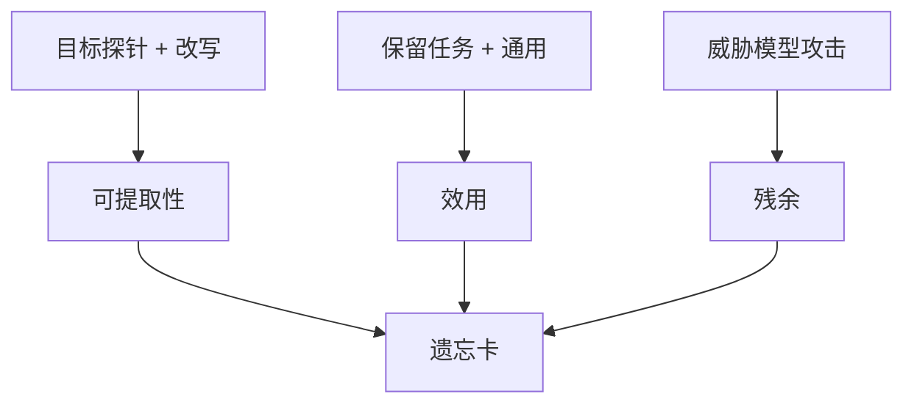

# 遗忘的度量

训练损失升高不等于忘掉；拒答也不等于不可抽取。度量要分开：目标集上的可提取性、保留集上的效用、以及攻击换措辞后是否还在。

<footer>—— 综合 Maini 等 TOFU（2024）、Li 等 WMDP（ICML 2024）、Eldan 与 Russinovich 的 Harry Potter 遗忘实验（2023）</footer>

前几课已经在用「忘了」「还在」说话。[回放](/llm/continual-replay)要旧任务回归；[RMU](/llm/rmu-wmdp)要 WMDP 降、MMLU 留；[ROME](/llm/rome-memit)要无关事实保持。本课把度量收成可写进配方的几栏，避免用单一准确率宣布成功。下一课[负任务向量](/llm/negative-task-vector)仍用这套尺来验收算术遗忘。不发明新基准名。

## 问题

持续学习里的遗忘：任务 $T_i$ 在学完 $T_{j>i}$ 之后的性能相对刚学完 $T_i$ 时下降多少。隐私遗忘：攻击者能否从模型抽出 $D_f$ 中的字符串或确认成员。能力遗忘：领域代理题是否仍会做。三种都叫 forgetting，曲线不可互换。用 MMLU 下降证明隐私遗忘，是用效用伤害冒充删除；用拒答率证明 WMDP 遗忘，是用接口冒充知识去掉。

Eldan 与 Russinovich 删除《哈利·波特》相关完成：表面问「霍格沃茨」会糊，换别名或补全诗句仍可能漏。度量必须含**改写攻击集**，否则只测了训练时见过的探针。

### 对照模型几乎总是缺的

TOFU 的优点是虚构传记，可与从未见过该传记的模型比。真实预训练数据没有「从未见过莎士比亚」的对照。只能用：抽取长度、成员推断 AUC、释义一致率、以及效用下限。不要报告「与精确遗忘只差 1%」除非真有对照。

成员推断（Shokri 等的攻击传统）在 LLM 上不稳定，但仍应作为一栏：有的方法降低填空却提高成员可分性，或相反。

## 方法

写一份遗忘卡，最少四栏：

1. **目标失败**：在 $D_f$ 探针上，准确率 / 精确抽取率 / WMDP 分，应下降。含原文、释义、翻译、补全前缀。
2. **效用**：声明的 $D_r$ 与通用基准，相对遗忘前的相对下降上限（例如 2%）。
3. **流畅与格式**：在[chat template](/llm/chat-template) 下是否仍能对话，而不是进入乱码。乱码是破坏，不是遗忘。
4. **攻击残余**：Best-of-N、角色扮演、把答案藏在代码注释里等你实际会面对的套取。只选与威胁模型相关的，但至少一类非原探针。

持续学习另加：**平均准确率**与**向后迁移**（旧任务变化）、**向前迁移**（新任务是否受益）。报表不要只给平均值。

比较方法时用同一张卡。RMU、梯度上升、负任务向量、拒答 SFT 会在四栏上呈现不同轮廓：拒答常是 1 好、4 差；打乱权重常是 1 好、2–3 差。

## 机制

「损失升高」只说明 $D_f$ 上的平均 NLL 变差。模型仍可能用低熵的错误完成（改写成反事实）或把概率质量从原文挪到同义改写上——抽取失败、知识还在。故目标栏要生成式抽取，不只闭卷准确率。效用栏防止把模型推到随机初始化。攻击栏防止度量过拟合探针分布，这与 SFT 过拟合[谱系](/llm/instruction-data-lineage)同构：你优化哪张表，哪张表就好看。

ROME 的局部性测试是遗忘卡在事实编辑上的特例：目标 / 邻近 / 流畅。应复用结构，换内容。

LoRA 卸载后四栏全回到基座，说明「遗忘」只存在于适配器。若合规要求针对基座，卡必须在卸载后测。

## 边界与工程取舍

没有单一标量可以排序所有遗忘方法。产品选定威胁模型后，对四栏做阈值约束，再在约束内优化计算。公开论文的数字依赖其探针；迁移到内部 $D_f$ 必须重做卡。不要用本课指标去「证明」监管意义上的删除完成。下一课的任务算术在卡上往往表现为：目标任务掉、邻近任务若方向重叠也会掉，效用栏要写清哪些算 $D_r$。

## 小结

- 持续学习遗忘、隐私抽取、能力代理是三种度量，不可互相替代。
- 遗忘卡至少含：目标失败（含改写）、效用、流畅格式、攻击残余。
- 拒答与乱码都不是合格遗忘。
- 无对照模型时不要声称接近精确遗忘。
- 适配器方法须声明卸载后是否仍测。
- 出处：Maini 等，TOFU，2024；Li 等，WMDP，2024；Eldan 与 Russinovich，2023；ROME 的局部性评测结构。
