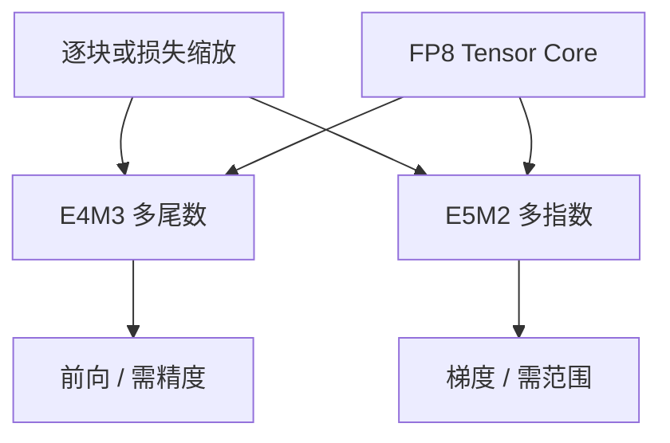

# E4M3 / E5M2

FP8 仍是浮点：指数决定动态范围，尾数决定精度。E4M3 多给尾数，E5M2 多给指数。同一 8 bit，对准的是计算核，不是 GPTQ 那种整数格子。

<footer>—— 对照 NVIDIA/Intel/ARM 的 FP8 白皮书与 OCP 8-bit 浮点约定；训练配方另见通信 dtype</footer>

[NF4](/llm/nf4-quantile) 是存储用的分位整数码本。本课 **E4M3 / E5M2** 是 8-bit 浮点格式，面向 Tensor Core 上的乘加。缺口：它们是非均匀（指数编码），但不是学出来的码本；溢出、NaN、以及缩放（loss scale / 逐块 scale）是一等公民。[加速器对比](/llm/accelerator-comparison-method) 里「有没有 FP8 核」指这一对，不是 NF4。

## 问题

E4M3：4 bit 指数、3 bit 尾数，精度相对好，动态范围窄，易溢出，适合需要准的前向权重/激活。E5M2：5 bit 指数、2 bit 尾数，范围更像 FP16 的缩小版，精度更糙，常放梯度或需要范围的张量。两者都是 8 bit，不能混用同一解释。

没有逐块或逐张量缩放时，Transformer 的激活离群会把 E4M3 打进 inf。FP8 训练是「格式 + 缩放策略 + 核」，缺一不可。问题是 **把哪类张量放进哪一格式**，以及与 PTQ INT8 的关系：FP8 常走训练/推理的原生核，INT8 常走事后量化。

OCP 与厂商白皮书对 E4M3 的 NaN / inf 行为有具体约定（有的变体几乎不用 inf）。实现必须跟核，不要假设 IEEE FP16 的语义缩小。本课不编造未写入公开格式文档的 bit 图案。

## 方法

训练：前向 E4M3、反向梯度 E5M2 是常见分工（以你用的框架默认与论文配方为准，换代会变）。必须有溢出监控与缩放更新。推理：权重、激活都 FP8 可吃 Tensor Core；KV 是否 FP8 另算，精度与长度敏感。

与 INT PTQ：FP8 推理往往是训练就在 FP8 或 QAT；把 FP16 模型事后「铸」成 FP8 仍要校准尺度，近似 W8A8，但格子是浮点不是均匀 INT。不要把 GPTQ 的 4-bit 整数检查点当成 E4M3。

通信：[预训练通信](/llm/pretrain-comm) 的梯度 FP8 通信是另一开关，格式可能与计算 FP8 对齐，协议必须全集群一致。

## 机制

浮点的非均匀来自指数：靠近零（正规数范围内）相对精度大约恒定（尾数 bit），而不是均匀 INT 的绝对台阶恒定。对近似对数动态范围的张量，这比 INT8 更省心；对已经平滑到良好范围的张量，INT8 可能更准或核更成熟。离群仍会占满指数的高端，该通道其余值下溢——平滑与混精并不过时。

E4M3 范围不够时不是「换 E5M2 就结束」，梯度要范围、权重要精度，拆张量类型才是机制。

## 边界与工程取舍

不要在没有 FP8 核的加速器上用软件模拟当对比成绩。不要混用不同厂商的 FP8 变体检查点。不要把 FP8 与 INT8 的 PPL 差写成「8 bit 就是 8 bit」。下一课开始验收：误差度量，适用于 INT 与 FP 格子。

## 小结

- E4M3 偏精度，E5M2 偏范围；都是 8-bit 浮点核格式。
- 必须配缩放；离群照样溢出或下溢。
- 与 GPTQ/NF4 检查点不互换；与梯度 FP8 通信要对齐协议。
- 对比加速器时 FP8 是计算维，不是存储码本维。
- 出处：FP8 白皮书与 OCP 8-bit 浮点约定；框架训练配方。
