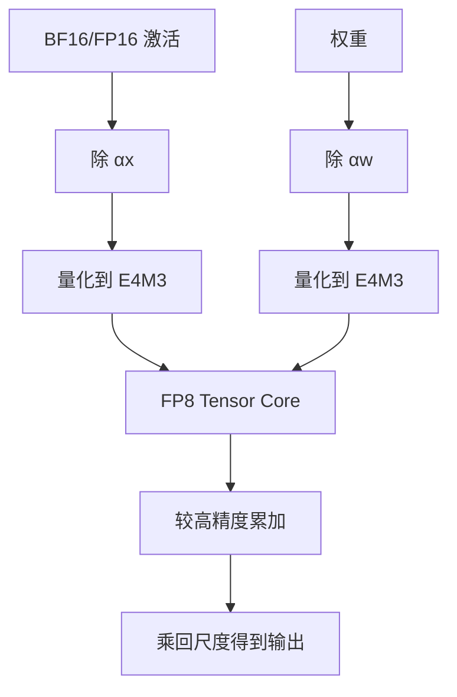

# FP8 推理

八个比特仍保留指数：E4M3 多给尾数、E5M2 多给范围；没有逐张量缩放，绝大多数 Transformer 激活都进不了这套格子。

<footer>—— Micikevicius et al., FP8 Formats for Deep Learning, 2022（NVIDIA / Arm / Intel）</footer>

INT8 把值写成整数乘尺度；FP8 把值写成带指数的小浮点。同样 8-bit，语义不同：异常通道在整数格子里会绑死 max 尺度，在 FP8 里先消耗的是指数头空间。Hopper 一类 GPU 把 FP8 GEMM 做成 Tensor Core 一等公民之后，推理侧开始把权重、激活甚至 KV 往 FP8 搬，而不必走 SmoothQuant 那套「迁到 INT8」的预处理。代价是格式要选对——E4M3 还是 E5M2——并且几乎总要配缩放。本篇写推理，不把训练期的 FP8 混合精度配方整段搬过来；训练侧见 [混合精度预训练](/llm/pretrain-mixed-precision)。

## 问题

半精度推理的墙有两面：权重与 KV 的带宽，以及 prefill 的矩阵吞吐。INT8 能打通整数管道，但对 LLM 激活的通道尖峰不友好，往往要离线平滑或在线分流，见 [W8A8](/llm/w8a8)。人们想要一种「位宽相同、动态范围更像浮点」的格式，减少逐通道仿射的痛苦，同时仍能喂饱 8-bit Tensor Core。

IEEE 没有把 FP8 收成唯一标准。工业界收敛到两种指数-尾数拆法，由 Micikevicius 等人 2022 年的联合白皮书写清，并进入 OCP 的 8-bit 浮点讨论：E4M3 与 E5M2。推理要回答的不是「有没有 FP8 这个名字」，而是：**前向操作数用哪一种、缩放放在张量还是块上、哪些算子不准降**。选错格式的典型失败是 E4M3 溢出成 NaN/Inf，或 E5M2 尾数太粗把小权重打成零。

### E4M3 与 E5M2 各买什么

两种都是 1 位符号。E4M3：4 位指数、3 位尾数（外加隐含位时的有效精度视实现），有限值范围窄、相对精度较好，白皮书将其偏向**前向权重与激活**。E5M2：5 位指数、2 位尾数，范围接近 FP16 的数量级，精度更糙，偏向**梯度**——那是训练故事。推理若把激活存成 E5M2，动态范围宽，量化噪声大；若把激活存成 E4M3，噪声小，但必须保证缩放后的 amax 落在有限值内，否则饱和。推理默认更常是权重与激活都走 E4M3，梯度格式根本不出现。

E4M3 在部分约定里不保留 Inf，用额外码字表示 NaN 或扩展有限值，与 IEEE FP16 的特例不完全一样。实现必须跟硬件文档，而不是跟「浮点常识」。溢出策略（饱和还是 NaN）会改变能否在无损失缩放时跑完一层 softmax 前的投影。

## 方法

FP8 GEMM 通常写成

$$
Y \approx \alpha\big(Q_{\mathrm{fp8}}(X/\alpha_x)\; Q_{\mathrm{fp8}}(W/\alpha_w)\big),
$$

其中 $Q_{\mathrm{fp8}}$ 是打到 E4M3 或 E5M2 格子，$\alpha_x,\alpha_w$ 是正缩放，使张量的 amax 映射到该格式最大有限值附近。推理可以：离线对权重算死 $\alpha_w$（校准或整网统计）；对激活用运行时 amax、滑动窗口、或校准冻结的逐通道/逐 token 尺度。Transformer Engine 一类栈在训练时动态收集 amax；推理为了可复现与避免设备间不一致，更常把权重尺度写进检查点，激活用对称逐 token 尺度或块尺度。

KV 另走一条：[KV 的 INT8/FP8](/llm/kv-int8-fp8) 把缓存当带宽问题，格式同样是 E4M3 加点缩放。注意力分数是否在 FP8 里算，取决于核：很多实现是 Q、K 以 FP8 加载，softmax 仍在较高精度。这与「模型权重 FP8」不是同一开关。

累加不能在 FP8 里做完。8-bit 乘积的部分和需要 FP16/FP32 累加器，与 INT8 用 INT32 累加是同一条数值纪律。缺这一步的「纯 FP8 网络」只存在于宣传。

### 与 INT8 仿射的差别

INT8：值 $\approx s\cdot(q-z)$，$q$ 是整数。零点处理非对称分布，尺度被 max-min 绑死。FP8：值自带指数，同一张量里可以同时有 $10^{-2}$ 与 $10^{1}$ 量级（在格式范围内），对通道尖峰的第一反应是占指数位而不是占满整数格子。仍可能饱和，所以缩放没消失，只是**更粗的逐张量缩放往往够用**，不必先做 SmoothQuant 也能上 8-bit GEMM——这是 FP8 推理相对 W8A8-INT8 的工程吸引力。代价是硬件绑定：没有 FP8 Tensor Core 时，模拟 FP8 只有精度实验意义。

## 机制

指数位把动态范围变成对数均匀的档位。尾数少，相对误差在每个 bin 内大约是 $2^{-(m+1)}$ 量级。E4M3 的 $m=3$，相对误差大约优于 E5M2 的 $m=2$，所以前向更怕的是溢出而不是舍入；E5M2 更怕舍入把小信号吃掉。推理前向没有梯度爆炸问题，范围需求低于训练，故 E4M3 匹配。若某层 LayerNorm 前的隐藏态偶尔出现极端值，E4M3 会先饱和：要么在该层禁用 FP8，要么对该层用更细的块缩放（MX 一类分组浮点是后话，见更低比特格式，不在本篇展开）。

FP8 不是「免费的 W8A8」。没有核就没有吞吐；有核仍要把 softmax、RMSNorm、SiLU 等非线性留在 BF16，图是混合精度的。报表应写 GEMM dtype，而不是「全网 FP8」。

### 推理与训练配方不要混用

训练 FP8 常前向 E4M3、反向 E5M2，再加重缩放与 amax 历史。推理没有反向，把训练检查点里的 E5M2 梯度统计拿来量化激活，是用错张量。主权重若以 FP32/BF16 保存、推理再静态转 FP8，应在验证集上扫 $\alpha$，不能假定训练时的 per-tensor amax 仍最优——训练 amax 跟踪的是当前 mini-batch，推理要覆盖长尾请求。

## 边界与工程取舍

设备：Hopper / 部分后续 GPU、以及声明支持 FP8 的 NPU 才能把格式变成墙钟。Ampere 上的 FP8 是软件模拟。同一份 FP8 权重在只认 INT8 的服务引擎里要反量化，回到带宽墙。厂商中间件（Transformer Engine、TensorRT-LLM）对融合、缩放粒度、是否允许 E4M3 权重配 FP16 激活（W8A16-FP8）各有默认，对拍数字必须钉版本。

与 W4A16 的分工依旧：小 batch decode 更饿权重比特，4-bit 整数权重大于 FP8 权重；prefill 大 GEMM 更饿 FP8/INT8 吞吐。FP8 权重约等于「W8A8 的浮点方言」，体积与 INT8 同阶，对单卡装 70B 的帮助不如 4-bit。产品上常见：权重 GPTQ 4-bit，KV 用 FP8，激活 GEMM 仍 BF16——三套 dtype 并存。

### 数值签字

FP8 推理要记录：E4M3 还是 E5M2、缩放粒度（张量 / token / 块）、溢出是饱和还是 inf、哪些层排除、累加精度。缺一项就无法复现。不要引用未公开的内部 amax 表当论文结果。Micikevicius 白皮书给的是格式定义与深度学习里的使用建议，不是某个 70B 聊天模型的业务 SLA。

OCP 后来还有微缩放（MX）系列，把更少尾数配块尺度。那是 4-bit 浮点故事，不要把 MXFP4 的块尺度规则套到本篇的逐张量 FP8 上。

## 小结

- FP8 推理用带指数的 8-bit 浮点喂 Tensor Core，与 INT8 仿射同宽不同语义。
- E4M3 偏向前向精度，E5M2 偏向范围（训练梯度）；推理默认以 E4M3 为主。
- 几乎总需要缩放把 amax 送进有限值；累加在更高精度。
- 相对 INT8，通道异常值更好熬，但仍是混合精度图，非线性常留 BF16。
- 无 FP8 核则无吞吐意义；decode 容量仍可能更需要 4-bit 权重。
- 训练 amax 与推理静态尺度不是同一套契约。
- 出处：Micikevicius et al., *FP8 Formats for Deep Learning*, 2022。硬件路径见 NVIDIA Hopper / Transformer Engine 文档；INT8 对照 Xiao et al., SmoothQuant, ICML 2023。
