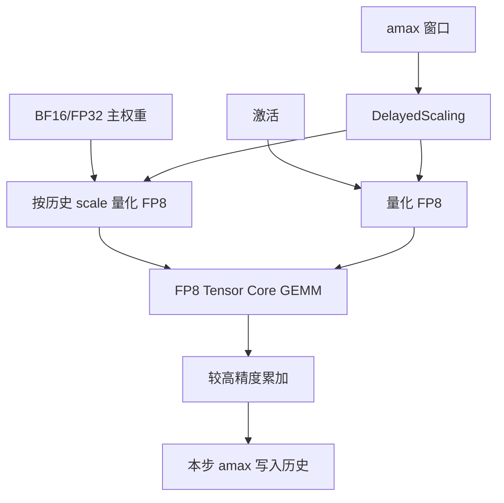

# FP8 训练（Transformer Engine）

    
前向 E4M3、反传 E5M2，尺度来自上一窗的 amax 而不是本步再扫一遍；FP8 训练是带元数据的层级合同，不是 <code>tensor.to(fp8)</code>。

    <footer>—— NVIDIA Transformer Engine 用户指南：DelayedScaling、Format.HYBRID；Micikevicius et al., FP8 Formats for Deep Learning, 2022</footer>

混合精度的数学——主权重、损失缩放、哪些算子留宽——见 [BF16 / FP8 训练](/llm/pretrain-mixed-precision)。Hopper 芯片与 TE 作为硬件合同见 [H100 Transformer Engine](/llm/hopper-te)。本篇写**库这一层**：Transformer Engine 如何把 OFP8 的两种编码、延迟缩放、融合线性层和分布式 amax 收成可在 Megatron / PyTorch 里打开的配方。没有这条路径，H100 的 FP8 Tensor Core 只是产品表上的列。推理侧的静态尺度与 KV 见 [FP8 推理](/llm/fp8-inference)，不要用推理校准集去「验证」预训练 FP8。

## 问题

E4M3 与 E5M2 由 NVIDIA、Arm、Intel 的 2022 年白皮书写清，并进入 OCP OFP8。E4M3 尾数多、有限范围窄，适合前向权重与激活；E5M2 指数多、尾数少，适合梯度。没有每张量（或更细）的缩放，大多数激活与梯度进不了格子。若每步先做一次全张量 amax 再量化，等于把 GEMM 的访存加倍，FP8 的带宽优势被统计吃掉。若缩放因子陈旧，溢出或下溢会把该层变成随机学习率。

还需要一层软件，把「主权重仍是 BF16/FP32、参与 MMA 的操作数是 FP8、softmax 与 LayerNorm 留宽」绑在模块上，而不是让用户在每个 `Linear` 前后手写 `quantize`。这就是 TE 的产品形状：`te.Linear` / `te.LayerNorm` / `te.TransformerLayer`，外加 `fp8_autocast` 与 recipe。设备要求文档写明 FP8 延迟缩放路径需要 SM89（Ada）或更新；数据中心训练的主对象是 SM90 Hopper。没有 FP8 Tensor Core 的卡上打开 TE，没有吞吐意义。

### HYBRID 不是「反传 BF16」

`Format.HYBRID`（默认）：前向 FP8 张量用 E4M3，反传里进入 Tensor Core 的梯度张量用 E5M2。`Format.E4M3` 允许全程 E4M3。纯 E5M2 训练在库里直接断言拒绝——尾数对权重更新太糙。HYBRID 管的是**参与 GEMM 的张量**，不是整网所有 op。口语里把 HYBRID 说成「前向 FP8、反传 BF16」，会漏掉梯度也走 8-bit MMA 这一条，屋顶线就估错了。

白皮书的 E4M3 在部分约定里不保留 Inf，用额外码字表示 NaN 或扩展有限值。溢出策略（饱和还是 NaN）改变能否在无额外损失缩放时跑完一层。实现必须跟 TE / 硬件文档，而不是跟 IEEE FP16 常识。

## 方法

典型用法：用 TE 模块替换框架线性层，或让 Megatron / NeMo 在配置里打开 TE；构造 `DelayedScaling`（或较新的 Current Scaling / Block Scaling）；在 `fp8_autocast` 里前向反传。主权重保持较宽格式，每步（或按实现）量化出 FP8 副本送进 GEMM，累加在较高精度（常见 FP32 累加器），再反量化语义乘回 scale。漏乘一个 scale，等于给该层乘了随机增益。

`DelayedScaling` 的默认思路：本步用历史 amax 窗口估计 scale，本步观察到的 amax 写入历史，供后续步使用。文档默认窗口长度可达 1024 步量级，实践常改短。`amax_compute_algo` 选窗口内 `max` 还是 `most_recent`。相对 Current Scaling，延迟缩放把「先扫 amax 再量化」合成一次读，换来的是 scale 陈旧。`margin` 给 amax 留出头空间，减小溢出概率，代价是格子用不满。

### 分布式 amax 与检查点

张量若被数据并行、张量并行、序列并行或上下文并行切开，各 rank 的局部 amax 不是全局 amax。TE 要求在持有该张量分片的进程组上做 amax reduction（`reduce_amax`，autocast 的 `amax_reduction_group`）。不做归约，每张卡各用各的 scale，拼接后的数值协议破裂：可以降损失，有效学习率已经不是配置文件里的数。流水线各阶段的 FP8 元数据要随检查点一起存；只存 FP8 权重、不存 scale 与 amax 历史，无法按原配方续训。

融合是另一半合同。GEMM 后接 GELU / 偏置、LayerNorm 线性等，减少 FP8 进出 HBM 的往返。用户手写三颗独立 kernel、中间用 BF16 写回，等于把 TE 降成「偶尔发一次 FP8 MMA」。`fp8_dpa` / `fp8_mha` 把注意力也纳入 FP8 路径，但文档限定后端（如 FusedAttention）与模块形状；默认注意力仍可能在较宽格式。不要假设「开了 autocast 等于 FlashAttention 也是 FP8」。

## 机制

延迟缩放能成立，是因为大 batch 预训练的 amax 在相邻步之间往往平滑。scale 慢一拍，大多数值仍落在可表示区；偶发尖峰则溢出，实现通常跳过该步或缩小 scale，与动态损失缩放是同一类控制回路。微调、极小 batch、MoE 路由剧烈变化、损失尖峰更频繁时，陈旧 scale 更危险，应改 Current Scaling、缩短窗口、先 BF16 热身再开 FP8，或把敏感层剔出 autocast。这不是格式缺陷，是统计假设破了。

屋顶线上，FP8 把同一 HBM 流量对应的算术强度抬高：本该带宽受限的宽层有机会靠近计算墙。Decode 小 $M$ 的 GEMM 除外——tile 填不满 Tensor Core，精度再窄也接近带宽墙。所以「开 TE」对预训练大微批、prefill 更敏感，对单请求 decode 不是同一故事。稀疏 2:4 峰值另算：权重必须满足模式且走稀疏 MMA。

ZeRO / FSDP All-Gather 的对象必须与 TE 存储约定一致：Gather 来的是 BF16 主副本再量化，还是已经 FP8 的片，决定通信体积与 scale 归属。跨阶段流水时，amax 窗口在 microbatch 之间的更新顺序要固定，否则数值随流水深度漂。

## 边界与工程取舍

### 与推理 FP8、下一代块缩放分家

不要在 A100 上用 Hopper 配方期待 FP8 MMA。不要把产品表稀疏 FP8 除以墙钟当利用率。库版本必须与 CUDA / cuDNN 对齐；静默回退到 BF16 GEMM 是最常见的「开了 TE 却没加速」——Nsight 里 Tensor Pipe 是否非零，比 loss 曲线更早暴露。

Blackwell 的 MXFP8 / NVFP4 是第二代引擎与块缩放，见 [MXFP8](/llm/mxfp8) 与 [Blackwell 对推理的含义](/llm/blackwell-infer)。不要把 `MXFP8BlockScaling` 的结论写进 H100 的 `DelayedScaling` 实验记录。验收应包含：溢出 / 跳步计数、amax 是否在跨 rank 归约、与 BF16 基线的损失，而不是只看 MFU。

纯 E4M3 全程训练在范围上更紧，对梯度尖峰更苛刻；HYBRID 用 E5M2 接反传是默认稳健项。换数据集或换深度之后重新看溢出直方图，不要假设「Llama 上能跑的配方在 MoE 上也能跑」。

出处：NVIDIA Transformer Engine 用户指南（DelayedScaling、Format.HYBRID / E4M3、设备 SM89+、reduce_amax）；Micikevicius et al., *FP8 Formats for Deep Learning*, arXiv:2209.05433；OCP 8-bit Floating-Point Specification。硬件峰值对照 Hopper 产品页，不在本篇写成定律。

## 小结

- TE 把 FP8 GEMM、HYBRID 编码与延迟缩放收成层级 API；主权重仍宽，参与 MMA 的操作数才是 FP8。
- DelayedScaling 用历史 amax 避免每步双倍读；分布式必须按分片组归约 amax。
- HYBRID 是前向 E4M3、梯度 E5M2，不是反传 BF16；纯 E5M2 训练不受支持。
- 融合与真正发出 FP8 MMA 才接近表头；静默回退是主故障模式。
- 块缩放 / MX 是下一代配方，不要与 Hopper 逐张量路径混表。
- 出处：NVIDIA TE 文档与 Micikevicius et al. 2022；硬件对照 [H100 TE](/llm/hopper-te)。
