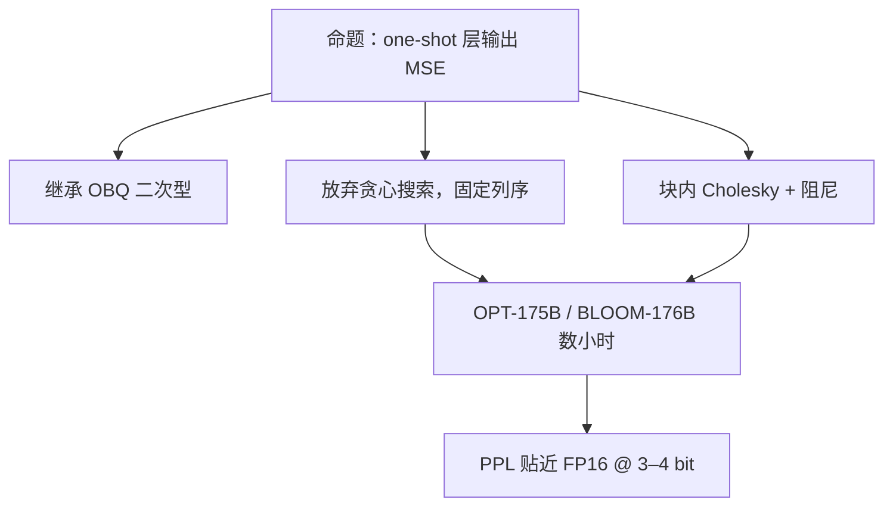

# GPTQ 原文

    
按层把权重量化写成最小二乘，用 Hessian 把已经引入的舍入误差补偿到尚未量化的列上；这样 4-bit 权重建模可以在数小时内打到百亿、千亿参数，而不必再做一轮量化感知训练。

    <footer>—— Frantar、Ashkboos、Hoefler、Alistarh，GPTQ，ICLR 2023</footer>

算法、分组大小与部署格式见 [GPTQ](/llm/gptq)。本篇钉 Elias Frantar、Saleh Ashkboos、Torsten Hoefler、Dan Alistarh 的 ICLR 2023 原文（arXiv:2210.17323）：它从 Optimal Brain Quantization 继承了什么、放弃了什么才跑得过 OPT-175B、实验表在困惑度与生成上支持哪一句、以及 2022 年 10 月这篇**没有**承诺的核与校准域。落地实现（AutoGPTQ、vLLM 打包）与论文伪代码并不总一致；引用「GPTQ 论文数字」时应对齐当时的 OPT/BLOOM、bit 数与校准协议，不要把 AWQ 核或 QLoRA 的 NF4 写回来。

## 问题

生成式 Transformer 的推理墙首先是权重体积：175B 的 FP16 要三百多 GB，decode 还要反复扫这些字节。量化感知训练（QAT）要回传全网，对千亿不可接受。朴素训练后量化（PTN/RTN）在 8-bit 往往还能用，到 4-bit/3-bit，层输出误差沿残差累积，困惑度塌掉。Optimal Brain Surgeon / OBQ 知道该用二阶信息补偿，但每步在剩余权重里搜「伤害最小的那个」，复杂度对 LLM 宽层跑不完。

Frantar 等人要交的合同是：**一层一个最小二乘** $\min\|\hat{W}X-WX\|_F^2$，一次性（one-shot）PTQ，校准只需少量文本激活，墙钟在千亿上以 GPU 小时计，精度以 C4/Wiki 困惑度贴近 FP16。自变量是算法（列块补偿 + Cholesky），不是新码本、不是激活量化。把这篇写成「一种 4-bit 数据类型」或写成 W8A8，都读错题目。

### 从 OBQ 到 GPTQ：搜变成顺序

OBQ（Frantar & Alistarh，2022）与 GPTQ 共享二次型目标。差别在搜索：OBQ 贪心选下一个量化的权重，GPTQ **按固定列序**走，用 Hessian 逆把残差 squirt 到未量化列，并用块内 Cholesky 避免反复求逆。论文把这写成可扩展性贡献：复杂度降到对宽度可承受，才能在 175B 上结束。引用若只说「GPTQ 用了 Hessian」，没有说放弃最优顺序，会把 OBQ 的理论最优安到这篇工程论文头上。

名字来自 OPT 家族与 PTQ 的拼写玩笑，不是 OpenAI 的官方量化格式。作者单位是 IST Austria / ETH 等。后续 Frantar 还写 SparseGPT 等同族二阶压缩，不要把稀疏掩码与 GPTQ 的稠密网格补偿混成一篇。

## 方法

原文方法节：对每一层缓存校准激活 $X$，形成与 $XX^\top$ 成正比的 Hessian，加阻尼防病态；按列块（常见 128）量化，块内用 Cholesky 因子做稳定更新；量化后的层输出（低比特权重 × 校准激活）再送给下一层，使误差沿真实推理路径走。网格是均匀仿射，分组共享尺度。论文实现强调单次过网络、不回传。175B 级给出大约数个 GPU 小时的量级（随硬件与实现变），用来对照「QAT 不可行」而不是对照 2026 年的 Triton 核。

实验主干：OPT 125M–175B、BLOOM-176B；bit 宽 3–4 为主，2-bit 作为极端档。指标：语言模型困惑度（C4、WikiText 等）以及若干零样本任务。叙事是 4-bit 接近原精度，3-bit 仍可用但掉得可见，独立 RTN 在 3–4 bit 明显更差。生成质量用定性/定量说明「可在单卡生成 175B」，这是 2022–2023 年的系统句，绑定当时 GPU 显存。

### 论文量过、留给核与后续方法的

量过：相对 RTN 的 PPL；相对当时其它 PTQ；在极大模型上的可行性；逐层量化+用量化激活校准下一层。量过但易误读：零样本选择题往往比 PPL 更能「看起来没事」，因为 argmax 仍可能对；生成与长尾实体更早坏。量不出：W4A16 的 Tensor Core 利用率（需要后来的 4-bit 加载核，先解回 FP16 只省显存）；校准换域后的稳健（[AWQ](/llm/awq) 用激活幅度保护通道，针对换任务）；训练期 4-bit 存储（[QLoRA](/llm/qlora) 的 NF4）；激活 INT8（[SmoothQuant](/llm/smoothquant)）。2023 年的 ICLR 文本不包含 Marlin / GPTQ 推理核的墙钟表。

## 机制

二次型里 $H$ 的大特征方向是校准能量方向。独立取整在这些方向上的误差会被 $X$ 放大。补偿是在刚被离散的自由度约束下，对其余列做牛顿步。机制成功依赖 $H$ 估得稳：校准太少，阻尼主导，退化成略聪明的 RTN；校准太偏，补偿把校准域误差清零、把任务域重要方向改坏——这是原文作为 PTQ 论文固有的过拟合通道，后续 AWQ 叙事会拿来对照。Cholesky 把更新限制在块内，既为数值稳定，也为 175B 一层能在 GPU 内存里放下中间因子。

### 「Exact 补偿」不等于跨实现 bitwise

浮点结合律、阻尼 $\lambda$、是否对列按激活排序（后来实现里的 `desc_act`）、分组大小，都会改最终网格。论文伪代码与 AutoGPTQ 默认不一致时，复现 PPL 应对齐实现。原文主张的是相对 RTN 的系统改进与极大模型可行性，不是「任何自称 GPTQ 的文件都有表 2 的数」。把 vLLM 某版 GPTQ 核的速度写进 ICLR 2023，是时间线错误。

困惑度是原文的苛刻指标，下游生成要另签。只拿 MMLU 说「4-bit 无损」不符合这篇的评价哲学。3-bit/2-bit 在文中是压力测试：网格过粗时不可补偿分量变大，不是推荐生产档。

## 边界与工程取舍

### 对象是权重，合同是 2023 年的 PTQ

GPTQ 不量化激活；小 batch decode 吃带宽红利，大 batch prefill 仍可能是计算墙。没有 4-bit 核就没有论文暗示的「单卡生成」墙钟。指令模型、代码权重若只用网页校准，补偿方向会错。检查点格式与 QLoRA NF4 基座不能对换。分组、对称、lm_head 是否留 8-bit，都是实现契约，换引擎要重量化。

何时读原文：需要引用 OBQ→GPTQ 的复杂度叙事、OPT-175B 可行性、ICLR 评审语境下的 PPL 表。何时读落地篇：需要 `group_size`、服务引擎、与 AWQ 怎么选。两者分工与 [FlashAttention 原文](/llm/dao-flashattention) 对算法专文相同。

出处：Frantar, Ashkboos, Hoefler, Alistarh，*GPTQ: Accurate Post-Training Quantization for Generative Pre-trained Transformers*，ICLR 2023，arXiv:2210.17323。前作 OBQ；同族 SparseGPT 分篇。部署对照见 [GPTQ](/llm/gptq)。

## 小结

- GPTQ 原文把 OBQ 的层输出最小二乘做成按列块、Cholesky 可扩展的 one-shot PTQ。
- 放弃贪心选权重，换 175B 级数小时内打完 3–4 bit。
- 表支持 OPT/BLOOM 上 PPL 贴近 FP16；不支持激活量化、换域稳健或 2026 年推理核 SLA。
- 校准域决定补偿方向；选择题分数不能代替 PPL 与生成签字。
- 出处：Frantar et al.，ICLR 2023；落地对照见 [GPTQ](/llm/gptq)。
