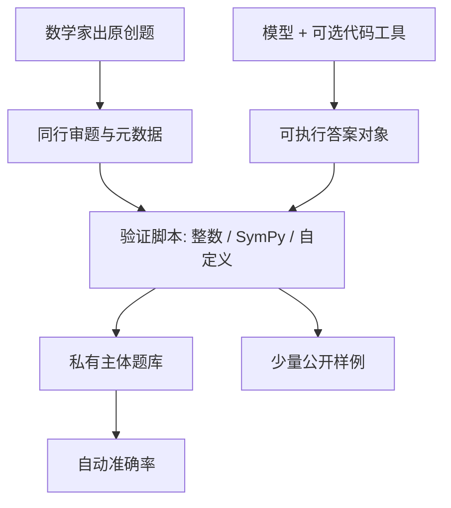

# FrontierMath

    
现有数学基准多停在高中与低年级本科；要衡量能否从事现代数学研究级推理，需要专家新出、尚未发表、且答案可自动核对的题。当时最强模型只能解出其中不足百分之二。

    <footer>—— Glazer, Erdil, Besiroglu et al. / Epoch AI, FrontierMath: A Benchmark for Evaluating Advanced Mathematical Reasoning in AI, arXiv:2411.04872</footer>

GSM8K 与 MATH 曾经区分会不会做应用题；前沿模型把它们推到饱和之后，剩下的分数差更多来自格式与污染，而不是代数几何直觉。[Humanity's Last Exam](/llm/humanitys-last-exam) 把闭卷专家题铺到上百学科；[GPQA](/llm/mmlu-pro-gpqa) 把科学问答做成搜不掉的钻石集。FrontierMath 更窄：Epoch AI 联合数十位职业数学家，出数百道**原创、未发表**的现代数学题，覆盖数论、分析、代数几何、范畴等 MSC 主干，典型题要该方向研究者数小时，难的要数天。答案设计成整数或可被 SymPy 核对的对象，避免用 Lean 形式化当评测瓶颈。本篇写这张卷子相对竞赛数学与通识考试改了哪一层协议，以及分数该怎么跟已有数学评测分账。

## 问题

竞赛基准（AIME、IMO 短题）每年有新题，污染较轻，但题量小、风格偏奥林匹克技巧，并不等于研究工作。教材基准题量大、可自动评分，但题面与解答在互联网上复制极广，[n-gram 重叠](/llm/contamination-ngram) 会把记忆算进准确率。FrontierMath 同时要三件事：难到专家也要花时间、新到预训练爬虫里不该有原文、评分不依赖人类逐份读证明。Glazer 等人把出题约束写成原创性、可自动验证、抗猜测、计算可在标准硬件上于约一分钟内完成。抗猜测要求：不把该做的工作做完，猜中的机会应很低——答案常常是很大的整数，而不是四选一。

发布时的经验结果是：当时最强模型即使多次尝试，解出率仍低于约 2%。这与 MATH 上近满分不是同一把尺。陶哲轩、Gowers、Borcherds 等在访谈里承认题极难、需要领域知识，也指出「最终答案是一个数」并不等于数学研究的日常形态——研究更常交付定义、定理与证明结构。FrontierMath 接受这一折中：用可核对的数当探针，换可规模化的评分，而不是声称已经在考「当数学家」。

### 未发表不是永久免疫

题一旦进入评测日志、博客或模型蒸馏语料，污染时钟启动。Epoch 只公开少量样例，主体留在私有集，评估需申请；后续版本还修正过相当比例的题目错误并调整题量。私有并不能挡住「评估期间模型把题面写进上下文缓存再泄漏」。协议上仍应使用金丝雀字符串、禁止把题面发到可被抓取的地方，并与[动态基准](/llm/live-benchmarks)一样声明评估日期与模型训练截止。OpenAI 曾资助并获子集独占访问，利益冲突应与分数一起读：同一实验室的模型在独占子集上的分，不能直接当成公开可复现的科学比较。

自动可验证把证明能力与「算出正确的数」拆开。模型可能用搜索、数值实验或形式工具撞到答案，却写不出人类可发表的证明；也可能有正确思路却在最后一步算术上栽。FrontierMath 分数衡量的是后一种任务上的通过率，不是期刊接受率。

## 方法

每题附解答、验证脚本与学科标签。模型提交的是能算出答案的代码（或可被脚本读取的对象），验证器做整数全等、符号差化简为零，或自定义检查（例如佩尔方程的整点，解不唯一）。这与竞赛的人工阅卷、也与 Lean 定理证明器的内核检查都不同：中间推理可以是自然语言加 Python，只要最终对象对。评测环境通常提供标准科学栈，使计算密集的数论题可以写脚本，但不能把「会调库」等同于「会证明」。

难度在收集时按背景知识、找到关键洞察的时间、完成技术细节的时间三维标注，并经同领域数学家审题。公开样例包括原根猜想密度、构造满足几何条件的多项式再求值、p 进连续延拓等——读题本身就需要专业语言。计分主指标是准确率；多次采样应单独报 pass@k，并钉死工具（是否允许代码执行、网络、计算机代数）。没有工具的闭卷生成与带 Python 的代理，不是同一协议。

$$
\mathrm{Acc}(M)=\frac{1}{|Q|}\sum_{q\in Q}\mathbf{1}\bigl[\mathrm{verify}(\mathrm{exec}(M(q)),y_q)=1\bigr]
$$

$\mathrm{verify}$ 是题目自带脚本，不是另一个 LLM 裁判。这与 [LiveBench](/llm/livebench) 的客观标准一致，与聊天偏好榜相反。题集规模以数百计，远小于 MMLU；单个点估计方差大，应报置信区间或按 MSC 分科，避免用一两道幸运题解释「数学能力跃迁」。

### 与 MATH、HLE、竞赛新题如何分账

MATH / GSM8K：课程级、易污染、已饱和，适合回归「有没有把小学到高考做坏」，不适合宣称研究级推理。[LiveCodeBench](/llm/livecodebench) 按竞赛日期切的是编程，不是证明。HLE 含大量数学，但目标是跨学科专家闭卷，题型含选择与短答，且有多模态；FrontierMath 是数学家为数学家出的计算可核对题。AIME 一类当年卷适合测训练截止之后的竞赛技巧。一张能力表应分行：课程、竞赛、研究级可核对、跨学科专家。把 FrontierMath 的几个百分点涨幅平均进 MMLU，会把唯一还没饱和的数学尺稀释掉。

## 机制

FrontierMath 的区分力来自「必须做工作才能得到那个大整数」。选择题的排除法、短答案的常见常量，在这里收益低。工具通道改变机制：计算机代数与数值搜索可能把部分题从推理变成实验，协议必须声明。私有题降低预训练记忆，却提高对主办方的信任依赖——第三方不能本地复跑全量，只能比较申请到的评估槽。版本迭代（纠错、删题、增 Tier）使跨年分数不可直接连成一条曲线，必须钉版本号，这与动态基准的窗口 $W$ 是同一纪律。

专家出题引入选择偏差：贡献者擅长的分支、适合出成「一个数」的问题会过多，而定理发现、反例构造、概念定义过少。MSC 覆盖宣称达到顶级科目的大部分，仍不是按研究产出加权的 universes。读总分时要问：涨分来自计算密集的数论，还是来自更抽象的范畴题。后者更接近「研究直觉」，前者更接近「会写对的搜索程序」。

Tier 分层（较易的主体与极难的扩展）一旦公开使用，应分报。只用最难一档的失败来证明「AI 不会数学」，或只用较易档的成功来证明「AI 已达研究水平」，都是选层。发布说明里的题量与纠错比例，说明专家题本身也会错，验证脚本不是神谕。

### 资助与独占访问是评测协议的一部分

Epoch 写明 FrontierMath 的开发获得 OpenAI 资助，且后者对子集有独占访问。这不等于分数作假，但等于比较不对称：有独占权的实验室可以针对子集做更多内部迭代，外部模型只能打公开样例或申请槽。科学使用应：优先报对所有人可申请的同一私有切片；把独占子集单独成表；利益冲突与 [HLE](/llm/humanitys-last-exam) 的私有集一样写进方法而不是脚注。评测不是中立自然现象，是有资源约束的制度。

## 边界与工程取舍

数值答案约束排除了大量合法数学活动。形式化证明基准（MiniF2F、Putnam 形式化等）补的是另一轴，不能与 FrontierMath 互换。计算可处理性要求把超出现成算法一分钟的题挡在门外，于是「需要新算法」的研究问题进不来。人类专家耗时标注是主观的，只能当分层，不能当心理测量学上的 IRT 难度。模型若在评测中检索到泄漏的解答网页，分数归污染，应配合 canary 与网络策略。

本基准不替代课程考试，也不替代软件工程。数学代理的产品问题——会不会用错定理、会不会自信地给出错误引理——需要过程评分，FrontierMath 故意不做。把它当研发门禁时，应冻结版本、固定工具、禁止把私有题写入可训练语料。

「不足 2%」是论文发布窗口的快照。后续带长推理与工具的系统会涨分；涨分之后仍要问是否污染、是否只在计算题上涨、是否换版本后还在。饱和一旦出现，就需要新的未发表题，FrontierMath 自己也会变成下一轮动态基准问题。

## 小结

- FrontierMath（Glazer 等，Epoch AI，arXiv:2411.04872）用专家新出的研究级数学题、自动可核对答案，补课程基准饱和与污染的缺口。
- 发布窗口内前沿模型解出率极低；数值答案是为了评分，不是数学研究的充分统计。
- 与 MATH、竞赛当年卷、HLE、GPQA 分账：课程 / 奥赛 / 跨学科专家 / 研究级可核对。
- 私有题与资助独占是协议的一部分，比较必须钉版本、钉切片、钉工具。
- 证明过程、形式化、概念创新不在主指标里。
- 污染时钟在样例与日志公开后启动，需 canary 与截止声明。
- 出处：Glazer et al., *FrontierMath*, arXiv:2411.04872；对照 Hendrycks et al., MATH；Phan et al., HLE；Rein et al., GPQA。
