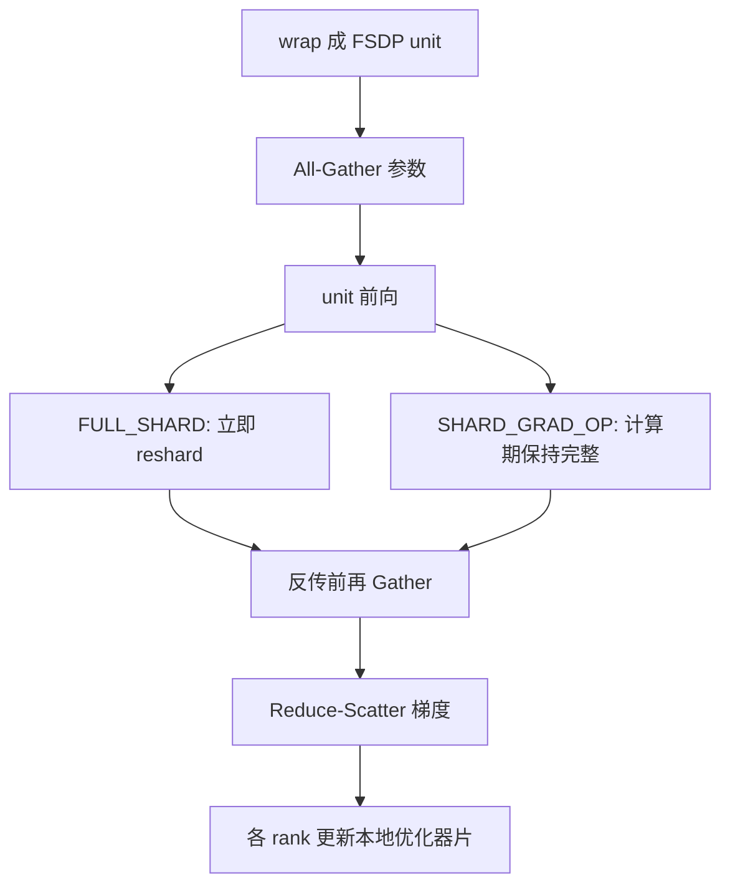

# FSDP

把参数、梯度和优化器状态按包装单元切到数据并行组上，用时 All-Gather，用完再切回去——这是 PyTorch 里与 ZeRO-3 最近的那条官方路径。

<footer>—— PyTorch 文档：FullyShardedDataParallel / ShardingStrategy</footer>

DeepSpeed 用 ZeRO 档位说话，PyTorch 用 **Fully Sharded Data Parallel (FSDP)** 说话。切的对象是同一张表：参数、梯度、优化器状态；通信仍是 All-Gather 与 Reduce-Scatter。差别在接口、包装粒度、以及混合精度、预取、混合分片这些旋钮如何暴露。本篇按 PyTorch 稳定文档写 FSDP 的策略与包装，不重写 [ZeRO 三档的内存公式](/llm/zero-stages)，也不把某一版 nightly 的未定 API 当成规范。

## 问题

DDP 每张卡复制完整参数、梯度与优化器状态，模型稍大就 OOM。用户若跳到 DeepSpeed，要换启动器、换配置文件、有时换优化器封装。PyTorch 需要一条仍在 `nn.Module` 上工作、集体通信走 `torch.distributed` 的分片数据并行：训练循环看起来像 DDP，内存语义接近 ZeRO。

问题立刻变成三个工程选择。第一，切多深：只切梯度与优化器，还是连参数也切。第二，All-Gather 的单位多大：整网一次，还是每个 Transformer 块一次。第三，多机时要不要在节点内切、节点间复制，以免跨机 All-Gather 把以太网打满。这些不是三套算法，是同一套分片状态机上的策略枚举。

### 策略名与 ZeRO 档位对齐

文档中的 `ShardingStrategy`：

- `FULL_SHARD`（默认）：参数、梯度、优化器状态都分片。前向计算前 All-Gather 出完整参数，前向后重新分片；反传前再 Gather，反传后 Reduce-Scatter 梯度。各 rank 只更新自己的优化器片。对应最深的 ZeRO-3。
- `SHARD_GRAD_OP`：计算期间参数保持完整，计算结束后再分片；梯度与优化器状态分片。少一次前向后的 reshard，省通信、费显存。接近 ZeRO-2。
- `NO_SHARD`：相当于 DDP，用来当对照基线。
- `HYBRID_SHARD`：在一个「单位」（通常是节点内 GPU）上做 `FULL_SHARD`，单位之间复制。节点内走 NVLink 做深切，节点间像 DDP 一样 All-Reduce 梯度语义。多机上常见折中。

`use_orig_params=True` 时，`SHARD_GRAD_OP` 在前向之后暴露的是未分片参数，行为与 `FULL_SHARD` 不同。调试时用 `summon_full_params`（需要梯度则 `with_grads=True`）查看，不要假设 `named_parameters()` 在两种策略下指向同一布局。

## 方法

FSDP 把模块树切成若干 **wrapping unit**。每个 unit 是一次 All-Gather / Reduce-Scatter 的粒度。`auto_wrap_policy` 常用 `transformer_auto_wrap_policy`，把 `LlamaDecoderLayer` 一类块包成独立 FSDP 实例；也可用按参数量阈值的 size-based 策略。整模型一个 unit：通信次数少，峰值高（一次取齐太多权重）。每层一个 unit：峰值低，NCCL 启动次数随层数涨。块级是常见折中，与 ZeRO-3 的 wrap 是同一旋钮，只是 API 名字不同。

混合精度由 `MixedPrecision` 指定参数、梯度、缓冲的 dtype，与「计算用 BF16、主状态用 FP32」的常见配方对齐，但是 FSDP 自己的模块，不必绑 Apex。`backward_prefetch` 默认 `BACKWARD_PRE`：反传当前 unit 时预取下一 unit 的参数，用显存换隐藏延迟。`limit_all_gathers` 限制同时在飞的 Gather，防止预取把峰值顶破。`cpu_offload=CPUOffload(offload_params=True)` 把参数卸到主机，墙钟通常明显变慢，语义上也离开「只卸优化器」的 ZeRO-Offload 合同。

### 从 FSDP1 到可组合的 fully_shard

第一代 API 是 `FullyShardedDataParallel` 包装整个模块。PyTorch 后续引入基于 DTensor 的 **FSDP2**（`torch.distributed.fsdp.fully_shard` 一类可组合接口）：分片状态是张量上的布局，而不是一个巨大的 wrapper 对象，便于与 `torch.compile`、流水线、其他并行维组合。迁移时不要假设两套默认策略、预取与 `use_orig_params` 完全同构；以你锁定的版本文档为准。本篇以稳定文档里仍在的 `ShardingStrategy` 语义为准，不把某一 commit 的默认值写成永恒定律。

`device_mesh` 把混合分片从「隐式按节点」变成显式网格：哪一维是 shard，哪一维是 replicate。这与 JAX 的 mesh 是同一类思想，只是运行时仍是 NCCL 而不是 XLA 分区器。检查点：分片检查点按 rank 写片；要导出完整权重，需 `summon_full_params` 或专门的聚合作业，峰值内存会回到「几乎一份完整模型」。

## 机制

状态机比公式重要。对每个 unit，`FULL_SHARD` 在时间轴上交替「完整」与「分片」：完整只覆盖该 unit 的计算窗口。窗口外 GPU 上是 $1/N$ 的参数。峰值 ≈ 分片常驻 + 当前 unit 完整参数 + 激活 + 预取的下一 unit。包装越粗，窗口越大。这就是为什么只报「FSDP 省 $N$ 倍」会骗人：省的是常驻，不是峰值。

`HYBRID_SHARD` 的机制是缩小 All-Gather 的进程组。组内 $n_{\mathrm{local}}$ 张卡做深切，组间复制一份逻辑模型。跨机不再每层 Gather 整网参数，只在副本之间同步梯度。节点内 NVLink 吃得起 ZeRO-3 的次数，以太网往往吃不起。代价是每台机器仍要放下「一份完整模型 / $n_{\mathrm{local}}$」，机器太少或单机卡太少时混合分片省不出那一档。

FSDP 的通信次数随 unit 数线性涨，体积每层仍与该 unit 参数量同阶。深而窄、wrap 很细、跨机 `FULL_SHARD`，延迟项会压过省显存换来的更大微批。选策略先看拓扑：节点内 `FULL_SHARD`，跨机优先 `HYBRID_SHARD` 或 `SHARD_GRAD_OP`，而不是看模型参数口号。

### 与 DeepSpeed 的工程差，而不是数学差

数学对象几乎相同：分片数据并行。工程差包括：启动器与配置（Python 参数 vs JSON）；优化器是否必须包一层；CPU 卸载默认卸什么；MoE / 流水线的成熟度随生态走；以及检查点格式。写报告应同时写「`FULL_SHARD` + transformer wrap」和「切了参数 / 梯度 / 状态」，避免「我们用了 FSDP」无法对照「我们用了 ZeRO-3」。不要把 FSDP 当成张量并行：它不切单层矩阵的列，All-Reduce 语义在 DDP 对照里才出现。

## 边界与工程取舍

不要在单卡已能 DDP 时默认 `FULL_SHARD`。不要把自定义缓冲、非 `nn.Parameter` 的缓存、或被 `ignored_modules` 漏掉的层当成已分片。不要在 `no_sync` 梯度累积时忘记：`SHARD_GRAD_OP` 在 `no_sync` 内反传后可以不 reshard，峰值行为会变。`sync_module_states` 用于从 rank0 广播初始权重，初始化在 CPU 上用 `param_init_fn` 可避免所有卡同时物化完整 FP32。

与梯度裁剪、全局范数：必须在分片上做正确归约。与 `torch.compile`：FSDP2 的可组合性是为这个准备的，但图断裂、动态 wrap 仍是常见坑，要用你目标版本的已知限制清单，而不是假设「compile 后 FSDP 免费加速」。

出处以 PyTorch 稳定文档的 `FullyShardedDataParallel` 与 `ShardingStrategy` 为准。第三方博客里「FULL 只要 model/N、SHARD_GRAD_OP 只要 45 GB」一类算例依赖具体模型与是否算激活，不能当公式。

## 小结

- FSDP 是 PyTorch 的分片数据并行：unit 级 All-Gather 参数、Reduce-Scatter 梯度，优化器片本地更新。
- `FULL_SHARD` ≈ ZeRO-3，`SHARD_GRAD_OP` ≈ ZeRO-2，`NO_SHARD` ≈ DDP，`HYBRID_SHARD` 为节点内深切、节点间复制。
- wrap 粒度决定峰值与通信次数；预取、`limit_all_gathers`、混合精度是同一状态机上的旋钮。
- 参数 CPU 卸载与 ZeRO-Offload 默认合同不同；导出完整权重需要专门的聚集。
- 跨机优先缩小 Gather 组，而不是无条件全网 `FULL_SHARD`。
- 出处：PyTorch 文档 *FullyShardedDataParallel*；语义对照见 [ZeRO 三档](/llm/zero-stages)。
